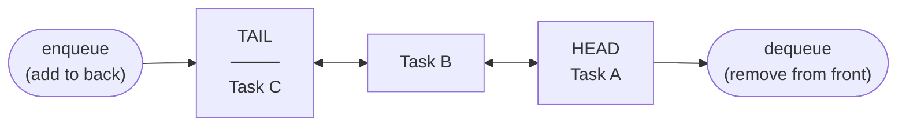
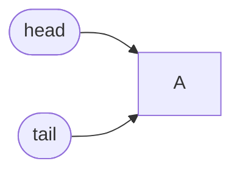
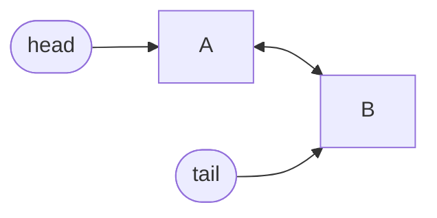
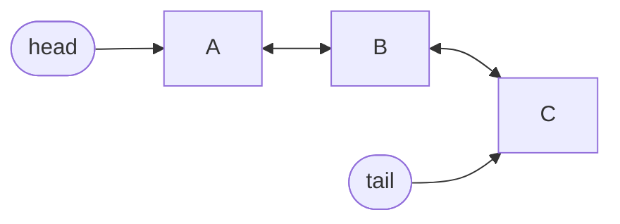
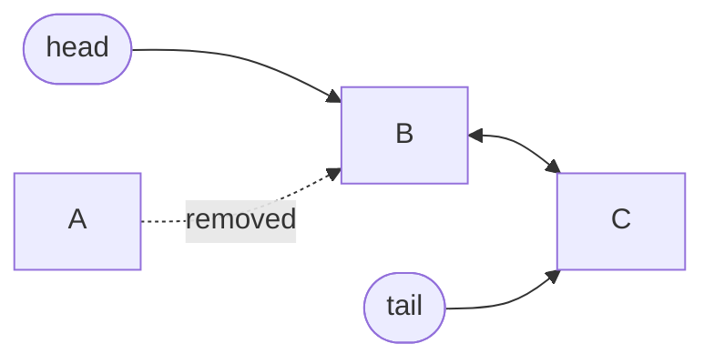

# Queues

Picture the checkout line at a supermarket. The first person to join the line is the first person to pay and leave. Nobody jumps the queue. Nobody gets served out of order. That's a **queue**: First In, First Out — **FIFO**.

## The FIFO Principle

A queue has exactly two operations:

- **Enqueue** — add an item to the **back** of the line
- **Dequeue** — remove an item from the **front** of the line



The item that has waited the longest always gets served next. Items can never skip ahead.

## Why a Doubly Linked List Is the Right Tool

You might wonder: why not just use a Python list? The problem is that removing from the *front* of a list (`list.pop(0)`) is O(n) — every remaining element must shift one position to the left. With a million items, that's a million moves per dequeue.

A doubly linked list with a `head` pointer makes dequeue O(1): just redirect the head pointer to the second node. A `tail` pointer makes enqueue O(1) too.

| Structure | Enqueue | Dequeue |
|-----------|---------|---------|
| Python list | O(1) amortised | O(n) — items shift |
| Singly linked list | O(1) | O(1) |
| **Doubly linked list** | **O(1)** | **O(1)** |
| `collections.deque` | O(1) | O(1) |

## Building a Queue from a Doubly Linked List

```python,editable
class Node:
    def __init__(self, value):
        self.value = value
        self.prev = None
        self.next = None


class Queue:
    def __init__(self):
        self.head = None   # front — dequeue from here
        self.tail = None   # back  — enqueue here
        self.length = 0

    def enqueue(self, value):
        """Add to the back. O(1)."""
        node = Node(value)
        if self.tail is None:
            self.head = self.tail = node
        else:
            node.prev = self.tail
            self.tail.next = node
            self.tail = node
        self.length += 1

    def dequeue(self):
        """Remove from the front. O(1)."""
        if self.head is None:
            return None
        value = self.head.value
        self.head = self.head.next
        if self.head is not None:
            self.head.prev = None
        else:
            self.tail = None   # queue is now empty
        self.length -= 1
        return value

    def peek(self):
        """Look at the front item without removing it. O(1)."""
        return self.head.value if self.head else None

    def is_empty(self):
        return self.length == 0

    def __repr__(self):
        items = []
        cur = self.head
        while cur:
            items.append(str(cur.value))
            cur = cur.next
        return "front -> [" + ", ".join(items) + "] <- back"


q = Queue()
print("Enqueuing tasks...")
for task in ["print report", "send email", "run backup"]:
    q.enqueue(task)
    print(f"  enqueued: {task!r:20s}  queue: {q}")

print("\nProcessing tasks...")
while not q.is_empty():
    task = q.dequeue()
    print(f"  processed: {task!r:20s}  queue: {q}")
```

## Enqueue Step by Step

Starting with an empty queue, enqueue `A`, then `B`, then `C`:

**After enqueue A:**


**After enqueue B:**


**After enqueue C:**


## Dequeue Step by Step

**Dequeue from the above queue (removes A):**


`head` now points to `B`. `A` is unreachable and gets garbage collected.

## The Pythonic Way: `collections.deque`

Python's standard library includes `collections.deque` — a battle-hardened doubly linked list (implemented in C). For production code, always prefer it over a hand-rolled queue.

```python,editable
from collections import deque

# Simulate a print spooler
print_spooler = deque()

# Users submit print jobs
print_spooler.append("Alice: budget.pdf")
print_spooler.append("Bob: slides.pptx")
print_spooler.append("Carol: report.docx")
print_spooler.append("Dave: logo.png")

print(f"Jobs in queue: {len(print_spooler)}")
print(f"Next to print: {print_spooler[0]}\n")

# Printer processes jobs one by one
while print_spooler:
    job = print_spooler.popleft()   # O(1) dequeue
    print(f"Printing: {job}")

print("\nAll jobs done. Spooler empty.")
```

`deque` also supports `appendleft` and `pop` for use as a stack or deque (double-ended queue), but when you only use `append` + `popleft`, it behaves as a pure FIFO queue.

## Breadth-First Search: Queues in Algorithms

One of the most important uses of a queue is **Breadth-First Search (BFS)** — the algorithm that finds shortest paths in unweighted graphs. BFS explores all neighbours of the current node before moving deeper, and a queue is what enforces that "process closest nodes first" ordering.

```python,editable
from collections import deque

def bfs(graph, start):
    """
    Find the shortest number of hops from 'start' to every reachable node.
    Returns a dict: {node: distance_from_start}
    """
    visited = {start: 0}
    queue = deque([start])

    while queue:
        node = queue.popleft()          # process the oldest (closest) node
        for neighbour in graph[node]:
            if neighbour not in visited:
                visited[neighbour] = visited[node] + 1
                queue.append(neighbour) # explore it later

    return visited


# A simple social network: who follows whom
network = {
    "Alice": ["Bob", "Carol"],
    "Bob":   ["Alice", "Dave", "Eve"],
    "Carol": ["Alice", "Frank"],
    "Dave":  ["Bob"],
    "Eve":   ["Bob"],
    "Frank": ["Carol"],
}

distances = bfs(network, "Alice")
print("Degrees of separation from Alice:")
for person, hops in sorted(distances.items(), key=lambda x: x[1]):
    print(f"  {person}: {hops} hop(s)")
```

## Real-World Queues

| Use Case | What Gets Queued | Why FIFO Matters |
|----------|-----------------|-----------------|
| **Print spooler** | Print jobs | Documents print in submission order |
| **CPU task scheduling** | OS processes | Fair allocation of CPU time |
| **Message queues (Kafka, RabbitMQ)** | Events / messages | Consumers see events in order produced |
| **BFS graph traversal** | Nodes to visit | Shortest path guarantee requires level-order processing |
| **Web server request handling** | HTTP requests | Requests handled in arrival order |
| **Keyboard input buffer** | Keystrokes | Characters appear in the order they were typed |

## Time Complexity Summary

| Operation | Time | Notes |
|-----------|------|-------|
| `enqueue` | O(1) | Append to tail |
| `dequeue` | O(1) | Remove from head |
| `peek` | O(1) | Read head value |
| `is_empty` | O(1) | Check length |
| Access by index | O(n) | Queues aren't for random access |
