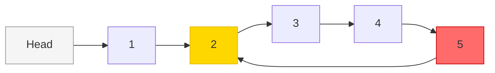

# Fast and Slow Pointers

Imagine two runners on a circular track — one jogs at a steady pace while the other sprints at double the speed. If the track loops, the sprinter will eventually lap the jogger and they will meet. If the track is straight with a finish line, the sprinter just reaches the end first. This elegant insight is the heart of **Floyd's Cycle Detection Algorithm**, and it works just as beautifully on linked lists.

The fast/slow pointer pattern (also called the "tortoise and hare" technique) is one of the most satisfying tricks in computer science: two pointers, one constraint, and a surprising number of problems solved.

---

## How It Works

Two pointers start at the head of a linked list:

- **Slow pointer** — advances **1 node** per step
- **Fast pointer** — advances **2 nodes** per step

Their relative behaviour tells us everything:

| Situation | What happens |
|---|---|
| List has a cycle | Fast laps slow — they meet inside the cycle |
| List has no cycle | Fast reaches `None` — exits cleanly |
| Finding the middle | When fast hits the end, slow is exactly in the middle |



In the diagram above, node 5 points back to node 2, creating a cycle. The fast pointer enters the cycle first, keeps circling, and eventually collides with the slow pointer.

---

## Problem 1: Detect a Cycle (Floyd's Algorithm)

**Real-world analogue:** Memory leak detection — a garbage collector needs to know if a reference chain loops back on itself rather than terminating. Operating systems also use this to detect infinite loops in state machines.

```python,editable
class Node:
    def __init__(self, val):
        self.val = val
        self.next = None

def has_cycle(head):
    slow = head
    fast = head

    while fast is not None and fast.next is not None:
        slow = slow.next        # 1 step
        fast = fast.next.next   # 2 steps

        if slow is fast:        # same object in memory
            return True

    return False  # fast reached the end — no cycle

# --- Build a list WITHOUT a cycle: 1 -> 2 -> 3 -> 4 -> 5 ---
nodes = [Node(i) for i in range(1, 6)]
for i in range(len(nodes) - 1):
    nodes[i].next = nodes[i + 1]

print("No cycle:", has_cycle(nodes[0]))   # False

# --- Build a list WITH a cycle: 1 -> 2 -> 3 -> 4 -> 5 -> (back to 2) ---
nodes[4].next = nodes[1]  # 5 points back to 2

print("With cycle:", has_cycle(nodes[0]))  # True
```

**Why does this work?** Once the fast pointer enters a cycle of length `L`, it is "trapped". Each step the gap between fast and slow changes by 1 (fast gains 2, slow gains 1, so fast gains 1 on slow relative to the cycle). After at most `L` steps inside the cycle they are guaranteed to occupy the same node.

**Complexity:**
- Time: O(n) — fast pointer visits each node at most twice before either exiting or meeting slow
- Space: O(1) — just two pointer variables, no extra data structures

---

## Problem 2: Find the Start of the Cycle

Knowing a cycle exists is useful. Knowing *where* it starts is even more useful — for example, finding the exact point of a circular reference in a dependency graph.

**The mathematical trick:** When slow and fast first meet, reset one pointer to the head and keep the other at the meeting point. Now advance *both* one step at a time. They will meet at the cycle's entry node.

```python,editable
class Node:
    def __init__(self, val):
        self.val = val
        self.next = None

def find_cycle_start(head):
    slow = head
    fast = head
    meeting_point = None

    # Phase 1: detect the cycle
    while fast is not None and fast.next is not None:
        slow = slow.next
        fast = fast.next.next
        if slow is fast:
            meeting_point = slow
            break

    if meeting_point is None:
        return None  # no cycle

    # Phase 2: find cycle entry
    pointer1 = head
    pointer2 = meeting_point

    while pointer1 is not pointer2:
        pointer1 = pointer1.next
        pointer2 = pointer2.next

    return pointer1  # both arrive at cycle start simultaneously

# Build: 0 -> 1 -> 2 -> 3 -> 4 -> 5 -> (back to 2)
nodes = [Node(i) for i in range(6)]
for i in range(len(nodes) - 1):
    nodes[i].next = nodes[i + 1]
nodes[5].next = nodes[2]  # cycle entry is node with value 2

start = find_cycle_start(nodes[0])
print("Cycle starts at node with value:", start.val)  # 2

# Build: 0 -> 1 -> 2 -> 3 -> (back to 0, full cycle)
nodes2 = [Node(i) for i in range(4)]
for i in range(len(nodes2) - 1):
    nodes2[i].next = nodes2[i + 1]
nodes2[3].next = nodes2[0]  # cycle entry is node with value 0

start2 = find_cycle_start(nodes2[0])
print("Cycle starts at node with value:", start2.val)  # 0
```

**Why does Phase 2 work?** Let `F` = distance from head to cycle start, `C` = cycle length, `k` = distance from cycle start to meeting point. It can be proven that `F = C - k`, which means a pointer from the head and a pointer from the meeting point, both moving one step at a time, will travel the same distance before reaching the cycle entry node.

**Complexity:**
- Time: O(n)
- Space: O(1)

---

## Problem 3: Find the Middle of a Linked List

When fast reaches the end (`None` or the last node), slow is exactly at the middle. This is useful for merge sort on linked lists — split the list at the middle and sort each half recursively.

```python,editable
class Node:
    def __init__(self, val):
        self.val = val
        self.next = None

def find_middle(head):
    slow = head
    fast = head

    # Fast moves 2 steps; when it can't, slow is at middle
    while fast is not None and fast.next is not None:
        slow = slow.next
        fast = fast.next.next

    return slow

def build_list(values):
    if not values:
        return None
    nodes = [Node(v) for v in values]
    for i in range(len(nodes) - 1):
        nodes[i].next = nodes[i + 1]
    return nodes[0]

def list_to_str(head):
    result = []
    while head:
        result.append(str(head.val))
        head = head.next
    return " -> ".join(result)

# Odd length: 1 -> 2 -> 3 -> 4 -> 5
head_odd = build_list([1, 2, 3, 4, 5])
mid = find_middle(head_odd)
print(f"List: {list_to_str(head_odd)}")
print(f"Middle node: {mid.val}")   # 3

print()

# Even length: 1 -> 2 -> 3 -> 4
head_even = build_list([1, 2, 3, 4])
mid = find_middle(head_even)
print(f"List: {list_to_str(head_even)}")
print(f"Middle node: {mid.val}")   # 3  (second of the two middle nodes)
```

**Complexity:**
- Time: O(n)
- Space: O(1)

---

## Problem 4: Check if a Linked List Length is Even or Odd

A neat side effect of the two-pointer dance: when fast exits the loop, its final position reveals the parity of the list's length.

- If `fast is None` after the loop → fast took a full last step and "fell off" → even number of nodes
- If `fast.next is None` → fast landed on the last node exactly → odd number of nodes

```python,editable
class Node:
    def __init__(self, val):
        self.val = val
        self.next = None

def is_length_even(head):
    fast = head
    while fast is not None and fast.next is not None:
        fast = fast.next.next
    # If fast is None, we exhausted the list evenly
    return fast is None

def build_list(values):
    if not values:
        return None
    nodes = [Node(v) for v in values]
    for i in range(len(nodes) - 1):
        nodes[i].next = nodes[i + 1]
    return nodes[0]

for length in [1, 2, 3, 4, 5, 6]:
    head = build_list(list(range(length)))
    parity = "even" if is_length_even(head) else "odd"
    print(f"Length {length}: {parity}")
```

**Complexity:**
- Time: O(n)
- Space: O(1)

---

## Putting It All Together: Merge Sort on a Linked List

Here is a complete runnable merge sort that uses `find_middle` to split the list — the canonical real-world use of finding the middle node.

```python,editable
class Node:
    def __init__(self, val):
        self.val = val
        self.next = None

def find_middle(head):
    slow = head
    fast = head
    prev = None
    while fast is not None and fast.next is not None:
        prev = slow
        slow = slow.next
        fast = fast.next.next
    if prev:
        prev.next = None  # split the list at the middle
    return slow

def merge(left, right):
    dummy = Node(0)
    tail = dummy
    while left and right:
        if left.val <= right.val:
            tail.next = left
            left = left.next
        else:
            tail.next = right
            right = right.next
        tail = tail.next
    tail.next = left if left else right
    return dummy.next

def merge_sort(head):
    if head is None or head.next is None:
        return head
    mid = find_middle(head)
    left = merge_sort(head)   # head's list is now cut at mid
    right = merge_sort(mid)
    return merge(left, right)

def build_list(values):
    if not values:
        return None
    nodes = [Node(v) for v in values]
    for i in range(len(nodes) - 1):
        nodes[i].next = nodes[i + 1]
    return nodes[0]

def list_to_python(head):
    result = []
    while head:
        result.append(head.val)
        head = head.next
    return result

import random
random.seed(42)
values = random.sample(range(100), 10)
print("Before:", values)

head = build_list(values)
sorted_head = merge_sort(head)
print("After: ", list_to_python(sorted_head))
```

---

## Complexity Summary

| Problem | Time | Space | Key insight |
|---|---|---|---|
| Detect cycle | O(n) | O(1) | Fast always catches slow inside a cycle |
| Find cycle start | O(n) | O(1) | F = C - k mathematical proof |
| Find middle | O(n) | O(1) | Fast ends when slow is at centre |
| Even/odd length | O(n) | O(1) | Final position of fast |

---

## Real-World Applications

- **Memory leak detection** — garbage collectors and tools like Valgrind track reference chains; a cycle means an object can never be freed.
- **Infinite loop detection in state machines** — a finite state machine that cycles indefinitely without reaching an exit state is broken; fast/slow can detect this in O(states) time.
- **Merge sort on linked lists** — finding the midpoint without knowing the length in advance is exactly what `find_middle` does; used in real standard library implementations.
- **Network packet routing** — detecting routing loops where a packet bounces between routers infinitely.
- **Functional programming** — lazy infinite lists and stream processing use cycle detection to identify when a generator has looped back.
