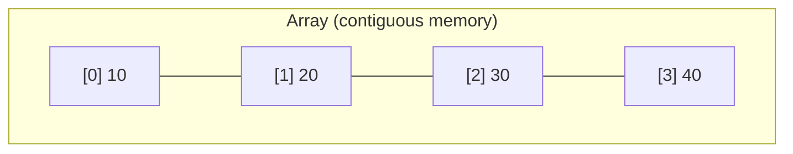
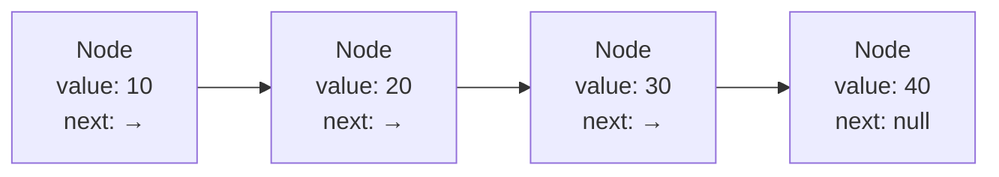
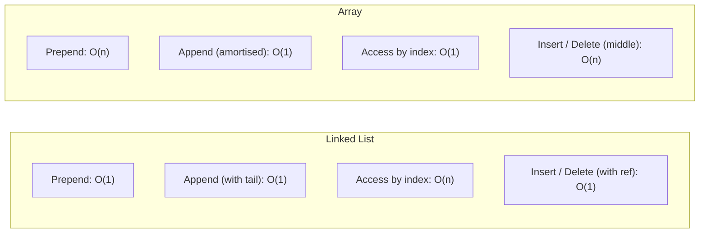

# Linked Lists

What if instead of buying reserved seats in a theatre (like an array), everyone just holds a ticket that says "the next person is in seat 42"? You don't need a block of seats together — each person simply points to the next. That's a linked list.

## The Problem with Arrays

Arrays store data in a contiguous block of memory. That's great for random access (`arr[5]` is instant), but terrible when you need to insert or delete in the middle — everything has to shuffle along.

Insert `15` after index 0? Every element from index 1 onward must move one position to the right. With a million items, that's a million moves — `O(n)`.

## The Linked List Solution

A linked list breaks free from contiguous memory. Each piece of data lives inside a **node**, and every node holds two things:

1. The **value** (the actual data)
2. A **pointer** (the memory address of the next node)

Nodes can live anywhere in memory — they don't need to be neighbours. Inserting a new node is just a matter of updating two pointers, regardless of list size.

## Array vs Linked List at a Glance

Neither structure is universally better — the right choice depends on your access pattern.

## Real-World Linked Lists

Linked lists show up everywhere you need cheap insertions and deletions at the edges:

- **Music playlist** — each song points to the next; skipping to the next track is just following one pointer
- **Browser history** — each page visited is a node; the back button follows `prev` pointers
- **Blockchain** — each block holds the hash (pointer) of the previous block, chaining them together
- **Undo / redo in editors** — each change is a node; undo walks backwards through the chain

## What's in This Section

| Page | What You'll Learn |
|------|-------------------|
| [Singly Linked Lists](./05-singly-linked-lists.md) | Nodes that point forward only; append, prepend, delete, search |
| [Doubly Linked Lists](./06-doubly-linked-lists.md) | Nodes that know both neighbours; O(1) delete, bidirectional traversal |
| [Queues](./07-queues.md) | FIFO processing built on a doubly linked list; Python's `deque` |
