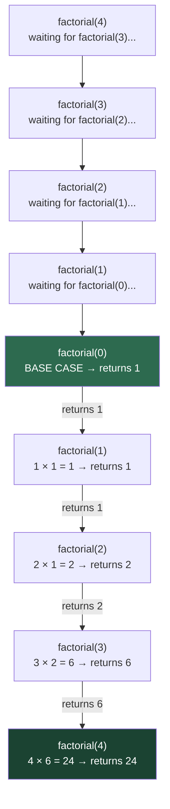

# Factorial

How many ways can 5 friends sit in a row? The first seat has 5 choices, the second has 4, then 3, then 2, then 1. Multiply them together: **5 × 4 × 3 × 2 × 1 = 120**. That is 5 factorial, written **5!**

Factorial is the perfect first recursion problem because the mathematical definition and the recursive code are nearly identical.

## The Mathematical Definition

```
0! = 1               ← base case (defined by convention)
n! = n × (n - 1)!   ← recursive case
```

Reading that second line: "the factorial of n is n multiplied by the factorial of n minus 1." The definition refers to itself. That is exactly what recursion does.

## Translating Math to Code

```python,editable
def factorial(n):
    # Base case: factorial(0) = 1
    if n <= 0:
        return 1
    # Recursive case: n! = n × (n-1)!
    return n * factorial(n - 1)


# Print a small table
print(f"{'n':>3}  {'n!':>10}")
print("-" * 16)
for n in range(8):
    print(f"{n:>3}  {factorial(n):>10}")
```

The code mirrors the math almost word for word. That directness is recursion's greatest strength.

## Watching the Call Stack Unwind

When you call `factorial(4)`, Python does not compute the answer in one shot. It opens a chain of suspended function calls, then closes them one by one as answers come back.



**Phase 1 (going down):** Each call discovers it needs a smaller answer first, so it suspends and calls itself again. The call stack grows.

**Phase 2 (coming back up):** Once the base case returns, each suspended call wakes up, finishes its multiplication, and returns. The call stack shrinks.

## Call Stack Depth

Every frame on the call stack costs memory. For `factorial(n)`, the stack reaches depth `n` before it starts unwinding:

```python,editable
def factorial_with_depth(n, depth=0):
    indent = "  " * depth
    print(f"{indent}factorial({n}) called — stack depth: {depth + 1}")

    if n <= 0:
        print(f"{indent}  → base case, returning 1")
        return 1

    result = n * factorial_with_depth(n - 1, depth + 1)
    print(f"{indent}  → returning {result}")
    return result


factorial_with_depth(5)
```

For factorial, a stack depth equal to `n` is fine. But if `n` were one million, you would hit Python's recursion limit. This is why recursion depth matters.

## Iterative Version — Same Answer, No Stack

```python,editable
def factorial_iterative(n):
    result = 1
    for x in range(2, n + 1):
        result *= x
    return result


# Verify both give the same answers
def factorial_recursive(n):
    if n <= 0:
        return 1
    return n * factorial_recursive(n - 1)


print(f"{'n':>3}  {'recursive':>12}  {'iterative':>12}  {'match':>6}")
print("-" * 38)
for n in range(10):
    r = factorial_recursive(n)
    i = factorial_iterative(n)
    print(f"{n:>3}  {r:>12}  {i:>12}  {str(r == i):>6}")
```

| | Recursive | Iterative |
|---|---|---|
| Readability | Mirrors the math definition | Requires mental translation |
| Stack usage | O(n) frames | O(1) — no stack growth |
| Risk | Stack overflow for large n | None |
| When to prefer | Teaching, prototyping | Production with large inputs |

## Real-World Uses

**Combinatorics** — How many ways can you arrange a deck of 52 cards? That is 52!, a number with 68 digits. Probability theory depends on factorials for counting arrangements.

**Permutations in cryptography** — The strength of many encryption schemes comes from the astronomical number of possible key arrangements, which factorials quantify.

**Binomial coefficients** — Choosing k items from n uses factorials: C(n, k) = n! / (k! × (n-k)!). This appears in statistics, Pascal's triangle, and machine learning (binomial distributions).

```python,editable
def factorial(n):
    if n <= 0:
        return 1
    return n * factorial(n - 1)

def choose(n, k):
    """How many ways to choose k items from n? (combinations)"""
    return factorial(n) // (factorial(k) * factorial(n - k))

# How many 5-card poker hands exist from a 52-card deck?
hands = choose(52, 5)
print(f"Possible 5-card poker hands: {hands:,}")

# How many ways to arrange a 3-person podium from 10 contestants?
# This is a permutation: P(10, 3) = 10! / (10-3)!
def permute(n, k):
    return factorial(n) // factorial(n - k)

podiums = permute(10, 3)
print(f"3-place podium arrangements from 10 people: {podiums:,}")
```

## Key Takeaways

- Factorial is the archetypal recursive problem: the definition IS the algorithm.
- The call stack grows going down, shrinks coming back up — understand this deeply and all recursion becomes clear.
- For large inputs, the iterative version is safer; the recursive version is more readable.
