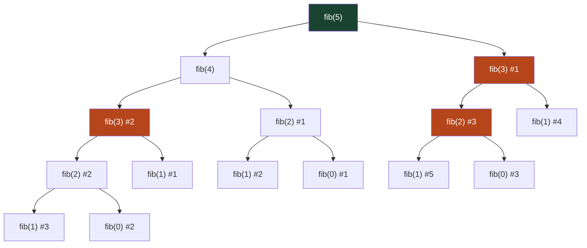

# Fibonacci Sequence

This sequence appears in sunflower seeds, galaxy spirals, and stock markets. Each number is the sum of the two before it: 0, 1, 1, 2, 3, 5, 8, 13, 21, 34...

It is also the most important example of **why naive recursion can be dangerously slow** — and how a single insight (memoization) transforms it from unusable to instant.

## The Definition

```
fib(0) = 0              ← base case
fib(1) = 1              ← base case
fib(n) = fib(n-1) + fib(n-2)   ← recursive case
```

Two base cases, one recursive case. Translating directly to Python:

## Naive Recursive Version

```python,editable
def fib(n):
    if n <= 1:
        return n
    return fib(n - 1) + fib(n - 2)


for n in range(10):
    print(f"fib({n}) = {fib(n)}")
```

Elegant. Clean. And for small n, perfectly fine. But there is a hidden catastrophe waiting for larger inputs.

## The Hidden Catastrophe: Exponential Work

To compute `fib(5)`, Python builds this entire call tree:



Notice `fib(3)` is computed **twice**, `fib(2)` is computed **three times**, and `fib(1)` five times. This is called **overlapping subproblems**, and it gets catastrophically worse as n grows.

```python,editable
# Count how many times each fib(n) gets called
call_counts = {}

def fib_counted(n):
    call_counts[n] = call_counts.get(n, 0) + 1
    if n <= 1:
        return n
    return fib_counted(n - 1) + fib_counted(n - 2)


fib_counted(10)

print(f"{'fib(n)':>8}  {'times called':>14}")
print("-" * 25)
for k in sorted(call_counts):
    print(f"{'fib(' + str(k) + ')':>8}  {call_counts[k]:>14}")

total = sum(call_counts.values())
print(f"\nTotal function calls to compute fib(10): {total}")
print("For fib(40) this would be over 300 million calls.")
```

The number of calls grows as roughly 2^n. For `fib(50)`, that is over one **quadrillion** calls. A modern laptop doing billions of operations per second would still take years.

## Memoization: Remember What You Computed

The fix is simple: if you have already computed `fib(k)`, store the answer and return it immediately instead of recomputing.

This is called **memoization** (not memorization — it comes from "memo", as in a written note to yourself).

```python,editable
def fib_memo(n, cache={}):
    # Already computed? Return instantly.
    if n in cache:
        return cache[n]
    # Base cases
    if n <= 1:
        return n
    # Compute, store, return
    cache[n] = fib_memo(n - 1, cache) + fib_memo(n - 2, cache)
    return cache[n]


# Now fib(40) is instant
for n in [10, 20, 30, 40, 50]:
    print(f"fib({n}) = {fib_memo(n)}")
```

Python also has a built-in decorator for this:

```python,editable
from functools import lru_cache

@lru_cache(maxsize=None)
def fib_cached(n):
    if n <= 1:
        return n
    return fib_cached(n - 1) + fib_cached(n - 2)


# Identical results, zero extra code
for n in [10, 20, 30, 40, 50]:
    print(f"fib({n}) = {fib_cached(n)}")
```

`@lru_cache` automatically memoizes any function. It is one of the most useful tools in Python for recursive algorithms.

## Bottom-Up: Iterative Version

Memoization (top-down) works by caching recursive calls. The iterative approach (bottom-up) builds from the smallest values upward, never recursing at all:

```python,editable
def fib_iterative(n):
    if n <= 1:
        return n
    prev2, prev1 = 0, 1
    for _ in range(2, n + 1):
        prev2, prev1 = prev1, prev1 + prev2
    return prev1


# Verify all three approaches give the same results
from functools import lru_cache

@lru_cache(maxsize=None)
def fib_memo(n):
    if n <= 1:
        return n
    return fib_memo(n - 1) + fib_memo(n - 2)

print(f"{'n':>4}  {'iterative':>12}  {'memoized':>12}  {'match':>6}")
print("-" * 40)
for n in range(12):
    i = fib_iterative(n)
    m = fib_memo(n)
    print(f"{n:>4}  {i:>12}  {m:>12}  {str(i == m):>6}")
```

## Comparing All Three Approaches

```python,editable
import time
from functools import lru_cache

def fib_naive(n):
    if n <= 1:
        return n
    return fib_naive(n - 1) + fib_naive(n - 2)

@lru_cache(maxsize=None)
def fib_memo(n):
    if n <= 1:
        return n
    return fib_memo(n - 1) + fib_memo(n - 2)

def fib_iter(n):
    if n <= 1:
        return n
    a, b = 0, 1
    for _ in range(2, n + 1):
        a, b = b, a + b
    return b

n = 30
print(f"Computing fib({n}):\n")

start = time.time()
result = fib_naive(n)
naive_time = time.time() - start
print(f"  Naive recursive:  {result}  ({naive_time:.4f}s)")

# Clear the cache first so it starts fresh
fib_memo.cache_clear()
start = time.time()
result = fib_memo(n)
memo_time = time.time() - start
print(f"  Memoized:         {result}  ({memo_time:.6f}s)")

start = time.time()
result = fib_iter(n)
iter_time = time.time() - start
print(f"  Iterative:        {result}  ({iter_time:.6f}s)")

print(f"\nMemoized is roughly {naive_time / max(memo_time, 0.000001):.0f}x faster than naive.")
```

| Approach | Time complexity | Space complexity | Stack depth |
|---|---|---|---|
| Naive recursive | O(2^n) | O(n) stack | O(n) |
| Memoized recursive | O(n) | O(n) cache + O(n) stack | O(n) |
| Iterative | O(n) | O(1) | O(1) |

## Real-World Appearances

**Nature** — The number of petals on most flowers, the spiral count in sunflower seed heads, and the branching patterns of trees all follow Fibonacci numbers. The ratio of consecutive Fibonacci numbers converges to the **golden ratio** (1.618...), which appears throughout art and architecture.

```python,editable
def fib_iterative(n):
    if n <= 1:
        return n
    a, b = 0, 1
    for _ in range(2, n + 1):
        a, b = b, a + b
    return b

# Fibonacci numbers converge to the golden ratio
print("Ratio of consecutive Fibonacci numbers (converges to golden ratio):\n")
for n in range(2, 16):
    f_n = fib_iterative(n)
    f_prev = fib_iterative(n - 1)
    ratio = f_n / f_prev
    print(f"  fib({n}) / fib({n-1}) = {f_n} / {f_prev} = {ratio:.8f}")

import math
print(f"\n  Golden ratio φ = {(1 + math.sqrt(5)) / 2:.8f}")
```

**Dynamic programming** — Fibonacci is the entry point to DP. The memoization pattern you learned here — identify overlapping subproblems, cache results, build from smaller to larger — is the exact same pattern used in harder problems like longest common subsequence, knapsack, and edit distance.

**Financial models** — Fibonacci retracement levels (23.6%, 38.2%, 61.8%) are used in technical analysis of stock and commodity markets. Whether or not they predict prices, they are watched by enough traders that they become self-fulfilling.

## Key Takeaways

- Naive recursion on Fibonacci is O(2^n) — practically unusable past n=40.
- The problem is **overlapping subproblems**: the same values computed repeatedly.
- Memoization caches intermediate results, cutting the complexity to O(n).
- The iterative bottom-up version is O(n) time and O(1) space — the most efficient.
- This pattern (naive recursion → memoization → iterative DP) is one of the most important algorithmic techniques you will ever learn.
