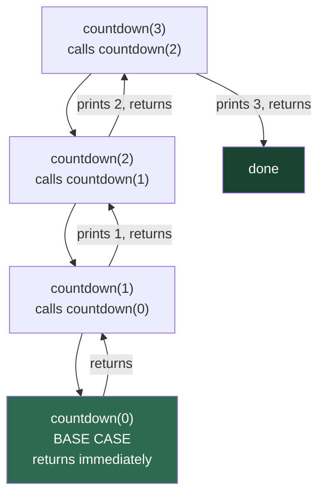

# Recursion

A function that calls itself — like two mirrors facing each other, creating infinite reflections. Each reflection is a smaller version of the whole, and somewhere, the reflections stop. That stopping point is what makes recursion useful rather than infinite.

Recursion is one of the most elegant ideas in computer science. Once it clicks, you will see it everywhere: file systems, trees, sorting algorithms, compilers, and natural language parsers all lean on it.

## The Core Idea

Every recursive solution has exactly two parts:

| Part | What it does | What happens without it |
|---|---|---|
| **Base case** | Stops the recursion | Infinite loop → stack overflow |
| **Recursive case** | Breaks the problem into a smaller version of itself | Nothing gets computed |

Think of it like Russian nesting dolls (matryoshka). You open a doll to find a smaller doll inside, and you keep opening until you reach a doll that cannot be opened — that is the base case.

## How the Call Stack Works

When a function calls itself, Python pushes a new frame onto the **call stack**. Each frame holds its own local variables and waits for the one below it to return. Once the base case is reached, the stack unwinds — each frame picks up where it left off.



Here it is in code:

```python,editable
def countdown(n):
    if n <= 0:          # base case — stop here
        print("Go!")
        return
    print(n)
    countdown(n - 1)    # recursive case — smaller problem

countdown(3)
```

## The Danger: Stack Overflow

Python keeps a limit on how deep the call stack can go (usually 1000 frames). If your base case is never reached — or the input is enormous — Python raises a `RecursionError`.

```python,editable
import sys

# Python's default recursion limit
print("Default recursion limit:", sys.getrecursionlimit())

# This function has no base case — it will crash
def infinite(n):
    return infinite(n + 1)

# Uncomment the line below to see the error:
# infinite(0)

print("Recursion errors happen when the stack gets too deep.")
print("Always make sure your base case is reachable!")
```

The fix is almost always one of:
1. Make sure the base case exists and is reachable.
2. Switch to an iterative solution for very deep inputs.
3. Use memoization so repeated calls do not re-enter the stack.

## The Two-Question Test

Before writing any recursive function, answer these two questions:

1. **What is the smallest version of this problem I can solve directly?** → That is your base case.
2. **How does solving a slightly smaller version help me solve the full version?** → That is your recursive case.

If you can answer both clearly, the code almost writes itself.

## In This Section

- **Factorial** — the cleanest first recursion example: call stack unwinding, iterative comparison, real-world combinatorics
- **Fibonacci Sequence** — why naive recursion can be dangerously slow, and how memoization rescues it
