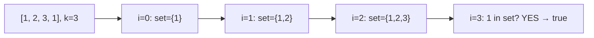

# Contains Duplicate II

**Difficulty:** Easy
**Source:** [NeetCode](https://neetcode.io/problems/contains-duplicate-ii)

## Problem

> Given an integer array `nums` and an integer `k`, return `true` if there are two distinct indices `i` and `j` in the array such that `nums[i] == nums[j]` and `abs(i - j) <= k`.
>
> **Example 1:**
> Input: nums = [1,2,3,1], k = 3
> Output: true
>
> **Example 2:**
> Input: nums = [1,0,1,1], k = 1
> Output: true
>
> **Example 3:**
> Input: nums = [1,2,3,1,2,3], k = 2
> Output: false
>
> **Constraints:**
> - 1 <= nums.length <= 10^5
> - -10^9 <= nums[i] <= 10^9
> - 0 <= k <= 10^5

## Prerequisites

Before attempting this problem, you should be comfortable with:

- **Hash Sets** — a data structure that stores unique elements and allows O(1) average-time lookups
- **Sliding Window** — a technique where you maintain a window of elements and slide it across the array

---

## 1. Brute Force

### Intuition
For every element, look back up to `k` positions and check if any earlier element has the same value. If we find a match within `k` distance, we can immediately return true. It's straightforward but does redundant work because we're re-examining the same pairs repeatedly.

### Algorithm
1. For each index `i`, iterate over the previous `k` indices (or from the start, whichever is closer).
2. If `nums[i] == nums[j]` for any `j` in that range, return `true`.
3. If no such pair is found after scanning the whole array, return `false`.

### Solution

```python,editable
def containsNearbyDuplicate_brute(nums, k):
    n = len(nums)
    for i in range(n):
        for j in range(max(0, i - k), i):
            if nums[i] == nums[j]:
                return True
    return False


# Test cases
print(containsNearbyDuplicate_brute([1, 2, 3, 1], 3))       # True
print(containsNearbyDuplicate_brute([1, 0, 1, 1], 1))       # True
print(containsNearbyDuplicate_brute([1, 2, 3, 1, 2, 3], 2)) # False
```

### Complexity
- Time: `O(n * k)` — for each of n elements we look back up to k positions
- Space: `O(1)` — no extra data structures

---

## 2. Sliding Window with Hash Set

### Intuition
Instead of checking backwards every time, maintain a sliding window of the last `k` elements in a hash set. When you move to a new element, check if it's already in the set (meaning an identical value exists within distance `k`). If the window grows beyond size `k`, evict the oldest element. This way each element is added and removed at most once.

### Algorithm
1. Initialize an empty set `window`.
2. For each index `i`:
   - If `nums[i]` is already in `window`, return `true`.
   - Add `nums[i]` to `window`.
   - If the window size exceeds `k`, remove `nums[i - k]` from the set to keep it at most size `k`.
3. Return `false` if no duplicate was found.



### Solution

```python,editable
def containsNearbyDuplicate(nums, k):
    window = set()
    for i, num in enumerate(nums):
        if num in window:
            return True
        window.add(num)
        # Evict the element that's now more than k steps behind
        if len(window) > k:
            window.remove(nums[i - k])
    return False


# Test cases
print(containsNearbyDuplicate([1, 2, 3, 1], 3))       # True
print(containsNearbyDuplicate([1, 0, 1, 1], 1))       # True
print(containsNearbyDuplicate([1, 2, 3, 1, 2, 3], 2)) # False
```

### Complexity
- Time: `O(n)` — each element is added and removed from the set at most once
- Space: `O(k)` — the set holds at most k+1 elements at any time

---

## Common Pitfalls

**Off-by-one on window eviction.** The window should hold at most `k` elements *before* checking the new one. Evict `nums[i - k]` after adding `nums[i]` — if you evict too early or too late, you'll either miss valid duplicates or allow pairs that are more than `k` apart.

**k = 0 edge case.** When k is 0, no two distinct indices can satisfy `abs(i - j) <= 0`, so the answer is always false. The algorithm handles this naturally because the window evicts its only element immediately after adding it.
