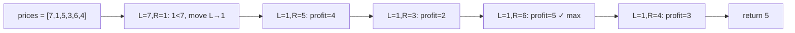

# Best Time to Buy and Sell Stock

**Difficulty:** Easy
**Source:** [NeetCode](https://neetcode.io/problems/best-time-to-buy-and-sell-stock)

## Problem

> You are given an array `prices` where `prices[i]` is the price of a given stock on the `i`th day. You want to maximize your profit by choosing a single day to buy one stock and choosing a different day in the future to sell that stock. Return the maximum profit you can achieve from this transaction. If you cannot achieve any profit, return `0`.
>
> **Example 1:**
> Input: prices = [7,1,5,3,6,4]
> Output: 5
>
> **Example 2:**
> Input: prices = [7,6,4,3,1]
> Output: 0
>
> **Constraints:**
> - 1 <= prices.length <= 10^5
> - 0 <= prices[i] <= 10^4

## Prerequisites

Before attempting this problem, you should be comfortable with:

- **Sliding Window (Two Pointers)** — maintaining a left and right pointer to track a range of interest
- **Greedy thinking** — making locally optimal choices (always buy at the lowest price seen so far)

---

## 1. Brute Force

### Intuition
Try every possible pair of buy and sell days. For each buy day `i`, check every sell day `j > i` and track the maximum profit. This is conceptually simple but very slow for large inputs.

### Algorithm
1. For each index `i` (buy day), iterate over every `j > i` (sell day).
2. Compute profit as `prices[j] - prices[i]`.
3. Track and return the maximum profit seen. If it never exceeds 0, return 0.

### Solution

```python,editable
def maxProfit_brute(prices):
    max_profit = 0
    n = len(prices)
    for i in range(n):
        for j in range(i + 1, n):
            profit = prices[j] - prices[i]
            max_profit = max(max_profit, profit)
    return max_profit


# Test cases
print(maxProfit_brute([7, 1, 5, 3, 6, 4]))  # 5
print(maxProfit_brute([7, 6, 4, 3, 1]))      # 0
print(maxProfit_brute([2, 4, 1]))            # 2
```

### Complexity
- Time: `O(n²)` — nested loops over all pairs
- Space: `O(1)` — only tracking a single max value

---

## 2. Sliding Window (One Pass)

### Intuition
Think of `left` as the buy pointer and `right` as the sell pointer. Move `right` forward one step at a time. Whenever the price at `right` drops below the price at `left`, there's no point holding onto that buy day — just move `left` to `right` because we found a cheaper buy price. At each step, calculate the profit and update the maximum. This is sliding window in disguise: we're maintaining a window `[left, right]` where `prices[left]` is the minimum seen so far.

### Algorithm
1. Initialize `left = 0`, `right = 1`, `max_profit = 0`.
2. While `right < len(prices)`:
   - If `prices[right] < prices[left]`, move `left = right` (found cheaper buy).
   - Otherwise, compute `profit = prices[right] - prices[left]` and update `max_profit`.
   - Advance `right`.
3. Return `max_profit`.



### Solution

```python,editable
def maxProfit(prices):
    left = 0           # buy pointer
    right = 1          # sell pointer
    max_profit = 0

    while right < len(prices):
        if prices[right] < prices[left]:
            # Found a cheaper day to buy — reset the buy pointer
            left = right
        else:
            profit = prices[right] - prices[left]
            max_profit = max(max_profit, profit)
        right += 1

    return max_profit


# Test cases
print(maxProfit([7, 1, 5, 3, 6, 4]))  # 5
print(maxProfit([7, 6, 4, 3, 1]))      # 0
print(maxProfit([2, 4, 1]))            # 2
```

### Complexity
- Time: `O(n)` — single pass through the array
- Space: `O(1)` — only a handful of variables

---

## Common Pitfalls

**Returning negative profit.** If prices only decrease, every `prices[right] - prices[left]` is negative. Initialize `max_profit = 0` (not `-infinity`) so you naturally return 0 when no profitable trade exists.

**Selling before buying.** The constraint is that you must buy before you sell — `left` always trails `right`, so the two-pointer approach naturally enforces this. Never swap or set `left > right`.

**Single element array.** With only one price, there's no sell day, so profit is 0. The while loop condition `right < len(prices)` handles this without any special casing.
