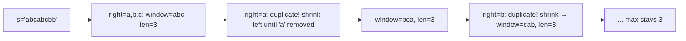

# Longest Substring Without Repeating Characters

**Difficulty:** Medium
**Source:** [NeetCode](https://neetcode.io/problems/longest-substring-without-repeating-characters)

## Problem

> Given a string `s`, find the length of the longest substring without repeating characters.
>
> **Example 1:**
> Input: s = "abcabcbb"
> Output: 3
>
> **Example 2:**
> Input: s = "bbbbb"
> Output: 1
>
> **Example 3:**
> Input: s = "pwwkew"
> Output: 3
>
> **Constraints:**
> - 0 <= s.length <= 5 * 10^4
> - `s` consists of English letters, digits, symbols and spaces

## Prerequisites

Before attempting this problem, you should be comfortable with:

- **Sliding Window** — dynamically resizing a window by moving left and right pointers
- **Hash Sets** — O(1) membership checks to detect duplicate characters

---

## 1. Brute Force

### Intuition
Generate every possible substring, check whether it has all unique characters, and track the longest one that passes the check. We pay O(n) for each uniqueness check on top of the O(n²) enumeration, making this quite slow.

### Algorithm
1. For each start index `i`, for each end index `j >= i`, extract the substring `s[i:j+1]`.
2. Check if all characters in that substring are unique (convert to a set and compare lengths).
3. Track the maximum length found.

### Solution

```python,editable
def lengthOfLongestSubstring_brute(s):
    max_len = 0
    n = len(s)
    for i in range(n):
        for j in range(i, n):
            substring = s[i:j + 1]
            if len(set(substring)) == len(substring):  # all unique
                max_len = max(max_len, len(substring))
    return max_len


# Test cases
print(lengthOfLongestSubstring_brute("abcabcbb"))  # 3
print(lengthOfLongestSubstring_brute("bbbbb"))     # 1
print(lengthOfLongestSubstring_brute("pwwkew"))    # 3
```

### Complexity
- Time: `O(n³)` — O(n²) substrings, each checked in O(n)
- Space: `O(n)` — storing the set for each substring check

---

## 2. Sliding Window with Hash Set

### Intuition
Instead of restarting from scratch for each substring, keep a window `[left, right]` that always contains unique characters. Expand the window by moving `right`. When a duplicate is detected (the new character is already in the set), shrink the window from the left until the duplicate is gone. The window is always valid, so we can update the answer at every step without extra checking.

### Algorithm
1. Initialize `left = 0`, an empty set `char_set`, and `max_len = 0`.
2. For each `right` in range `len(s)`:
   - While `s[right]` is already in `char_set`, remove `s[left]` and increment `left`.
   - Add `s[right]` to `char_set`.
   - Update `max_len = max(max_len, right - left + 1)`.
3. Return `max_len`.



### Solution

```python,editable
def lengthOfLongestSubstring(s):
    char_set = set()
    left = 0
    max_len = 0

    for right in range(len(s)):
        # Shrink from the left until the window has no duplicates
        while s[right] in char_set:
            char_set.remove(s[left])
            left += 1
        char_set.add(s[right])
        max_len = max(max_len, right - left + 1)

    return max_len


# Test cases
print(lengthOfLongestSubstring("abcabcbb"))  # 3
print(lengthOfLongestSubstring("bbbbb"))     # 1
print(lengthOfLongestSubstring("pwwkew"))    # 3
```

### Complexity
- Time: `O(n)` — each character is added and removed from the set at most once
- Space: `O(min(n, m))` — where m is the size of the character set (e.g., 128 for ASCII)

---

## Common Pitfalls

**Inner while loop vs if.** Use `while` not `if` when shrinking the window. A single character removal may not be enough — you need to keep removing from the left until the duplicate character is fully gone from the window.

**Empty string input.** If `s` is empty, `max_len` stays 0 and the loop never executes. That's the correct answer, so no special handling needed.

**Unicode / non-ASCII characters.** The hash set approach handles any character type, but the space complexity bound changes. For plain ASCII the set is bounded by 128; for arbitrary Unicode, it could be larger.
