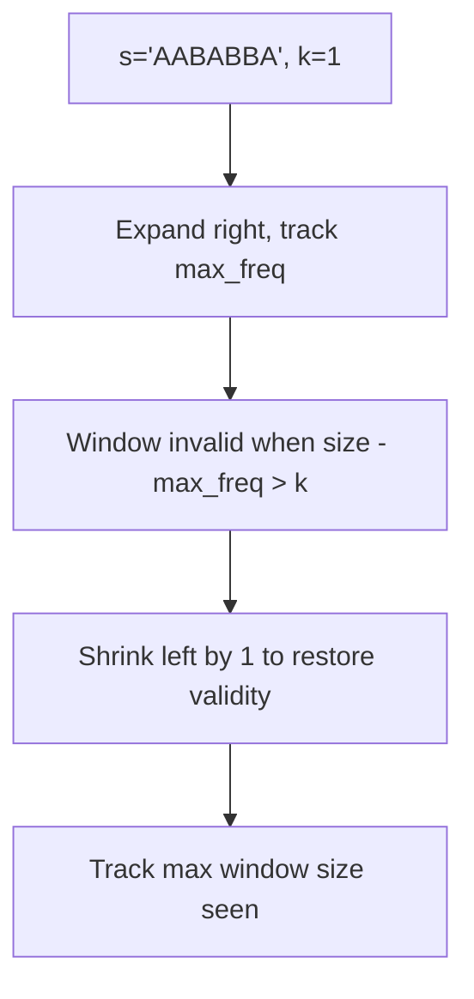

# Longest Repeating Character Replacement

**Difficulty:** Medium
**Source:** [NeetCode](https://neetcode.io/problems/longest-repeating-substring-with-replacement)

## Problem

> You are given a string `s` and an integer `k`. You can choose any character of the string and change it to any other uppercase English character. You can perform this operation at most `k` times. Return the length of the longest substring containing the same letter you can get after performing the above operations.
>
> **Example 1:**
> Input: s = "ABAB", k = 2
> Output: 4
>
> **Example 2:**
> Input: s = "AABABBA", k = 1
> Output: 4
>
> **Constraints:**
> - 1 <= s.length <= 10^5
> - s consists of only uppercase English letters
> - 0 <= k <= s.length

## Prerequisites

Before attempting this problem, you should be comfortable with:

- **Sliding Window** — variable-size window with expand/shrink logic
- **Frequency Counting** — using a dictionary or array to count character occurrences in the current window

---

## 1. Brute Force

### Intuition
Check every possible substring. For each one, count the most frequent character. The number of replacements needed is `window_size - max_freq`. If that's at most `k`, it's a valid window and we track its length.

### Algorithm
1. For each start `i` and end `j`, count character frequencies in `s[i:j+1]`.
2. Check if `(j - i + 1) - max(freq.values()) <= k`.
3. Track the maximum valid window length.

### Solution

```python,editable
def characterReplacement_brute(s, k):
    max_len = 0
    n = len(s)
    for i in range(n):
        freq = {}
        for j in range(i, n):
            freq[s[j]] = freq.get(s[j], 0) + 1
            window_size = j - i + 1
            if window_size - max(freq.values()) <= k:
                max_len = max(max_len, window_size)
    return max_len


# Test cases
print(characterReplacement_brute("ABAB", 2))     # 4
print(characterReplacement_brute("AABABBA", 1))  # 4
print(characterReplacement_brute("AAAA", 0))     # 4
```

### Complexity
- Time: `O(n²)` — two nested loops; frequency update is O(1) incremental
- Space: `O(1)` — at most 26 characters in the frequency map

---

## 2. Sliding Window

### Intuition
The key insight is: a window is valid if `window_size - count_of_most_frequent_char <= k`. In other words, the number of characters we'd need to replace (everything that isn't the dominant character) must be within our budget `k`. We expand the window greedily to the right and shrink from the left only when the window becomes invalid. We track `max_freq` — the highest character count seen in any window so far. Note that `max_freq` never decreases (we only ever grow the answer), which is what makes this O(n).

### Algorithm
1. Initialize `left = 0`, `freq = {}` (character counts in window), `max_freq = 0`, `max_len = 0`.
2. For each `right`:
   - Add `s[right]` to `freq` and update `max_freq`.
   - While `(right - left + 1) - max_freq > k`, shrink: decrement `freq[s[left]]`, move `left` right.
   - Update `max_len = max(max_len, right - left + 1)`.
3. Return `max_len`.



### Solution

```python,editable
def characterReplacement(s, k):
    freq = {}
    left = 0
    max_freq = 0
    max_len = 0

    for right in range(len(s)):
        freq[s[right]] = freq.get(s[right], 0) + 1
        # max_freq: highest frequency of any single char in current window
        max_freq = max(max_freq, freq[s[right]])

        # Characters to replace = window_size - max_freq
        # If replacements needed exceed k, shrink the window
        window_size = right - left + 1
        if window_size - max_freq > k:
            freq[s[left]] -= 1
            left += 1

        max_len = max(max_len, right - left + 1)

    return max_len


# Test cases
print(characterReplacement("ABAB", 2))     # 4
print(characterReplacement("AABABBA", 1))  # 4
print(characterReplacement("AAAA", 0))     # 4
```

### Complexity
- Time: `O(n)` — each character is visited by right once; left only moves forward
- Space: `O(1)` — frequency map has at most 26 entries

---

## Common Pitfalls

**max_freq never decreases — and that's intentional.** When we shrink the window, we don't recompute `max_freq`. This is fine because we're only interested in windows that are at least as large as the best we've seen. A smaller max_freq would just mean we'd shrink more, which can't give us a longer answer anyway.

**Confusing window_size - max_freq with the replacement count.** This formula counts how many non-dominant characters are in the window — the minimum replacements needed to make the whole window uniform. Make sure you're subtracting the right thing.

**Forgetting to shrink by exactly one.** When the window is invalid, you only move `left` by 1 (not a full while loop). Because `right` moves by 1 each iteration, the window size stays the same or grows — we never need to shrink by more than 1 per step.
