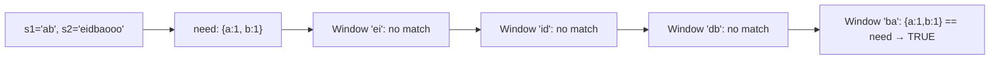

# Permutation in String

**Difficulty:** Medium
**Source:** [NeetCode](https://neetcode.io/problems/permutation-string)

## Problem

> Given two strings `s1` and `s2`, return `true` if `s2` contains a permutation of `s1`, or `false` otherwise. In other words, return `true` if one of `s1`'s permutations is a substring of `s2`.
>
> **Example 1:**
> Input: s1 = "ab", s2 = "eidbaooo"
> Output: true
>
> **Example 2:**
> Input: s1 = "ab", s2 = "eidboaoo"
> Output: false
>
> **Constraints:**
> - 1 <= s1.length, s2.length <= 10^4
> - s1 and s2 consist of lowercase English letters

## Prerequisites

Before attempting this problem, you should be comfortable with:

- **Fixed Sliding Window** — a window of constant size that slides across a string
- **Frequency Maps** — comparing character count dictionaries to check for anagrams

---

## 1. Brute Force

### Intuition
For every substring of `s2` that has the same length as `s1`, check if the two are anagrams by comparing their sorted versions (or frequency maps). Checking each window takes O(m) time where m = len(s1), making this approach slow overall.

### Algorithm
1. Compute the length `m = len(s1)`.
2. For each starting index `i` in `s2` where a window of size `m` fits:
   - Extract `s2[i:i+m]` and check if it's an anagram of `s1` (compare sorted strings or Counter objects).
3. Return `true` if any window matches, otherwise `false`.

### Solution

```python,editable
def checkInclusion_brute(s1, s2):
    m = len(s1)
    target = sorted(s1)
    for i in range(len(s2) - m + 1):
        if sorted(s2[i:i + m]) == target:
            return True
    return False


# Test cases
print(checkInclusion_brute("ab", "eidbaooo"))  # True
print(checkInclusion_brute("ab", "eidboaoo"))  # False
print(checkInclusion_brute("aab", "lecaabee")) # True
```

### Complexity
- Time: `O(n * m log m)` — for each of n windows, sorting takes O(m log m)
- Space: `O(m)` — storing sorted target and current window

---

## 2. Fixed Sliding Window with Frequency Arrays

### Intuition
A permutation of `s1` is just any arrangement of the same characters with the same counts. So instead of sorting, compare frequency counts. Use a fixed-size window of length `len(s1)` that slides across `s2`. When the window slides by one position, update the frequency counts by adding the new right character and removing the old left character. Compare counts at each position. Comparing two 26-element arrays is O(26) = O(1), making the whole thing linear.

### Algorithm
1. Build frequency arrays `need` (for s1) and `have` (for the first window of s2).
2. If they match immediately, return `true`.
3. Slide the window across `s2`:
   - Add the new right character to `have`.
   - Remove the old left character from `have`.
   - If `have == need`, return `true`.
4. Return `false`.



### Solution

```python,editable
def checkInclusion(s1, s2):
    if len(s1) > len(s2):
        return False

    m = len(s1)
    # Frequency arrays for 26 lowercase letters
    need = [0] * 26
    have = [0] * 26

    for ch in s1:
        need[ord(ch) - ord('a')] += 1

    # Initialize the first window
    for ch in s2[:m]:
        have[ord(ch) - ord('a')] += 1

    if have == need:
        return True

    # Slide the window
    for i in range(m, len(s2)):
        # Add new right character
        have[ord(s2[i]) - ord('a')] += 1
        # Remove old left character
        have[ord(s2[i - m]) - ord('a')] -= 1

        if have == need:
            return True

    return False


# Test cases
print(checkInclusion("ab", "eidbaooo"))  # True
print(checkInclusion("ab", "eidboaoo"))  # False
print(checkInclusion("aab", "lecaabee")) # True
```

### Complexity
- Time: `O(26 * n)` = `O(n)` — sliding the window is O(n), each comparison is O(26)
- Space: `O(1)` — two fixed-size arrays of length 26

---

## Common Pitfalls

**Using a Counter/dict comparison.** This works correctly but dict comparison in Python compares all keys and values, which is fine. However, the array approach makes the O(1) comparison per step more explicit.

**len(s1) > len(s2).** If s1 is longer than s2, no permutation can fit. Guard against this early, otherwise the slice `s2[:m]` might behave unexpectedly.

**Window boundary.** The initial window covers indices `[0, m-1]`. When sliding, `i` goes from `m` to `len(s2)-1`, and the character leaving the window is at `i - m`. Make sure the removal index is `i - m`, not `i - m - 1`.
