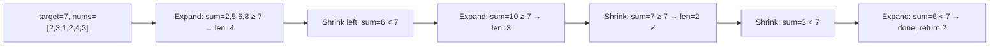

# Minimum Size Subarray Sum

**Difficulty:** Medium
**Source:** [NeetCode](https://neetcode.io/problems/minimum-size-subarray-sum)

## Problem

> Given an array of positive integers `nums` and a positive integer `target`, return the minimal length of a subarray whose sum is greater than or equal to `target`. If there is no such subarray, return `0` instead.
>
> **Example 1:**
> Input: target = 7, nums = [2,3,1,2,4,3]
> Output: 2
>
> **Example 2:**
> Input: target = 4, nums = [1,4,4]
> Output: 1
>
> **Example 3:**
> Input: target = 11, nums = [1,1,1,1,1,1,1,1]
> Output: 0
>
> **Constraints:**
> - 1 <= target <= 10^9
> - 1 <= nums.length <= 10^5
> - 1 <= nums[i] <= 10^4

## Prerequisites

Before attempting this problem, you should be comfortable with:

- **Variable Sliding Window** — a window that expands and contracts based on a condition
- **Greedy shrinking** — once the current window satisfies the constraint, try to make it as small as possible

---

## 1. Brute Force

### Intuition
Try every possible subarray: for each starting index, keep extending the end index until the sum meets or exceeds the target. Track the shortest such subarray. Since all numbers are positive, the sum only grows as we extend, so we can stop extending early once the condition is met.

### Algorithm
1. For each start index `i`, accumulate a running sum by adding elements one by one.
2. As soon as the sum `>= target`, record the window length and break the inner loop.
3. Return the minimum length found, or 0 if none was found.

### Solution

```python,editable
def minSubArrayLen_brute(target, nums):
    n = len(nums)
    min_len = float('inf')

    for i in range(n):
        current_sum = 0
        for j in range(i, n):
            current_sum += nums[j]
            if current_sum >= target:
                min_len = min(min_len, j - i + 1)
                break  # Can't shrink further from the left in this pass

    return min_len if min_len != float('inf') else 0


# Test cases
print(minSubArrayLen_brute(7, [2, 3, 1, 2, 4, 3]))     # 2
print(minSubArrayLen_brute(4, [1, 4, 4]))               # 1
print(minSubArrayLen_brute(11, [1, 1, 1, 1, 1, 1, 1, 1])) # 0
```

### Complexity
- Time: `O(n²)` — two nested loops in the worst case
- Space: `O(1)` — only a few variables

---

## 2. Variable Sliding Window

### Intuition
Since all numbers are positive, the window sum only increases as we expand right and only decreases as we shrink left. This monotonic property is what makes the sliding window work. Expand the right pointer to grow the sum. Once the sum hits the target, greedily shrink from the left to find the minimum window that still satisfies the condition. Then move right again.

### Algorithm
1. Initialize `left = 0`, `current_sum = 0`, `min_len = infinity`.
2. For each `right` in `range(len(nums))`:
   - Add `nums[right]` to `current_sum`.
   - While `current_sum >= target`:
     - Update `min_len = min(min_len, right - left + 1)`.
     - Subtract `nums[left]` from `current_sum` and increment `left`.
3. Return `min_len` if it was updated, otherwise `0`.



### Solution

```python,editable
def minSubArrayLen(target, nums):
    left = 0
    current_sum = 0
    min_len = float('inf')

    for right in range(len(nums)):
        current_sum += nums[right]

        # Shrink the window as long as it satisfies the condition
        while current_sum >= target:
            min_len = min(min_len, right - left + 1)
            current_sum -= nums[left]
            left += 1

    return min_len if min_len != float('inf') else 0


# Test cases
print(minSubArrayLen(7, [2, 3, 1, 2, 4, 3]))        # 2
print(minSubArrayLen(4, [1, 4, 4]))                  # 1
print(minSubArrayLen(11, [1, 1, 1, 1, 1, 1, 1, 1])) # 0
```

### Complexity
- Time: `O(n)` — each element is added once and removed at most once
- Space: `O(1)` — just a few pointers and a running sum

---

## Common Pitfalls

**This only works because all numbers are positive.** If `nums` could contain zeros or negatives, shrinking the window wouldn't necessarily decrease the sum, and the sliding window approach would break down.

**Updating min_len inside the while loop, not after.** The update must happen *before* you shrink the window — you want to record the length while the window still satisfies the condition, then try to make it smaller.

**Returning 0 vs infinity.** Initialize `min_len` to `float('inf')` so you can detect the case where no valid subarray was found. Only convert to `0` at the return statement.
