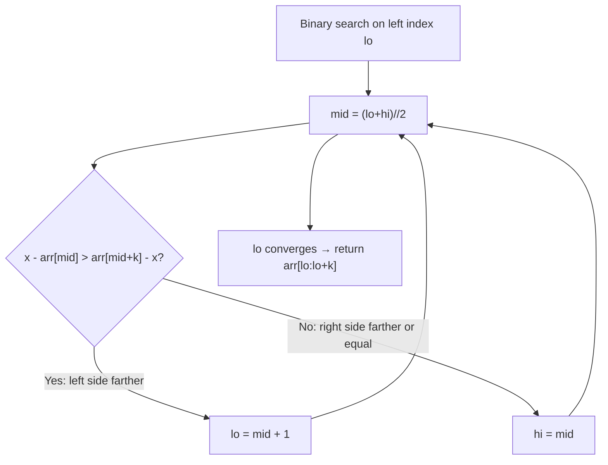

# Find K Closest Elements

**Difficulty:** Medium
**Source:** [NeetCode](https://neetcode.io/problems/find-k-closest-elements)

## Problem

> Given a sorted integer array `arr`, two integers `k` and `x`, return the `k` closest integers to `x` in the array. The result should also be sorted in ascending order. An integer `a` is closer to `x` than an integer `b` if `|a - x| < |b - x|`, or `|a - x| == |b - x|` and `a < b`.
>
> **Example 1:**
> Input: arr = [1,2,3,4,5], k = 4, x = 3
> Output: [1,2,3,4]
>
> **Example 2:**
> Input: arr = [1,2,3,4,5], k = 4, x = -1
> Output: [1,2,3,4]
>
> **Constraints:**
> - 1 <= k <= arr.length <= 10^4
> - arr is sorted in ascending order
> - -10^4 <= arr[i], x <= 10^4

## Prerequisites

Before attempting this problem, you should be comfortable with:

- **Binary Search** — efficient searching in sorted arrays
- **Sliding Window** — maintaining a fixed-size window; here we find where to position it
- **Tie-breaking rules** — when two elements are equally close, prefer the smaller one

---

## 1. Brute Force (Sort by Distance)

### Intuition
Sort all elements by their distance to `x` (with ties broken by the element value itself). Take the first `k` elements from that sorted list, then re-sort them in ascending order to get the answer. Simple to reason about, but sorting the whole array to find k elements is wasteful.

### Algorithm
1. Sort `arr` by the key `(abs(a - x), a)` — distance first, value as tiebreaker.
2. Take the first `k` elements.
3. Sort those `k` elements and return.

### Solution

```python,editable
def findClosestElements_brute(arr, k, x):
    # Sort by distance to x, then by value for ties
    sorted_by_dist = sorted(arr, key=lambda a: (abs(a - x), a))
    result = sorted(sorted_by_dist[:k])
    return result


# Test cases
print(findClosestElements_brute([1, 2, 3, 4, 5], 4, 3))   # [1, 2, 3, 4]
print(findClosestElements_brute([1, 2, 3, 4, 5], 4, -1))  # [1, 2, 3, 4]
print(findClosestElements_brute([1, 2, 3, 4, 5], 4, 5))   # [2, 3, 4, 5]
```

### Complexity
- Time: `O(n log n)` — sorting the array plus sorting k results
- Space: `O(n)` — storing the sorted copy

---

## 2. Binary Search on Left Boundary

### Intuition
Since the array is sorted, the answer is always a contiguous window of size `k`. We just need to find where that window starts. Binary search on the left boundary `mid` of the window: if `x - arr[mid] > arr[mid + k] - x`, the window should slide right (the left element is farther from x than the right element just outside the window). Otherwise, slide left. This neatly finds the optimal left index in O(log(n-k)) time.

### Algorithm
1. Binary search for the left boundary:
   - `lo = 0`, `hi = len(arr) - k`
   - While `lo < hi`, compute `mid = (lo + hi) // 2`.
   - If `x - arr[mid] > arr[mid + k] - x`, set `lo = mid + 1` (slide right).
   - Else set `hi = mid` (slide left or stay).
2. Return `arr[lo:lo + k]`.



### Solution

```python,editable
def findClosestElements(arr, k, x):
    lo = 0
    hi = len(arr) - k  # right boundary of search: window can start at most here

    while lo < hi:
        mid = (lo + hi) // 2
        # Compare left edge arr[mid] vs right edge arr[mid+k] (just outside window)
        if x - arr[mid] > arr[mid + k] - x:
            # Left element is farther → shift window to the right
            lo = mid + 1
        else:
            # Right element is farther or equidistant (prefer smaller → stay left)
            hi = mid

    return arr[lo:lo + k]


# Test cases
print(findClosestElements([1, 2, 3, 4, 5], 4, 3))   # [1, 2, 3, 4]
print(findClosestElements([1, 2, 3, 4, 5], 4, -1))  # [1, 2, 3, 4]
print(findClosestElements([1, 2, 3, 4, 5], 4, 5))   # [2, 3, 4, 5]
```

### Complexity
- Time: `O(log(n - k) + k)` — binary search plus slicing k elements
- Space: `O(1)` extra (output excluded)

---

## Common Pitfalls

**Binary search range is `[0, n - k]`, not `[0, n - 1]`.** The window of size `k` must fit entirely in the array, so the left boundary can be at most `n - k`. Searching beyond that causes index-out-of-bounds when accessing `arr[mid + k]`.

**The tie-breaking direction.** When `x - arr[mid] == arr[mid + k] - x`, the problem says prefer the smaller value. Since `arr[mid] < arr[mid + k]` (sorted array), we prefer `arr[mid]`, meaning we keep `hi = mid` (not `lo = mid + 1`). The `>` (strict greater-than) in the condition handles this correctly.

**Confusing mid+k as inside vs outside the window.** `arr[lo:lo+k]` means indices `lo, lo+1, ..., lo+k-1`. So `arr[mid+k]` is the element just *outside* the window's right edge — it's the candidate that gets added if we shift right.
