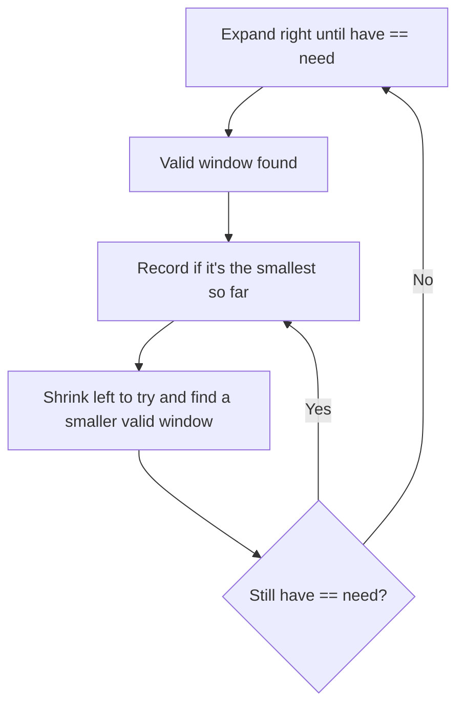

# Minimum Window Substring

**Difficulty:** Hard
**Source:** [NeetCode](https://neetcode.io/problems/minimum-window-with-characters)

## Problem

> Given two strings `s` and `t` of lengths `m` and `n` respectively, return the minimum window substring of `s` such that every character in `t` (including duplicates) is included in the window. If there is no such substring, return the empty string `""`. The test cases will be generated such that the answer is unique.
>
> **Example 1:**
> Input: s = "ADOBECODEBANC", t = "ABC"
> Output: "BANC"
>
> **Example 2:**
> Input: s = "a", t = "a"
> Output: "a"
>
> **Example 3:**
> Input: s = "a", t = "aa"
> Output: ""
>
> **Constraints:**
> - m == s.length, n == t.length
> - 1 <= m, n <= 10^5
> - s and t consist of uppercase and lowercase English letters

## Prerequisites

Before attempting this problem, you should be comfortable with:

- **Variable Sliding Window** — expand right to find a valid window, shrink left to minimize it
- **Frequency Maps** — tracking character counts for both the target and the current window
- **need/have counters** — a clever trick to avoid comparing full dictionaries on each step

---

## 1. Brute Force

### Intuition
Generate every possible substring of `s` and check if it contains all characters of `t` (with correct multiplicity). Keep the shortest valid one. This is simple to code but extremely slow for large inputs.

### Algorithm
1. For each pair `(i, j)`, extract substring `s[i:j+1]`.
2. For each character in `t`, confirm its count in the substring is at least as large.
3. Track the minimum length valid substring and return it.

### Solution

```python,editable
from collections import Counter

def minWindow_brute(s, t):
    if not t or not s:
        return ""

    need = Counter(t)
    best = ""

    for i in range(len(s)):
        for j in range(i, len(s)):
            window = s[i:j + 1]
            window_count = Counter(window)
            # Check if window satisfies all requirements
            if all(window_count[ch] >= need[ch] for ch in need):
                if best == "" or len(window) < len(best):
                    best = window

    return best


# Test cases
print(minWindow_brute("ADOBECODEBANC", "ABC"))  # "BANC"
print(minWindow_brute("a", "a"))                 # "a"
print(minWindow_brute("a", "aa"))                # ""
```

### Complexity
- Time: `O(n² * m)` — O(n²) substrings, each validated in O(m)
- Space: `O(n + m)` — Counter objects

---

## 2. Variable Sliding Window with need/have

### Intuition
Use two pointers. Expand `right` to collect characters until the window satisfies all of `t`'s requirements. Then greedily shrink `left` to find the smallest valid window. When shrinking makes the window invalid, expand `right` again. The trick to avoid full dictionary comparison on every step: track `need` (how many distinct chars still required) and `have` (how many we've satisfied). When `have == need`, the window is valid.

### Algorithm
1. Build `count_t` (frequency of each char in t). Set `need = len(count_t)` (distinct chars needed), `have = 0`.
2. Use `window = {}` for the current window's char counts, `left = 0`, and track best window `(length, left, right)`.
3. For each `right`:
   - Add `s[right]` to `window`. If `window[s[right]] == count_t[s[right]]`, increment `have`.
   - While `have == need` (window is valid):
     - Update best if current window is smaller.
     - Remove `s[left]` from `window`; if it drops below requirement, decrement `have`.
     - Increment `left`.
4. Return the best substring.



### Solution

```python,editable
from collections import defaultdict

def minWindow(s, t):
    if not t or not s:
        return ""

    count_t = {}
    for ch in t:
        count_t[ch] = count_t.get(ch, 0) + 1

    need = len(count_t)   # number of distinct chars in t we must satisfy
    have = 0              # number of distinct chars currently satisfied in window

    window = defaultdict(int)
    best_len = float('inf')
    best_left = 0

    left = 0
    for right in range(len(s)):
        ch = s[right]
        window[ch] += 1

        # Check if this char's requirement is now fully met
        if ch in count_t and window[ch] == count_t[ch]:
            have += 1

        # Shrink the window as long as it remains valid
        while have == need:
            # Update best window
            if right - left + 1 < best_len:
                best_len = right - left + 1
                best_left = left

            # Remove the leftmost character
            left_ch = s[left]
            window[left_ch] -= 1
            if left_ch in count_t and window[left_ch] < count_t[left_ch]:
                have -= 1
            left += 1

    return s[best_left:best_left + best_len] if best_len != float('inf') else ""


# Test cases
print(minWindow("ADOBECODEBANC", "ABC"))  # "BANC"
print(minWindow("a", "a"))                # "a"
print(minWindow("a", "aa"))               # ""
```

### Complexity
- Time: `O(n)` — right moves across s once; left also moves across s at most once
- Space: `O(m + n)` — count_t and window dictionaries

---

## Common Pitfalls

**Tracking `have` correctly.** Increment `have` only when `window[ch]` hits *exactly* `count_t[ch]` — not every time you add a character. Similarly, decrement `have` only when dropping below the requirement, not on every removal.

**Characters in s but not in t.** Characters not in `count_t` go into `window` but never affect `have`. That's fine — they're tracked in case we need to remove them, but they don't change validity.

**Updating best inside the while loop, before shrinking.** Record the best window *before* you remove `s[left]`. Moving left first would shrink the window and give you the wrong substring boundaries.

**Returning the right substring.** Track `best_left` and `best_len` as indices, then slice at the end. Storing the actual string at every update is wasteful and tricky to get right mid-shrink.
