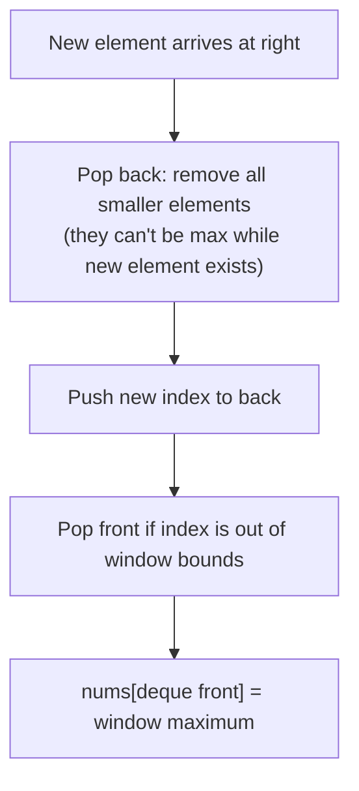

# Sliding Window Maximum

**Difficulty:** Hard
**Source:** [NeetCode](https://neetcode.io/problems/sliding-window-maximum)

## Problem

> You are given an array of integers `nums`, and there is a sliding window of size `k` which is moving from the very left of the array to the very right. You can only see the `k` numbers in the window. Each time the sliding window moves right by one position, return the maximum value in each window position.
>
> **Example 1:**
> Input: nums = [1,3,-1,-3,5,3,6,7], k = 3
> Output: [3,3,5,5,6,7]
>
> **Example 2:**
> Input: nums = [1], k = 1
> Output: [1]
>
> **Constraints:**
> - 1 <= nums.length <= 10^5
> - -10^4 <= nums[i] <= 10^4
> - 1 <= k <= nums.length

## Prerequisites

Before attempting this problem, you should be comfortable with:

- **Deque (double-ended queue)** — a data structure supporting O(1) append and pop from both ends
- **Monotonic Deque** — a deque where elements are kept in a specific order (here: decreasing) to efficiently answer range queries

---

## 1. Brute Force

### Intuition
For each window position, scan all `k` elements in the window and find the maximum. Simple and correct, but recalculates from scratch for every window position — a lot of redundant work.

### Algorithm
1. For each starting index `i` from `0` to `n - k`:
   - Compute `max(nums[i:i+k])`.
   - Append to result.
2. Return result.

### Solution

```python,editable
def maxSlidingWindow_brute(nums, k):
    result = []
    n = len(nums)
    for i in range(n - k + 1):
        result.append(max(nums[i:i + k]))
    return result


# Test cases
print(maxSlidingWindow_brute([1, 3, -1, -3, 5, 3, 6, 7], 3))  # [3, 3, 5, 5, 6, 7]
print(maxSlidingWindow_brute([1], 1))                           # [1]
print(maxSlidingWindow_brute([9, 8, 7, 6], 2))                 # [9, 8, 7]
```

### Complexity
- Time: `O(n * k)` — n window positions, each requiring O(k) to find max
- Space: `O(1)` extra (excluding output)

---

## 2. Monotonic Deque

### Intuition
Maintain a deque of *indices* where the corresponding values are in decreasing order. The front of the deque is always the index of the maximum element in the current window. When we slide right:
- **Add the new element:** pop from the back any indices whose values are smaller than the new element — they can never be the maximum while the new element is in the window.
- **Remove stale elements:** if the front index is outside the current window (index <= i - k), pop it from the front.
- **Record the max:** `nums[deque[0]]` is always the window max.

The deque stays in decreasing order of values, so the max is always at the front.

### Algorithm
1. Initialize an empty deque `dq` (stores indices) and result list.
2. For each index `i`:
   - While `dq` is not empty and `nums[dq[-1]] <= nums[i]`, pop from the back.
   - Append `i` to the back of `dq`.
   - Pop from the front if `dq[0] <= i - k` (out of window).
   - Once `i >= k - 1` (first full window), append `nums[dq[0]]` to result.
3. Return result.



### Solution

```python,editable
from collections import deque

def maxSlidingWindow(nums, k):
    dq = deque()   # stores indices; values are in decreasing order
    result = []

    for i in range(len(nums)):
        # Remove elements from the back that are smaller than current
        # (they're useless — current is bigger and will outlast them in the window)
        while dq and nums[dq[-1]] <= nums[i]:
            dq.pop()
        dq.append(i)

        # Remove the front element if it's slid out of the window
        if dq[0] <= i - k:
            dq.popleft()

        # Start recording results once the first full window is formed
        if i >= k - 1:
            result.append(nums[dq[0]])

    return result


# Test cases
print(maxSlidingWindow([1, 3, -1, -3, 5, 3, 6, 7], 3))  # [3, 3, 5, 5, 6, 7]
print(maxSlidingWindow([1], 1))                           # [1]
print(maxSlidingWindow([9, 8, 7, 6], 2))                 # [9, 8, 7]
```

### Complexity
- Time: `O(n)` — each index is added to the deque once and removed at most once
- Space: `O(k)` — the deque holds at most k indices at any time

---

## Common Pitfalls

**Storing indices, not values, in the deque.** You need the index to check whether a front element has slid out of the window. If you store values, you can't do this check. Always store indices and look up values with `nums[dq[...]]`.

**Pop condition uses `<=` not `<`.** Use `nums[dq[-1]] <= nums[i]` when cleaning the back. If you use strict `<`, you keep duplicate maxima in the deque. Both work for correctness but `<=` keeps the deque smaller.

**Window boundary check: `dq[0] <= i - k`.** The window for position `i` is `[i-k+1, i]`. An index `j` is out of bounds when `j < i - k + 1`, i.e., `j <= i - k`. Make sure the boundary math is right; off-by-one here gives wrong answers on the first or last window.

**Result collection starts at `i = k - 1`.** Only start appending to result once the first complete window exists (after processing at least k elements).
