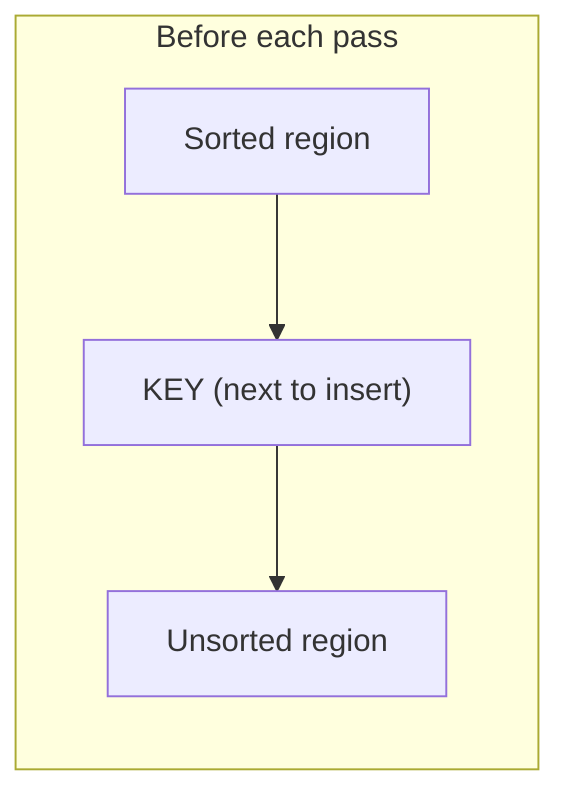
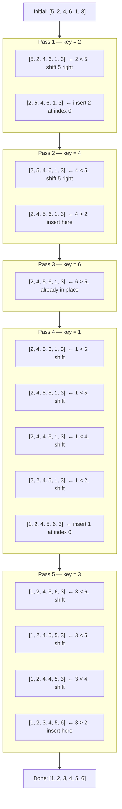

# Insertion Sort

This is exactly how you sort playing cards in your hand. You pick up one card at a time and slide it left until it lands in the right spot among the cards you already hold. Every human does this instinctively — and now you will teach a computer to do it too.

## The Core Idea

Imagine the array is split into two regions: a **sorted left side** and an **unsorted right side**. At each step, we take the first element from the unsorted side — call it the **key** — and insert it into its correct position in the sorted side by shifting larger elements one step to the right.



## Step-by-Step on [5, 2, 4, 6, 1, 3]



## Implementation

```python,editable
def insertion_sort(arr):
    # Work on a copy so we don't mutate the original
    arr = arr[:]

    # The sorted region starts with just arr[0].
    # We grow it one element at a time.
    for i in range(1, len(arr)):
        key = arr[i]      # The element we are about to insert
        j = i - 1         # Start comparing from the rightmost sorted element

        # Shift every sorted element that is larger than key one step right.
        # This opens up a slot for key.
        while j >= 0 and arr[j] > key:
            arr[j + 1] = arr[j]
            j -= 1

        # j+1 is now the correct position for key
        arr[j + 1] = key

    return arr


# --- Demo ---
data = [5, 2, 4, 6, 1, 3]
print("Before:", data)
print("After: ", insertion_sort(data))

# Nearly-sorted data — very fast!
nearly_sorted = [1, 2, 4, 3, 5, 6]
print("\nNearly sorted before:", nearly_sorted)
print("Nearly sorted after: ", insertion_sort(nearly_sorted))
```

## Time and Space Complexity

| Case | When it happens | Operations |
|---|---|---|
| Best — O(n) | Already sorted. Inner while never runs. | n comparisons, 0 swaps |
| Average — O(n²) | Random data | ~n²/4 comparisons |
| Worst — O(n²) | Reverse sorted: [6,5,4,3,2,1] | ~n²/2 comparisons |

Space: **O(1)** — sorting happens in-place with only a few extra variables.

## Why the best case is O(n)

When the array is already sorted, the `while` condition `arr[j] > key` is immediately false for every pass. The outer loop still runs n-1 times, but the inner loop does zero work each time — giving exactly n-1 comparisons total, which is O(n).

## When to use Insertion Sort

**Use it when:**
- The array has fewer than ~50 elements (constant factors dominate at small sizes).
- The data is nearly sorted — even one or two elements out of place is fine.
- You need a stable sort with no extra memory.
- You need to sort a stream of incoming elements one at a time (online algorithm).

**Avoid it when:**
- n is large (thousands+) and data is random — O(n²) will be painfully slow.

## Real-world appearances

- **Python's Timsort** uses insertion sort on small subarrays (runs of fewer than 64 elements) before merging. This is why Python's built-in `sorted()` is so fast on real-world data.
- **Database indexes** — when inserting a new row into a small, already-indexed B-tree leaf, the database effectively runs insertion sort to keep keys ordered.
- **Card games and board game AI** — any program that maintains a small sorted hand of items and inserts new ones one at a time.
