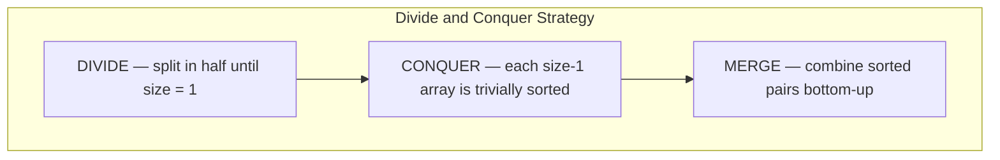
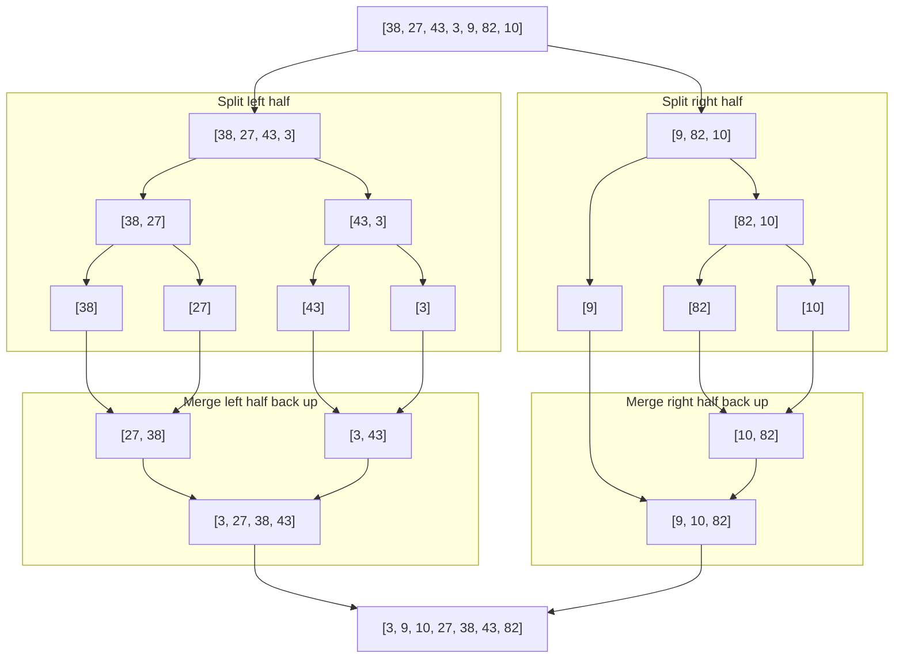
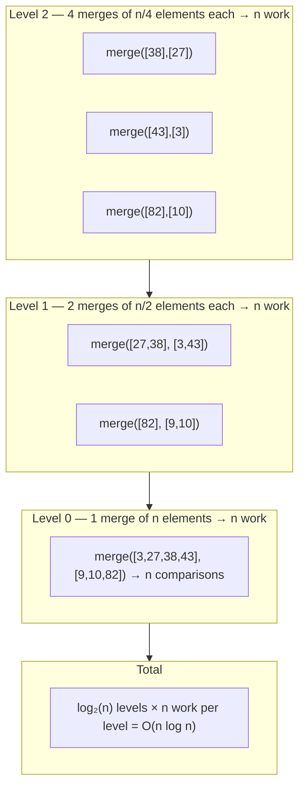

# Merge Sort

Divide and conquer — split the problem in half until it's trivial, then combine. Merge sort is the clearest real-world example of this technique: break the array in half, sort each half recursively, then merge the two sorted halves back together. The magic is in the merge step.

## The Core Idea

A single-element array is already sorted. That's the base case. Merge sort works backwards from there: if you have two sorted arrays, you can combine them into one sorted array in O(n) time by just comparing the front elements and taking the smaller one each time.



## Full Split and Merge Tree for [38, 27, 43, 3, 9, 82, 10]



## The Merge Step in Detail

The merge step is where the real work happens. Given two sorted arrays, we pick the smaller front element each time:

```mermaid
flowchart LR
    subgraph Input["Two sorted halves"]
        Left["Left:  [3, 27, 38, 43]\n         ^\n         i"]
        Right["Right: [9, 10, 82]\n          ^\n          j"]
    end

    subgraph Steps["Merge steps"]
        S1["Compare 3 vs 9  → take 3   → result: [3]"]
        S2["Compare 27 vs 9 → take 9   → result: [3, 9]"]
        S3["Compare 27 vs 10→ take 10  → result: [3, 9, 10]"]
        S4["Compare 27 vs 82→ take 27  → result: [3, 9, 10, 27]"]
        S5["Compare 38 vs 82→ take 38  → result: [3, 9, 10, 27, 38]"]
        S6["Compare 43 vs 82→ take 43  → result: [3, 9, 10, 27, 38, 43]"]
        S7["Left exhausted  → append 82 → result: [3, 9, 10, 27, 38, 43, 82]"]
    end

    Input --> S1 --> S2 --> S3 --> S4 --> S5 --> S6 --> S7
```



## Implementation

```python,editable
def merge_sort(nums):
    # Base case: a list of 0 or 1 elements is already sorted
    if len(nums) <= 1:
        return nums[:]

    # DIVIDE — find the midpoint and split
    mid = len(nums) // 2
    left = merge_sort(nums[:mid])   # Recursively sort the left half
    right = merge_sort(nums[mid:])  # Recursively sort the right half

    # MERGE — combine two sorted halves into one sorted list
    return merge(left, right)


def merge(left, right):
    result = []
    i = 0  # Pointer into left
    j = 0  # Pointer into right

    # Compare front elements; always take the smaller one
    while i < len(left) and j < len(right):
        if left[i] <= right[j]:
            result.append(left[i])
            i += 1
        else:
            result.append(right[j])
            j += 1

    # One side is exhausted — append the remainder of the other side
    result.extend(left[i:])
    result.extend(right[j:])
    return result


# --- Demo ---
data = [38, 27, 43, 3, 9, 82, 10]
print("Before:", data)
print("After: ", merge_sort(data))

# Merge sort handles all cases equally well
print("\nReverse sorted:", merge_sort([6, 5, 4, 3, 2, 1]))
print("Already sorted:", merge_sort([1, 2, 3, 4, 5, 6]))
print("Duplicates:    ", merge_sort([3, 1, 4, 1, 5, 9, 2, 6]))
```

## Why O(n log n)?

The key insight is that the recursion tree has **log n levels** (because we halve the array each time), and each level does **O(n) total work** in the merge step.



For n=7: log₂(7) ≈ 3 levels × 7 work per level = ~21 operations. Compare that to insertion sort's worst case of 7² = 49.

## Time and Space Complexity

| Case | Time | Why |
|---|---|---|
| Best | O(n log n) | Always splits and merges the same way |
| Average | O(n log n) | Same structure regardless of input |
| Worst | O(n log n) | Guaranteed — no bad pivot problem |

**Space: O(n)** — merge sort needs an auxiliary array of size n to hold the merged result. This is the trade-off vs. in-place algorithms.

**Stable:** Yes — when `left[i] <= right[j]`, we take from the left. Equal elements preserve their original order.

## When to use Merge Sort

**Use it when:**
- You need a guaranteed O(n log n) worst case (Quick Sort can degrade to O(n²)).
- Stability matters — you need equal elements to stay in their original order.
- You are sorting a linked list (merge sort works naturally; Quick Sort does not).
- Data doesn't fit in RAM — **external merge sort** splits a huge file into sorted chunks, writes them to disk, then merges the chunk files. This is how databases sort tables too large to fit in memory.

**Trade-off:** Requires O(n) extra space for the temporary merged array.

## Real-world appearances

- **Python's Timsort** (used by `sorted()` and `list.sort()`) is a hybrid of merge sort and insertion sort. It finds naturally ordered runs in the data and merges them — making it extremely fast on real-world data.
- **External sorting** — merge sort is the foundation of every large-scale sort that uses disk or distributed storage. MapReduce's shuffle-and-sort phase is essentially a distributed merge sort.
- **Inversion counting** — a classic interview problem solved by modifying the merge step to count how many times we pick from the right before the left.
