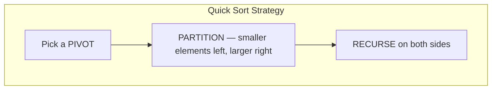
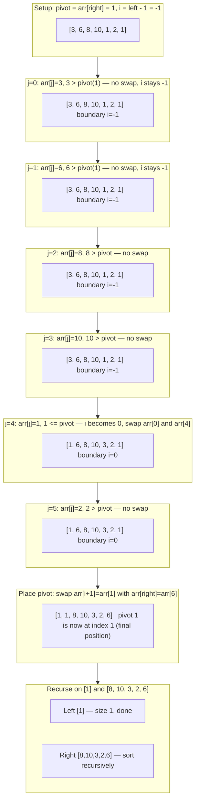

# Quick Sort

The fastest sorting algorithm in practice — used by C's `qsort()`, Java's `Arrays.sort()` for primitives, and the internals of most standard libraries. Quick sort is O(n log n) on average with tiny constant factors and sorts **in-place**, meaning it needs no extra array. That combination makes it the default choice for general-purpose sorting.

## The Core Idea

Pick an element called the **pivot**. Rearrange the array so that:
- Every element **less than or equal to the pivot** is to its left.
- Every element **greater than the pivot** is to its right.
- The pivot is now in its **final sorted position**.

Then recursively apply the same logic to the left and right sub-arrays. When every sub-array is size 1, you are done.



## Partition Step Visualised (Lomuto Scheme)

We use the **last element** as the pivot and maintain a boundary `i` that tracks where the "less than pivot" region ends.

Array: `[3, 6, 8, 10, 1, 2, 1]`, pivot = `1` (last element)



## Implementation (Lomuto Partition Scheme)

```python,editable
def quick_sort(nums):
    arr = nums[:]           # Work on a copy to avoid mutating the input
    _sort(arr, 0, len(arr) - 1)
    return arr


def _sort(arr, left, right):
    # Base case: a sub-array of 0 or 1 elements is already sorted
    if left >= right:
        return

    pivot_index = _partition(arr, left, right)

    # Recursively sort elements before and after the pivot
    _sort(arr, left, pivot_index - 1)
    _sort(arr, pivot_index + 1, right)


def _partition(arr, left, right):
    pivot = arr[right]  # Lomuto: always use the last element as pivot
    i = left - 1        # i tracks the end of the "less than pivot" region

    for j in range(left, right):
        if arr[j] <= pivot:
            i += 1
            arr[i], arr[j] = arr[j], arr[i]   # grow the left region

    # Place the pivot in its correct final position
    arr[i + 1], arr[right] = arr[right], arr[i + 1]
    return i + 1   # Return the pivot's final index


# --- Demo ---
data = [3, 6, 8, 10, 1, 2, 1]
print("Before:", data)
print("After: ", quick_sort(data))

print("\nRandom:        ", quick_sort([5, 1, 4, 2, 8, 3]))
print("Already sorted:", quick_sort([1, 2, 3, 4, 5, 6]))
print("Reverse sorted:", quick_sort([6, 5, 4, 3, 2, 1]))
```

## Time Complexity — The Full Picture

```mermaid
flowchart TD
    subgraph Best["Best / Average Case — O(n log n)"]
        BA["Pivot lands near the middle each time"]
        BA --> BA2["Recursion tree has log n levels"]
        BA2 --> BA3["Each level does n total work in partitioning"]
        BA3 --> BA4["Result: n × log n = O(n log n)"]
    end

    subgraph Worst["Worst Case — O(n²)"]
        WA["Pivot always lands at one end"]
        WA --> WA2["Happens when array is already sorted\nand we always pick the last element"]
        WA2 --> WA3["Recursion tree has n levels (not log n)"]
        WA3 --> WA4["Each level does n, n-1, n-2 ... work"]
        WA4 --> WA5["Result: n + (n-1) + ... + 1 = O(n²)"]
    end
```



### Why the worst case matters

If you receive `[1, 2, 3, 4, 5, ..., 1000]` and always pick the last element as pivot, the pivot is always the largest. The "less than" partition is empty, and the "greater than" partition has n-1 elements. This degrades to O(n²) — as slow as bubble sort.

**How to avoid it:** Randomise the pivot selection (pick a random index before partitioning, swap it to the end). This makes the O(n²) case astronomically unlikely in practice.

## Time and Space Complexity

| Case | Time | When it happens |
|---|---|---|
| Best | O(n log n) | Pivot always splits array in half |
| Average | O(n log n) | Random data, random pivot |
| Worst | O(n²) | Already-sorted data with last-element pivot |

**Space: O(log n)** — no extra array needed, but the recursion call stack uses O(log n) space on average (O(n) in the worst case).

**Stable:** No — the partition step may change the relative order of equal elements.

## When to use Quick Sort

**Use it when:**
- You want the fastest practical sorting for large random datasets.
- Sorting in-place matters (no extra O(n) memory like merge sort).
- You can randomise the pivot to avoid the O(n²) worst case.

**Avoid it when:**
- You need a guaranteed worst-case O(n log n) — use Merge Sort instead.
- Stability matters — use Merge Sort or Timsort instead.
- You are sorting a linked list — partitioning by index doesn't translate well.

## Real-world appearances

- **C standard library `qsort()`** — the name literally comes from Quick Sort.
- **Java `Arrays.sort()` for primitives** — uses a dual-pivot Quick Sort (Yaroslavskiy's algorithm), which is faster than single-pivot in practice.
- **Database query optimisation** — when a database engine sorts rows for an `ORDER BY` clause on non-indexed columns, it typically uses an in-place sort similar to Quick Sort.
- **Median-of-three pivot** — a common production optimisation: pick the pivot as the median of the first, middle, and last elements. This eliminates the sorted-array worst case without full randomisation.
