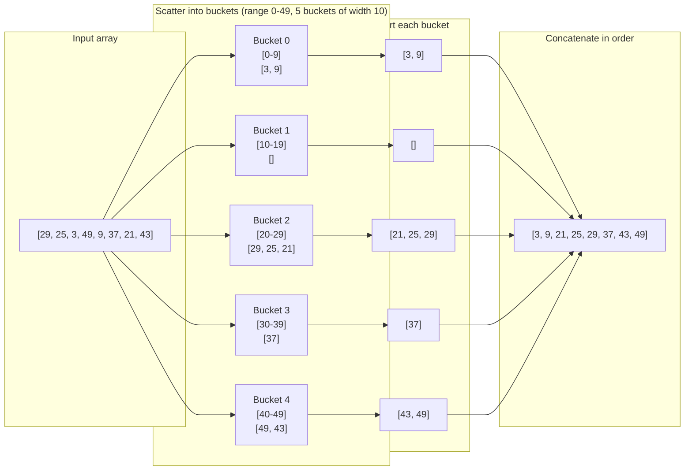
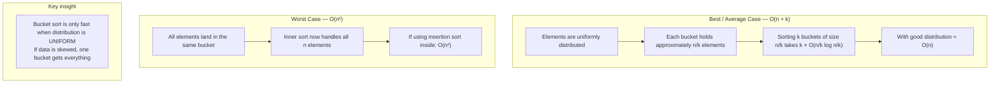

# Bucket Sort

When you know your data's range, you can sort in linear time — faster than any comparison sort. Comparison-based algorithms like merge sort and quick sort have a theoretical lower bound of O(n log n). Bucket sort sidesteps this entirely because it doesn't compare elements against each other. Instead, it uses the **value itself** as a guide to where each element belongs.

## The Core Idea

Divide the value range into equal-width **buckets**. Scatter each element into its bucket. Sort each bucket individually (they are much smaller). Concatenate all buckets in order.



## Bucket Index Formula

For a value `x` in range `[min_value, max_value]` with `k` buckets:

```
index = (x - min_value) * k // (max_value - min_value + 1)
```

This maps every value linearly to a bucket index in `[0, k-1]`.

## Implementation

```python,editable
def bucket_sort(nums, bucket_count=5):
    if not nums:
        return []

    min_value = min(nums)
    max_value = max(nums)

    # Edge case: all values are identical — already sorted
    if min_value == max_value:
        return nums[:]

    # Create empty buckets
    buckets = [[] for _ in range(bucket_count)]
    span = max_value - min_value + 1   # Total range of values

    # SCATTER — distribute each element into its bucket
    for x in nums:
        # Map value to bucket index (clamp to avoid off-by-one at max_value)
        index = (x - min_value) * bucket_count // span
        index = min(index, bucket_count - 1)   # Safety clamp
        buckets[index].append(x)

    # SORT — sort each bucket individually (insertion sort shines here)
    result = []
    for bucket in buckets:
        result.extend(sorted(bucket))   # sorted() uses Timsort on small lists

    return result


# --- Demo 1: Integers in a known range ---
scores = [29, 25, 3, 49, 9, 37, 21, 43]
print("Exam scores before:", scores)
print("Exam scores after: ", bucket_sort(scores))

# --- Demo 2: Floats between 0.0 and 1.0 ---
def bucket_sort_floats(nums, bucket_count=10):
    if not nums:
        return []
    buckets = [[] for _ in range(bucket_count)]
    for x in nums:
        index = min(int(x * bucket_count), bucket_count - 1)
        buckets[index].append(x)
    result = []
    for bucket in buckets:
        result.extend(sorted(bucket))
    return result

floats = [0.78, 0.17, 0.39, 0.26, 0.72, 0.94, 0.21, 0.12, 0.23, 0.68]
print("\nFloats before:", floats)
print("Floats after: ", bucket_sort_floats(floats))

# --- Demo 3: Grades 0-100 ---
grades = [88, 42, 75, 91, 63, 55, 79, 84, 97, 61]
print("\nGrades before:", grades)
print("Grades after: ", bucket_sort(grades, bucket_count=10))
```

## Time and Space Complexity



| Case | Time | Space |
|---|---|---|
| Best | O(n + k) | O(n + k) |
| Average (uniform data) | O(n + k) | O(n + k) |
| Worst (all in one bucket) | O(n²) | O(n + k) |

*n = number of elements, k = number of buckets*

**Stable:** Yes — elements are appended to buckets in order, and each bucket is sorted stably.

## When Bucket Sort Shines

**Use it when:**
- You know the range of your data in advance.
- Data is roughly **uniformly distributed** across that range.
- You need to beat the O(n log n) barrier for large datasets.

**Classic sweet spots:**
- Floats uniformly distributed between 0.0 and 1.0.
- Test scores between 0 and 100.
- Ages, percentages, ratings — any bounded numeric data.

**Avoid it when:**
- Data is heavily skewed — most values cluster in one region.
- You don't know the range ahead of time.
- Values aren't numeric or easily mappable to an index.

## Real-world appearances

- **Sorting exam scores** — 100 buckets for grades 0-100 means most buckets have just 1-2 students. Sorting is nearly instant regardless of class size.
- **Painter's algorithm in 3D rendering** — to draw objects back-to-front, render engines bucket-sort objects by depth (z-value). Each depth bucket is drawn in order, creating the correct visual layering without z-buffer complexity.
- **Network packet ordering** — packets arriving out of order are placed into sequence-number buckets and read out in order. The bounded sequence space maps perfectly to fixed buckets.
- **Radix sort foundation** — Radix sort (a cousin of bucket sort) applies bucket distribution digit by digit, achieving O(n) for integers. It is used in GPU sorting and large-scale data processing pipelines.
