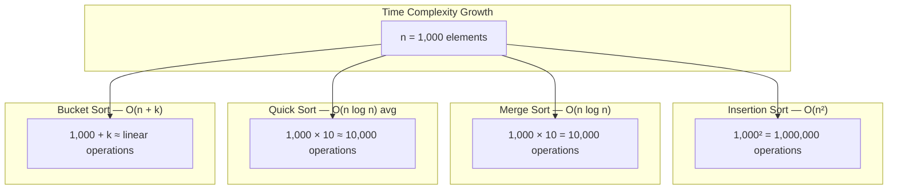
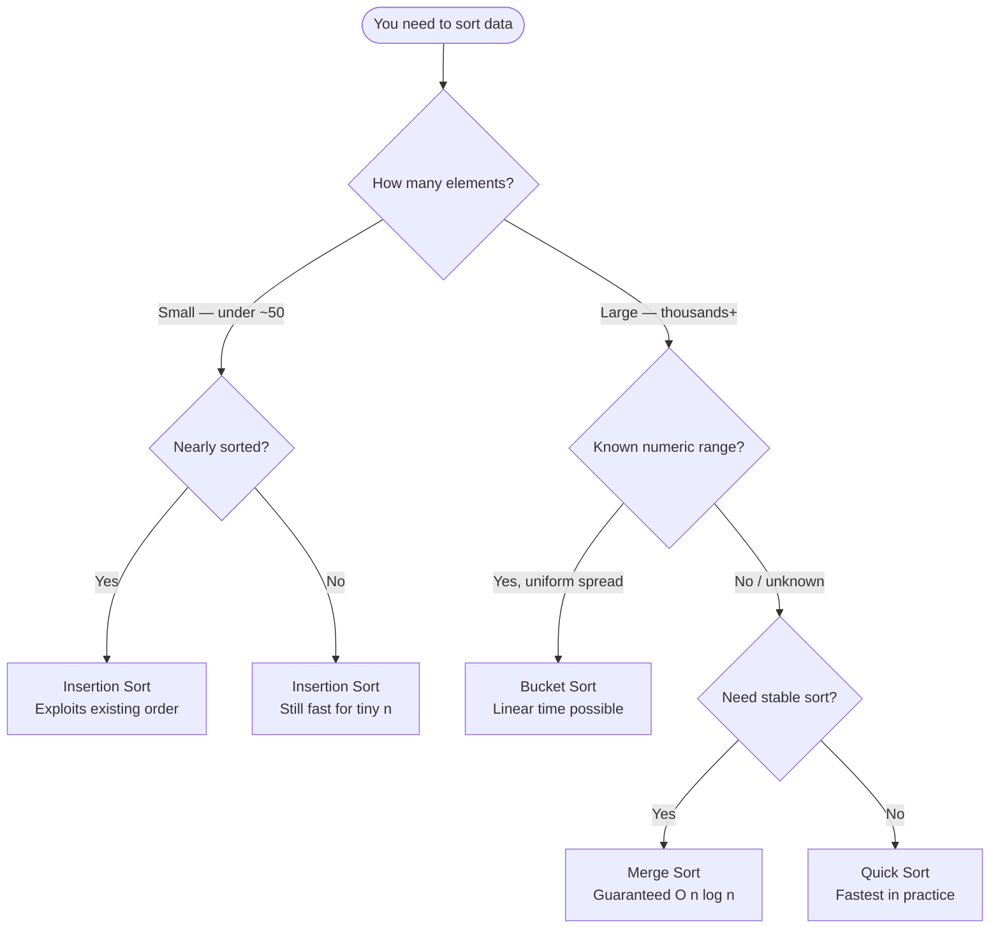

# Sorting Algorithms

Your phone contacts, your Spotify playlist, your Amazon search results — all sorted. Sorting is one of the most fundamental operations in computing. Without it, searching would be slow, databases would grind to a halt, and every app you use daily would feel sluggish.

Understanding sorting algorithms teaches you to think about **trade-offs**: speed vs. memory, simplicity vs. efficiency, best-case vs. worst-case. These are the same trade-offs you encounter in every engineering decision.

## Why do we need multiple sorting algorithms?

There is no single best sorting algorithm. The right choice depends on:

- **How much data?** 10 items vs. 10 million items changes everything.
- **Is it already partially sorted?** Some algorithms exploit existing order.
- **Do equal elements need to stay in their original order?** (Stability)
- **How much extra memory can we use?** In-place vs. auxiliary space.
- **What is the data's distribution?** Uniform? Skewed? Bounded range?

## Algorithm Comparison

| Algorithm | Best Case | Average Case | Worst Case | Space | Stable? |
|---|---|---|---|---|---|
| Insertion Sort | O(n) | O(n²) | O(n²) | O(1) | Yes |
| Merge Sort | O(n log n) | O(n log n) | O(n log n) | O(n) | Yes |
| Quick Sort | O(n log n) | O(n log n) | O(n²) | O(log n) | No |
| Bucket Sort | O(n + k) | O(n + k) | O(n²) | O(n + k) | Yes |

*k = number of buckets*

## Visualising Complexity

## When to use each

## In this section

- **Insertion Sort** — Start here. It mirrors how humans naturally sort cards.
- **Merge Sort** — Learn divide and conquer. Guaranteed O(n log n) always.
- **Quick Sort** — The workhorse of standard libraries. Fast in practice.
- **Bucket Sort** — Linear time when you know your data's range.
