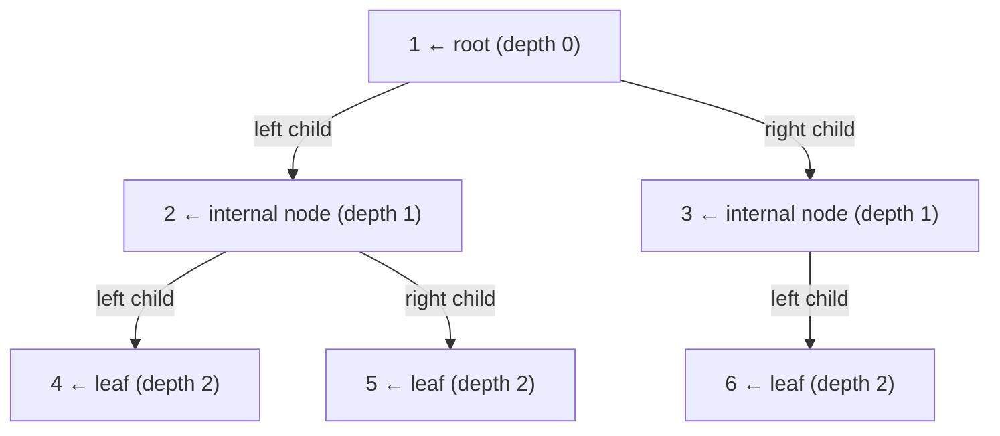
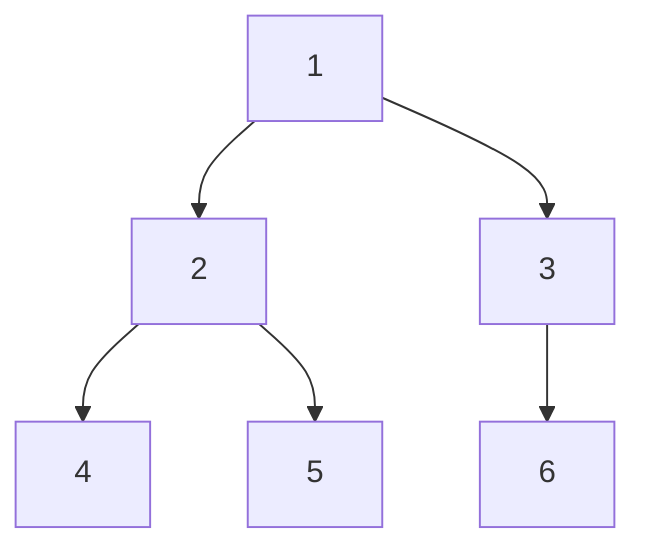
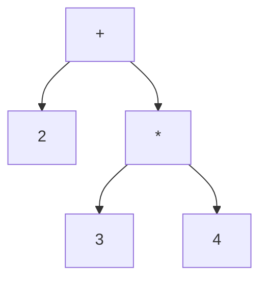

# Binary Tree

Every node has at most two children — left and right. Simple rule, enormous power.

That one constraint is all it takes to unlock fast searching, elegant sorting, file compression, and the way your compiler understands `2 + 3 * 4`. A binary tree is the foundation everything in this section is built on.

## Anatomy of a binary tree

Let's label every part of a concrete tree before we write any code.



| Concept | Definition | In the diagram above |
|---|---|---|
| **Root** | The top node — has no parent | Node `1` |
| **Leaf** | A node with no children | Nodes `4`, `5`, `6` |
| **Height** | Longest root-to-leaf edge count | `2` (root → 2 → 4) |
| **Depth** | Edge count from root to this node | Node `6` is at depth `2` |
| **Subtree** | Any node + all its descendants | Node `2` with children `4`, `5` |

## The TreeNode class

A node in a binary tree needs to store three things: its value, a pointer to its left child, and a pointer to its right child. If a child does not exist, the pointer is `None`.

```python,editable
class TreeNode:
    def __init__(self, value, left=None, right=None):
        self.value = value
        self.left = left
        self.right = right


# Build the tree from the diagram above manually
root = TreeNode(
    1,
    left=TreeNode(
        2,
        left=TreeNode(4),
        right=TreeNode(5),
    ),
    right=TreeNode(
        3,
        left=TreeNode(6),
    ),
)

print("Root:", root.value)
print("Root's left child:", root.left.value)
print("Root's right child:", root.right.value)
print("Root's left-left grandchild:", root.left.left.value)
print("Root's left-right grandchild:", root.left.right.value)
print("Root's right-left grandchild:", root.right.left.value)
```

Building a tree by nesting constructor calls like this is the clearest way to see the shape all at once. Each inner `TreeNode(...)` becomes a subtree.

## Computing height and depth

Height and depth are two sides of the same coin. Height is measured from a node *downward* to its deepest leaf; depth is measured from the root *down* to a node.

```python,editable
class TreeNode:
    def __init__(self, value, left=None, right=None):
        self.value = value
        self.left = left
        self.right = right


root = TreeNode(
    1,
    left=TreeNode(2, left=TreeNode(4), right=TreeNode(5)),
    right=TreeNode(3, left=TreeNode(6)),
)


def height(node):
    """Height of a subtree = longest path from node down to a leaf."""
    if node is None:
        return -1  # empty tree has height -1 by convention
    return 1 + max(height(node.left), height(node.right))


def depth(root, target_value, current_depth=0):
    """Depth of a node = number of edges from root to that node."""
    if root is None:
        return -1  # not found
    if root.value == target_value:
        return current_depth
    left_result = depth(root.left, target_value, current_depth + 1)
    if left_result != -1:
        return left_result
    return depth(root.right, target_value, current_depth + 1)


print("Height of whole tree:", height(root))          # 2
print("Height of node 2's subtree:", height(root.left))  # 1
print("Depth of node 6:", depth(root, 6))             # 2
print("Depth of node 1 (root):", depth(root, 1))      # 0
```

## The three traversal orders

Walking a binary tree means visiting every node exactly once. There are three classic orders, all defined recursively:

| Order | Visit sequence | Memory trick |
|---|---|---|
| **Pre-order** | Root → Left → Right | *Pre* = root comes *before* children |
| **In-order** | Left → Root → Right | Root is *in* the middle |
| **Post-order** | Left → Right → Root | Root comes *after* children |

We will implement all three fully in the Depth-First Search chapter. For now, see how the orders differ on the same tree:



- **Pre-order**: 1 → 2 → 4 → 5 → 3 → 6
- **In-order**: 4 → 2 → 5 → 1 → 6 → 3
- **Post-order**: 4 → 5 → 2 → 6 → 3 → 1

## Real-world: expression trees

When your compiler reads `2 + 3 * 4`, it cannot just evaluate left to right — operator precedence means `*` must happen before `+`. The compiler builds an **expression tree** where operators are internal nodes and numbers are leaves.



Post-order traversal evaluates this tree correctly:
1. Visit `2` (leaf) → value is 2
2. Visit `3` (leaf) → value is 3
3. Visit `4` (leaf) → value is 4
4. Visit `*` → compute 3 * 4 = 12
5. Visit `+` → compute 2 + 12 = **14**

```python,editable
class TreeNode:
    def __init__(self, value, left=None, right=None):
        self.value = value
        self.left = left
        self.right = right


# Represents: 2 + (3 * 4)
expr_tree = TreeNode(
    "+",
    left=TreeNode("2"),
    right=TreeNode("*", left=TreeNode("3"), right=TreeNode("4")),
)


def evaluate(node):
    """Evaluate an expression tree using post-order traversal."""
    if node is None:
        return 0
    # Leaf node — it's a number
    if node.left is None and node.right is None:
        return int(node.value)
    # Internal node — it's an operator
    left_val = evaluate(node.left)
    right_val = evaluate(node.right)
    if node.value == "+":
        return left_val + right_val
    if node.value == "*":
        return left_val * right_val
    if node.value == "-":
        return left_val - right_val
    if node.value == "/":
        return left_val // right_val


print("2 + 3 * 4 =", evaluate(expr_tree))  # 14
```

## Real-world: Huffman encoding

When you zip a file, the compression algorithm (often Huffman coding) builds a binary tree where:
- Frequent characters get short codes (close to the root).
- Rare characters get long codes (deep in the tree).

A character's binary code is the path from root to its leaf: go left → write `0`, go right → write `1`. The letter `e` (most frequent in English) might be encoded as just `10`, while `z` might be `110011`. This is why text files compress so well — common letters use fewer bits.

The binary tree is the data structure that makes this possible.
