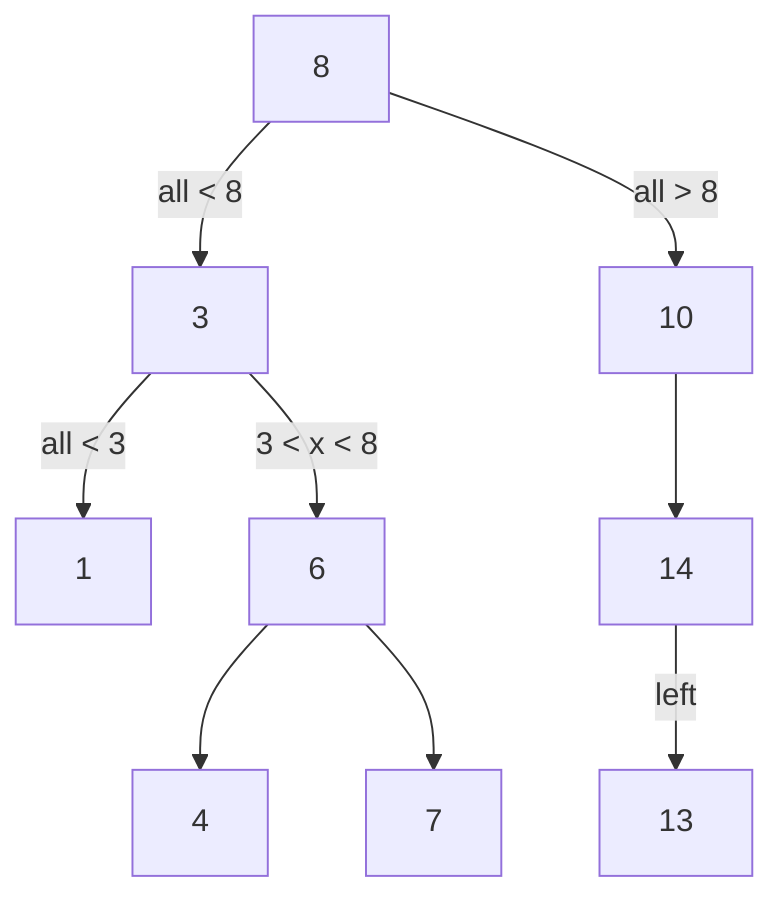
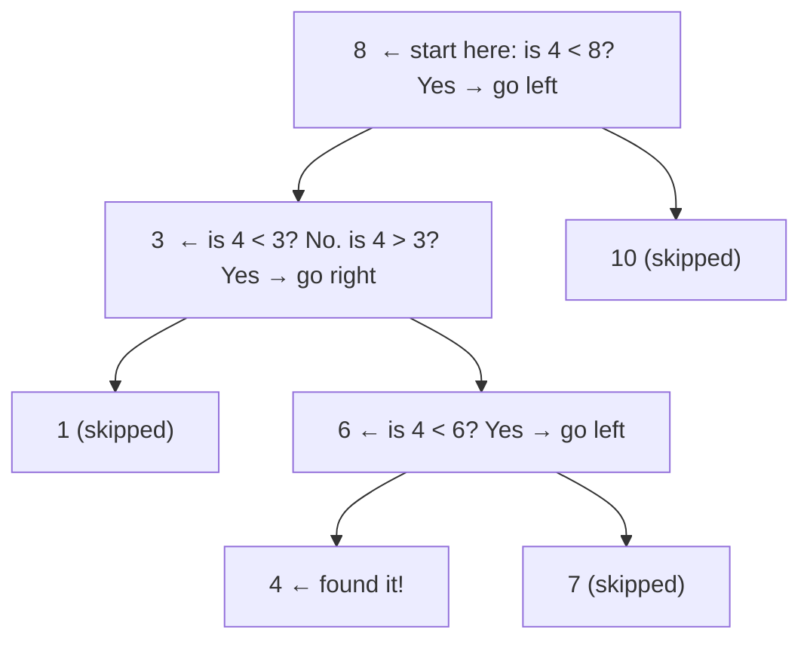
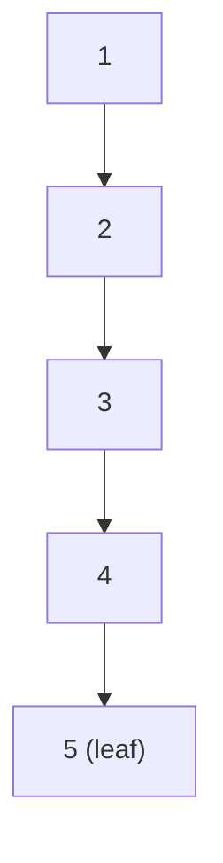

# Binary Search Tree

A binary tree with a superpower: left < node < right, always. This one rule makes search O(log n).

Think of a dictionary. You do not start at page 1 and flip forward one page at a time to find "umbrella". You open to the middle — if your word comes alphabetically before the middle word, you go left; if after, you go right. Each step cuts the remaining pages in half. A Binary Search Tree works exactly this way, but built from pointers instead of pages.

## The BST property

For **every** node in the tree:
- All values in its **left subtree** are **strictly less than** the node's value.
- All values in its **right subtree** are **strictly greater than** the node's value.

This must hold not just for immediate children but for the *entire* subtree below each node.



Check any node and the rule holds: node `6` has left child `4` (which is < 6) and right child `7` (which is > 6). Node `8` has an entire left subtree of values 1, 3, 4, 6, 7 — all less than 8 — and a right subtree of 10, 13, 14 — all greater than 8.

## Building a BST manually

```python,editable
class TreeNode:
    def __init__(self, value):
        self.value = value
        self.left = None
        self.right = None


# Build the BST from the diagram above
root = TreeNode(8)
root.left = TreeNode(3)
root.right = TreeNode(10)
root.left.left = TreeNode(1)
root.left.right = TreeNode(6)
root.left.right.left = TreeNode(4)
root.left.right.right = TreeNode(7)
root.right.right = TreeNode(14)
root.right.right.left = TreeNode(13)

# Verify the property holds for the root
print("Root:", root.value)
print("Left child (must be < 8):", root.left.value)
print("Right child (must be > 8):", root.right.value)
print("Left subtree's right child (must be > 3 and < 8):", root.left.right.value)
```

## Searching: narrowing down at every step

Search in a BST follows the same logic as flipping to the middle of a dictionary. At each node you ask one question: is my target smaller, larger, or equal to this node's value?



We searched a tree of 9 nodes but only visited 4 of them: `8 → 3 → 6 → 4`. At each step we discarded half (roughly) of the remaining tree. That is why search is **O(log n)** — the same reason binary search on a sorted array is O(log n).

```python,editable
class TreeNode:
    def __init__(self, value):
        self.value = value
        self.left = None
        self.right = None


def search(node, target):
    """
    Returns the node if found, otherwise None.
    At each step we go left or right, never both.
    """
    if node is None:
        return None           # ran off the bottom — not in tree
    if target == node.value:
        return node           # found it
    if target < node.value:
        return search(node.left, target)   # must be in left subtree
    else:
        return search(node.right, target)  # must be in right subtree


# Build a small BST
root = TreeNode(8)
root.left = TreeNode(3)
root.right = TreeNode(10)
root.left.left = TreeNode(1)
root.left.right = TreeNode(6)
root.left.right.left = TreeNode(4)
root.left.right.right = TreeNode(7)

result = search(root, 4)
print("Search for 4:", result.value if result else "not found")

result = search(root, 5)
print("Search for 5:", result.value if result else "not found")

result = search(root, 1)
print("Search for 1:", result.value if result else "not found")
```

## Iterative search (no recursion)

The recursive version is clean, but it is equally natural as a loop — and avoids stack frames for very deep trees:

```python,editable
class TreeNode:
    def __init__(self, value):
        self.value = value
        self.left = None
        self.right = None


def search_iterative(root, target):
    """Walk down the tree until we find the value or fall off the edge."""
    node = root
    steps = 0
    while node is not None:
        steps += 1
        if target == node.value:
            print(f"Found {target} in {steps} step(s)")
            return node
        elif target < node.value:
            node = node.left
        else:
            node = node.right
    print(f"{target} not found after {steps} step(s)")
    return None


root = TreeNode(8)
root.left = TreeNode(3)
root.right = TreeNode(10)
root.left.left = TreeNode(1)
root.left.right = TreeNode(6)
root.left.right.left = TreeNode(4)
root.left.right.right = TreeNode(7)
root.right.right = TreeNode(14)
root.right.right.left = TreeNode(13)

search_iterative(root, 13)  # should take 4 steps: 8 → 10 → 14 → 13
search_iterative(root, 5)   # not found
```

## Why it can go wrong: unbalanced trees

The O(log n) guarantee depends on the tree being roughly balanced — each step halving what remains. If you insert values in sorted order (`1, 2, 3, 4, 5, ...`) the BST degrades into a linked list and search becomes **O(n)**:



This is why self-balancing variants like **AVL trees** and **Red-Black trees** exist — they automatically restructure the tree after insertions to keep it balanced. Python's `sortedcontainers.SortedList` uses a similar technique internally.

## Real-world uses

**Database indexes** — When you run `SELECT * FROM users WHERE age > 30`, the database engine does not scan every row. If there is a BST-based index on `age`, it walks directly to the first node where `age = 31` and reads forward from there.

**Auto-complete** — A BST (or its cousin, a trie) stores every known word. When you type "pre", the search engine walks to the subtree of words that start with "pre" and returns them instantly.

**Symbol tables in compilers** — When the compiler processes your code it needs to store every variable name and look it up fast. A BST keyed on the variable name gives O(log n) lookups and also supports printing all variables in alphabetical order (via in-order traversal).
