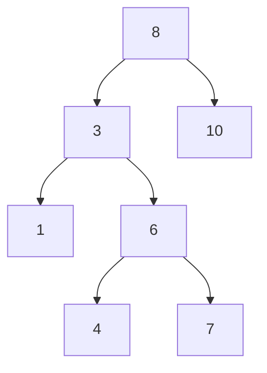
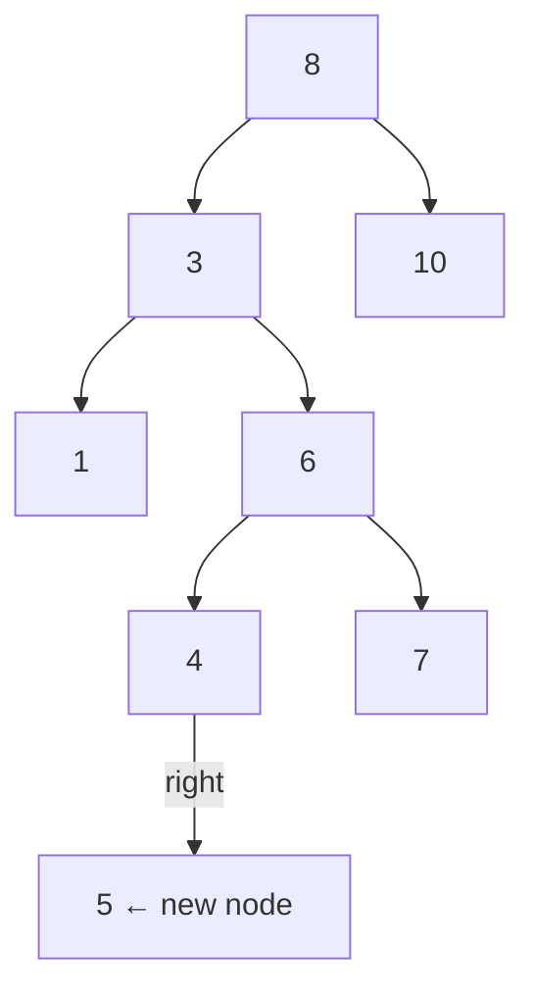
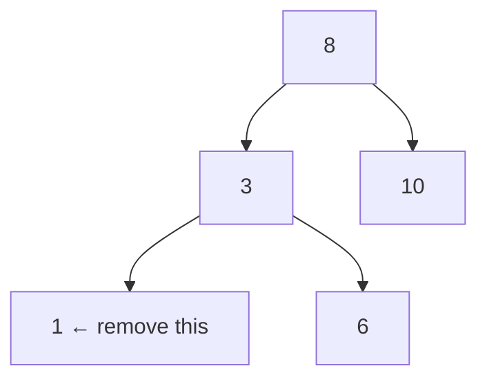
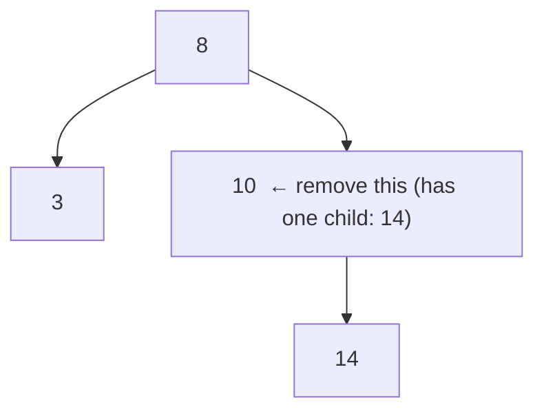
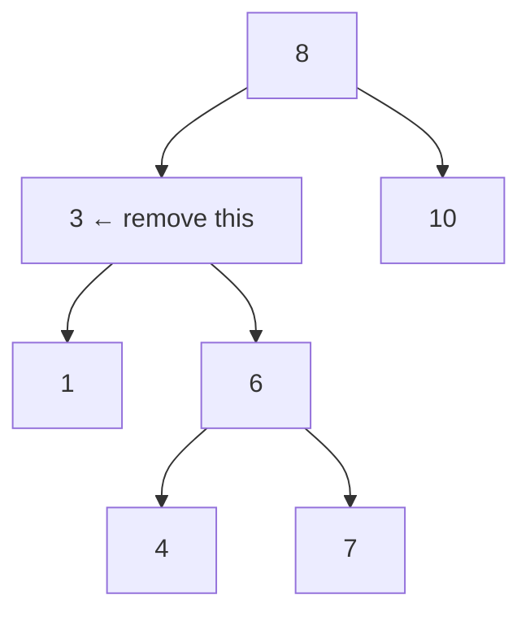
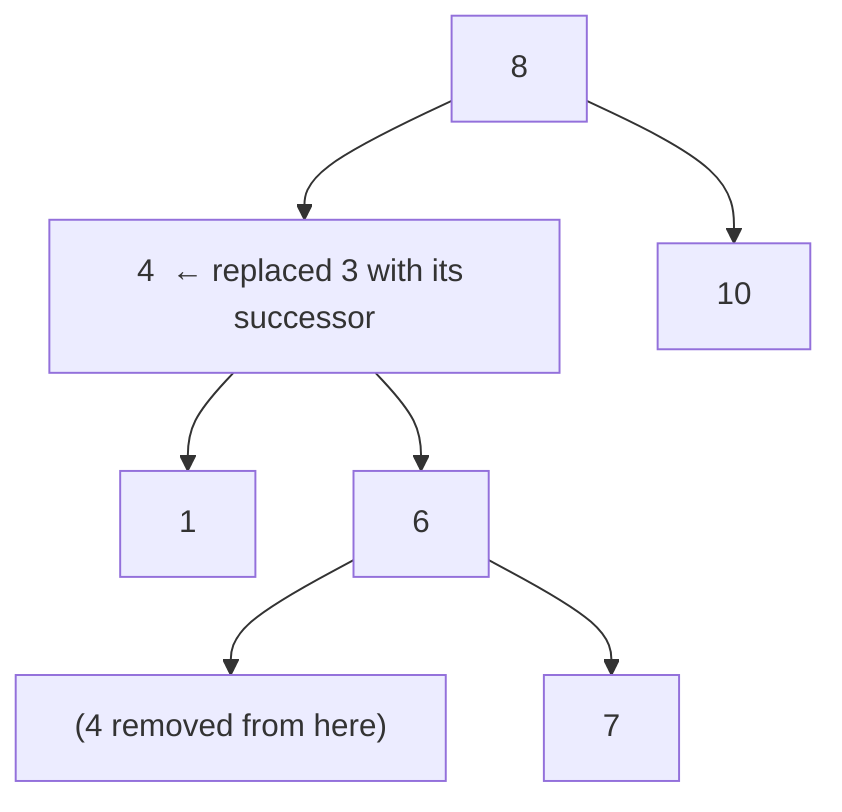

# BST Insert and Remove

A BST is only useful if you can add and remove values while keeping it sorted. Insert is straightforward — follow the search path until you find an empty slot. Remove is trickier, because pulling a node out must not break the left < node < right property for every other node.

## Insert: walk until you find the gap

Inserting a value is like searching for it, except instead of returning "not found" when you fall off the edge, you create a new node there.

### Before inserting 5



### After inserting 5

The path: 5 < 8 → go left. 5 > 3 → go right. 5 < 6 → go left. 5 > 4 → go right. Empty slot — place 5 here.



```python,editable
class TreeNode:
    def __init__(self, value):
        self.value = value
        self.left = None
        self.right = None


def insert(node, value):
    """
    Returns the root of the (possibly new) subtree.
    If node is None we've found the empty slot — create the node here.
    """
    if node is None:
        return TreeNode(value)
    if value < node.value:
        node.left = insert(node.left, value)
    elif value > node.value:
        node.right = insert(node.right, value)
    # value == node.value: duplicate — do nothing (BSTs store unique values)
    return node


def inorder(node):
    """In-order traversal of a BST returns values in sorted order."""
    if node is None:
        return []
    return inorder(node.left) + [node.value] + inorder(node.right)


# Build a BST by inserting values one at a time
root = None
for val in [8, 3, 10, 1, 6, 4, 7]:
    root = insert(root, val)

print("Before inserting 5:", inorder(root))

root = insert(root, 5)
print("After inserting 5: ", inorder(root))  # 5 appears in sorted position
```

## Remove: the three cases

Removing a node is more involved because the node might have children that need to stay in the tree. There are exactly three situations:

### Case 1 — The node is a leaf (no children)

Just delete it. Nothing else needs to move.



After removing `1`, node `3` simply has no left child.

### Case 2 — The node has one child

Replace the node with its only child. The subtree slides up one level.



After removing `10`, node `8`'s right child becomes `14`.

### Case 3 — The node has two children

This is the tricky case. We cannot simply delete the node because it has two subtrees that need a parent. The solution: replace the node's value with its **in-order successor** (the smallest value in its right subtree), then delete that successor from the right subtree.

Why the in-order successor? It is the smallest value that is still larger than every value in the left subtree — so it is the perfect replacement to maintain the BST property.



The in-order successor of `3` is `4` (smallest value in `3`'s right subtree). Replace `3` with `4`, then remove `4` from its original location:



## Full implementation

```python,editable
class TreeNode:
    def __init__(self, value):
        self.value = value
        self.left = None
        self.right = None


def insert(node, value):
    if node is None:
        return TreeNode(value)
    if value < node.value:
        node.left = insert(node.left, value)
    elif value > node.value:
        node.right = insert(node.right, value)
    return node


def find_min(node):
    """The in-order successor is the leftmost node in a subtree."""
    while node.left is not None:
        node = node.left
    return node


def remove(node, value):
    """
    Returns the root of the subtree after removing the value.
    The BST property is preserved for every remaining node.
    """
    if node is None:
        return None  # value not in tree — nothing to do

    if value < node.value:
        node.left = remove(node.left, value)    # it's somewhere in the left subtree
    elif value > node.value:
        node.right = remove(node.right, value)  # it's somewhere in the right subtree
    else:
        # We found the node to delete.
        # Case 1: leaf node
        if node.left is None and node.right is None:
            return None
        # Case 2: one child — return the child, skipping this node
        if node.left is None:
            return node.right
        if node.right is None:
            return node.left
        # Case 3: two children — replace with in-order successor
        successor = find_min(node.right)
        node.value = successor.value           # overwrite this node's value
        node.right = remove(node.right, successor.value)  # delete the successor

    return node


def inorder(node):
    if node is None:
        return []
    return inorder(node.left) + [node.value] + inorder(node.right)


# Build the tree
root = None
for val in [8, 3, 10, 1, 6, 4, 7, 14]:
    root = insert(root, val)

print("Initial tree (sorted):", inorder(root))

# Case 1: remove a leaf
root = remove(root, 1)
print("After removing 1 (leaf):           ", inorder(root))

# Case 2: remove a node with one child
root = remove(root, 10)
print("After removing 10 (one child):     ", inorder(root))

# Case 3: remove a node with two children
root = remove(root, 3)
print("After removing 3 (two children):   ", inorder(root))
```

## The tree stays sorted after every operation

Notice that in-order traversal always produces a sorted list, even after multiple insertions and removals. This is the BST invariant: every operation either preserves or explicitly restores the left < node < right property at every node.

## Real-world: dynamic sorted sets and ordered maps

**Python's `sortedcontainers.SortedList`** uses a variant of this technique to give you a list that stays sorted automatically as you add and remove items — useful when you need both fast lookup and sorted iteration.

**Java's `TreeMap` and `TreeSet`** are backed by a self-balancing BST (Red-Black tree). Every `put()` is an insert, every `remove()` is our three-case deletion, and `firstKey()` / `lastKey()` exploit the fact that in-order traversal is sorted.

**Database ordered indexes** use B-Trees (a generalisation of BSTs with many children per node), and the same three-case deletion logic applies to keeping them consistent.
