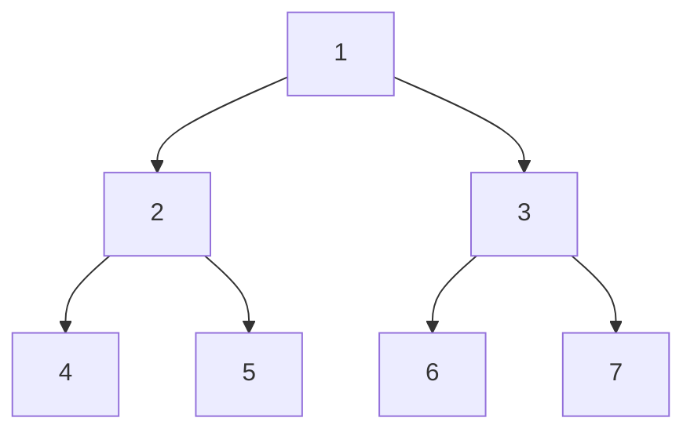

# Depth-First Search

Go as deep as possible before backtracking — like exploring a cave system.

Imagine you are in a cave with branching tunnels. Depth-first search means: always take the next available tunnel, go to the very end, then backtrack to the last junction and try the next tunnel. You explore all the way down one path before trying a different branch. On a tree this is natural to implement with recursion — the call stack *is* the backtracking.

There are three classic DFS orders for binary trees, each with distinct uses.

## The three DFS orders

The difference between the three orders is only *when* you visit the current node relative to its children:

| Order | Rule | Mnemonic |
|---|---|---|
| **Pre-order** | Visit node, then left subtree, then right subtree | *Pre* = current node comes *first* |
| **In-order** | Visit left subtree, then node, then right subtree | Node goes *in* the middle |
| **Post-order** | Visit left subtree, then right subtree, then node | *Post* = current node comes *last* |

## Traversal sequence on the same tree



Let's trace each order by hand.

**Pre-order** (node → left → right):
Visit `1`, go left → visit `2`, go left → visit `4` (leaf, back up), go right → visit `5` (leaf, back up, back up), go right → visit `3`, go left → visit `6` (leaf, back up), go right → visit `7` (leaf).
Sequence: **1, 2, 4, 5, 3, 6, 7**

**In-order** (left → node → right):
Go all the way left → visit `4`, back up → visit `2`, go right → visit `5`, back up to root → visit `1`, go right → go left → visit `6`, back up → visit `3`, go right → visit `7`.
Sequence: **4, 2, 5, 1, 6, 3, 7**

**Post-order** (left → right → node):
Go all the way left → visit `4`, go to sibling → visit `5`, back up → visit `2`, go to right subtree → visit `6`, visit `7`, back up → visit `3`, back up → visit `1`.
Sequence: **4, 5, 2, 6, 7, 3, 1**

## Full implementation of all three

```python,editable
class TreeNode:
    def __init__(self, value, left=None, right=None):
        self.value = value
        self.left = left
        self.right = right


# Build the tree from the diagram above
root = TreeNode(
    1,
    left=TreeNode(2, left=TreeNode(4), right=TreeNode(5)),
    right=TreeNode(3, left=TreeNode(6), right=TreeNode(7)),
)


def preorder(node):
    """node → left → right"""
    if node is None:
        return []
    return [node.value] + preorder(node.left) + preorder(node.right)


def inorder(node):
    """left → node → right"""
    if node is None:
        return []
    return inorder(node.left) + [node.value] + inorder(node.right)


def postorder(node):
    """left → right → node"""
    if node is None:
        return []
    return postorder(node.left) + postorder(node.right) + [node.value]


print("Pre-order: ", preorder(root))   # [1, 2, 4, 5, 3, 6, 7]
print("In-order:  ", inorder(root))    # [4, 2, 5, 1, 6, 3, 7]
print("Post-order:", postorder(root))  # [4, 5, 2, 6, 7, 3, 1]
```

## In-order gives sorted output for a BST

This is one of the most important properties you will use in practice. When you run in-order traversal on a Binary Search Tree, the values come out in ascending sorted order — because in-order visits left (smaller values) before the node before right (larger values).

```python,editable
class TreeNode:
    def __init__(self, value):
        self.value = value
        self.left = None
        self.right = None


def insert(node, value):
    if node is None:
        return TreeNode(value)
    if value < node.value:
        node.left = insert(node.left, value)
    elif value > node.value:
        node.right = insert(node.right, value)
    return node


def inorder(node):
    if node is None:
        return []
    return inorder(node.left) + [node.value] + inorder(node.right)


# Insert values in random order
root = None
for val in [5, 2, 8, 1, 4, 7, 9, 3, 6]:
    root = insert(root, val)

print("Inserted in random order:", [5, 2, 8, 1, 4, 7, 9, 3, 6])
print("In-order traversal:      ", inorder(root))  # always sorted!
```

## Iterative DFS with an explicit stack

The recursive versions above implicitly use Python's call stack. For very deep trees you can hit Python's recursion limit. An explicit stack avoids this and also makes the backtracking mechanism visible:

```python,editable
class TreeNode:
    def __init__(self, value, left=None, right=None):
        self.value = value
        self.left = left
        self.right = right


def preorder_iterative(root):
    """
    Pre-order using an explicit stack.
    Push right child first so left child is processed first (LIFO).
    """
    if root is None:
        return []
    stack = [root]
    result = []
    while stack:
        node = stack.pop()
        result.append(node.value)
        # Push right first — it will be processed after left (stack is LIFO)
        if node.right:
            stack.append(node.right)
        if node.left:
            stack.append(node.left)
    return result


root = TreeNode(
    1,
    left=TreeNode(2, left=TreeNode(4), right=TreeNode(5)),
    right=TreeNode(3, left=TreeNode(6), right=TreeNode(7)),
)

print("Pre-order (iterative):", preorder_iterative(root))  # [1, 2, 4, 5, 3, 6, 7]
```

## Real-world uses of each traversal order

**Pre-order — copying a tree**
To clone a tree you must create each node before its children. Pre-order does exactly that: process the node first, then recurse into children.

**Post-order — deleting a tree / computing folder sizes**
When your OS calculates the total size of a folder, it must know the sizes of all subfolders before it can sum them up. Post-order processes children before the parent — perfect. Same logic applies to deleting a tree: delete children before parent so you do not lose the pointers.

**In-order — sorted output from a BST**
As shown above, in-order on a BST gives sorted output. Database engines use this when scanning an indexed range query.

**Expression evaluation**
Post-order traversal of an expression tree evaluates it bottom-up: compute child subexpressions first, then combine at the operator node. We demonstrated this fully in the Binary Tree chapter.
