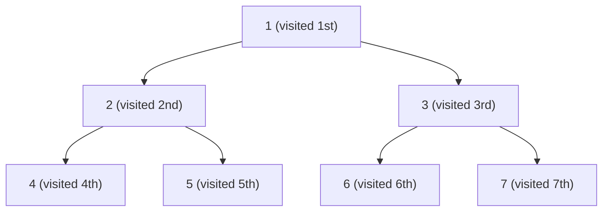

# Breadth-First Search

Explore level by level — like water flooding a maze.

Pour water into the root of a tree and it spreads outward in rings: first the root, then all nodes at depth 1, then all at depth 2, and so on. That is Breadth-First Search. Instead of diving deep down one branch like DFS, BFS finishes each entire level before moving to the next. This property makes it the natural choice whenever you care about *distance from the root*.

## BFS visits nodes level by level



Level 0: `1`
Level 1: `2`, `3`
Level 2: `4`, `5`, `6`, `7`

BFS visit order: **1, 2, 3, 4, 5, 6, 7**

## The queue is the secret

DFS uses a stack (either the call stack via recursion, or an explicit one). BFS uses a **queue** — a First-In-First-Out (FIFO) structure. This is why BFS processes nodes in the order they were discovered, which is exactly level order.

The algorithm:
1. Enqueue the root.
2. Dequeue the front node, record it, enqueue its children.
3. Repeat until the queue is empty.

```python,editable
from collections import deque


class TreeNode:
    def __init__(self, value, left=None, right=None):
        self.value = value
        self.left = left
        self.right = right


def bfs(root):
    """
    Level-order traversal using a queue.
    Returns all values in BFS (level-by-level) order.
    """
    if root is None:
        return []

    queue = deque([root])
    result = []

    while queue:
        node = queue.popleft()   # FIFO: take from the front
        result.append(node.value)

        if node.left:
            queue.append(node.left)   # enqueue left child
        if node.right:
            queue.append(node.right)  # enqueue right child

    return result


root = TreeNode(
    1,
    left=TreeNode(2, left=TreeNode(4), right=TreeNode(5)),
    right=TreeNode(3, left=TreeNode(6), right=TreeNode(7)),
)

print("BFS order:", bfs(root))  # [1, 2, 3, 4, 5, 6, 7]
```

## BFS with level tracking

Sometimes you need to know which level each node is on — for example, to find the minimum depth, or to print the tree level by level. Wrap each group of nodes in an inner loop:

```python,editable
from collections import deque


class TreeNode:
    def __init__(self, value, left=None, right=None):
        self.value = value
        self.left = left
        self.right = right


def bfs_by_level(root):
    """
    Returns a list of lists, one inner list per level.
    e.g. [[1], [2, 3], [4, 5, 6, 7]]
    """
    if root is None:
        return []

    queue = deque([root])
    levels = []

    while queue:
        level_size = len(queue)   # snapshot: how many nodes are on this level
        level_values = []

        for _ in range(level_size):
            node = queue.popleft()
            level_values.append(node.value)
            if node.left:
                queue.append(node.left)
            if node.right:
                queue.append(node.right)

        levels.append(level_values)

    return levels


root = TreeNode(
    1,
    left=TreeNode(2, left=TreeNode(4), right=TreeNode(5)),
    right=TreeNode(3, left=TreeNode(6), right=TreeNode(7)),
)

for level_num, level in enumerate(bfs_by_level(root)):
    print(f"Level {level_num}: {level}")
```

## DFS vs BFS — when to use each

| Question | Best choice | Why |
|---|---|---|
| Does a path from root to leaf exist? | Either | Both find all reachable nodes |
| What is the *shortest* path from root to a target? | **BFS** | BFS finds the nearest match first |
| Is there any path at all in a deep tree? | DFS | Less memory for very deep, narrow trees |
| Visit nodes in level order / by distance | **BFS** | That is exactly what BFS does |
| Copy, delete, or evaluate a tree | DFS | Recursive structure fits naturally |
| Find all ancestors of a node | DFS | Follow the call stack back up |

The key insight: BFS always finds the **shortest path** first because it expands nodes in distance order. DFS may find a path quickly but it might not be the shortest.

```python,editable
from collections import deque


class TreeNode:
    def __init__(self, value, left=None, right=None):
        self.value = value
        self.left = left
        self.right = right


def find_level_bfs(root, target):
    """Return the level (depth) of the first node with the target value."""
    if root is None:
        return -1

    queue = deque([(root, 0)])  # store (node, depth) pairs

    while queue:
        node, depth = queue.popleft()

        if node.value == target:
            return depth

        if node.left:
            queue.append((node.left, depth + 1))
        if node.right:
            queue.append((node.right, depth + 1))

    return -1  # not found


root = TreeNode(
    1,
    left=TreeNode(2, left=TreeNode(4), right=TreeNode(5)),
    right=TreeNode(3, left=TreeNode(6), right=TreeNode(7)),
)

print("Level of node 1:", find_level_bfs(root, 1))  # 0
print("Level of node 3:", find_level_bfs(root, 3))  # 1
print("Level of node 6:", find_level_bfs(root, 6))  # 2
print("Level of node 9:", find_level_bfs(root, 9))  # -1
```

## Real-world uses

**Finding the shortest path** — GPS navigation, network routing, and game pathfinding all rely on BFS (or Dijkstra's algorithm, which is BFS with weighted edges) to find the fewest-hops route between two points.

**Web crawlers** — A crawler starts at a seed URL and discovers links level by level: first all links on the seed page, then all links on those pages, and so on. BFS prevents it from going infinitely deep into one site before visiting others.

**Social network "degrees of separation"** — "How many friends-of-friends does it take to reach this person?" BFS from your profile, level by level, counts degrees exactly.

**Level-order tree serialisation** — When you need to store a tree as a flat array (the way binary heaps work) or send it over a network, you write nodes in BFS order. The position of each node in the array encodes its parent-child relationships without needing pointers.
