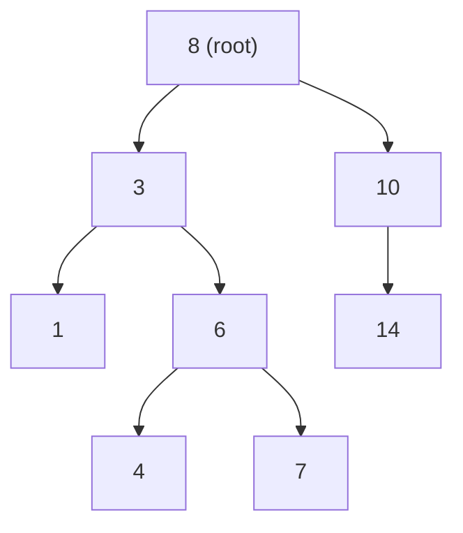

# BST Sets and Maps

Python's `set` and `dict` operations — under the hood, this is often a tree.

When you call `my_set.add(x)` or `my_dict[key] = value` in Python, the built-in types use *hash tables* internally. Hash tables are fast, but they cannot tell you the smallest key, the largest key, or all keys in a given range — they have no concept of order. A BST-backed set or map is slightly slower per operation, but it buys you something invaluable: **everything stays sorted, always**.

## A BST as a sorted set

A **set** stores unique values and supports three core operations: `insert`, `contains`, and `remove`. A BST handles all three in O(log n) and also gives you sorted iteration for free.



In-order traversal reads this tree as: **1, 3, 4, 6, 7, 8, 10, 14** — a sorted set.

```python,editable
class TreeNode:
    def __init__(self, value):
        self.value = value
        self.left = None
        self.right = None


class BSTSet:
    """A sorted set backed by a Binary Search Tree."""

    def __init__(self):
        self._root = None

    def add(self, value):
        self._root = self._insert(self._root, value)

    def contains(self, value):
        return self._search(self._root, value)

    def remove(self, value):
        self._root = self._delete(self._root, value)

    def to_sorted_list(self):
        """In-order traversal — always returns values in ascending order."""
        result = []
        self._inorder(self._root, result)
        return result

    def minimum(self):
        node = self._root
        while node and node.left:
            node = node.left
        return node.value if node else None

    def maximum(self):
        node = self._root
        while node and node.right:
            node = node.right
        return node.value if node else None

    def range_query(self, low, high):
        """Return all values where low <= value <= high, in sorted order."""
        result = []
        self._range(self._root, low, high, result)
        return result

    # ---- internal helpers ----

    def _insert(self, node, value):
        if node is None:
            return TreeNode(value)
        if value < node.value:
            node.left = self._insert(node.left, value)
        elif value > node.value:
            node.right = self._insert(node.right, value)
        return node

    def _search(self, node, value):
        if node is None:
            return False
        if value == node.value:
            return True
        if value < node.value:
            return self._search(node.left, value)
        return self._search(node.right, value)

    def _find_min(self, node):
        while node.left:
            node = node.left
        return node

    def _delete(self, node, value):
        if node is None:
            return None
        if value < node.value:
            node.left = self._delete(node.left, value)
        elif value > node.value:
            node.right = self._delete(node.right, value)
        else:
            if node.left is None:
                return node.right
            if node.right is None:
                return node.left
            successor = self._find_min(node.right)
            node.value = successor.value
            node.right = self._delete(node.right, successor.value)
        return node

    def _inorder(self, node, result):
        if node:
            self._inorder(node.left, result)
            result.append(node.value)
            self._inorder(node.right, result)

    def _range(self, node, low, high, result):
        if node is None:
            return
        if node.value > low:      # there might be values >= low in left subtree
            self._range(node.left, low, high, result)
        if low <= node.value <= high:
            result.append(node.value)
        if node.value < high:     # there might be values <= high in right subtree
            self._range(node.right, low, high, result)


s = BSTSet()
for val in [8, 3, 10, 1, 6, 4, 7, 14]:
    s.add(val)

print("Sorted contents:    ", s.to_sorted_list())
print("Contains 6:         ", s.contains(6))
print("Contains 5:         ", s.contains(5))
print("Minimum:            ", s.minimum())
print("Maximum:            ", s.maximum())
print("Range [4, 8]:       ", s.range_query(4, 8))

s.remove(6)
print("After removing 6:   ", s.to_sorted_list())
```

## A BST as an ordered map (dictionary)

A **map** stores key-value pairs and supports `put(key, value)` and `get(key)`. The BST is ordered by *key*, and each node carries an associated value as cargo.

```python,editable
class MapNode:
    def __init__(self, key, value):
        self.key = key
        self.value = value
        self.left = None
        self.right = None


class BSTMap:
    """
    An ordered map (dictionary) backed by a BST.
    Keys are kept sorted, so you get sorted iteration and range queries
    that a plain Python dict cannot provide.
    """

    def __init__(self):
        self._root = None

    def put(self, key, value):
        """Insert or update a key-value pair."""
        self._root = self._insert(self._root, key, value)

    def get(self, key, default=None):
        """Return the value for key, or default if not found."""
        node = self._search(self._root, key)
        return node.value if node else default

    def keys_sorted(self):
        """Return all keys in ascending order."""
        result = []
        self._inorder(self._root, result)
        return result

    def items_in_range(self, low_key, high_key):
        """Return (key, value) pairs where low_key <= key <= high_key, sorted."""
        result = []
        self._range(self._root, low_key, high_key, result)
        return result

    # ---- internal helpers ----

    def _insert(self, node, key, value):
        if node is None:
            return MapNode(key, value)
        if key < node.key:
            node.left = self._insert(node.left, key, value)
        elif key > node.key:
            node.right = self._insert(node.right, key, value)
        else:
            node.value = value   # update existing key
        return node

    def _search(self, node, key):
        if node is None:
            return None
        if key == node.key:
            return node
        if key < node.key:
            return self._search(node.left, key)
        return self._search(node.right, key)

    def _inorder(self, node, result):
        if node:
            self._inorder(node.left, result)
            result.append(node.key)
            self._inorder(node.right, result)

    def _range(self, node, low, high, result):
        if node is None:
            return
        if node.key > low:
            self._range(node.left, low, high, result)
        if low <= node.key <= high:
            result.append((node.key, node.value))
        if node.key < high:
            self._range(node.right, low, high, result)


# Store word frequencies
freq_map = BSTMap()
words = ["banana", "apple", "cherry", "apple", "banana", "banana", "date"]
for word in words:
    count = freq_map.get(word, 0)
    freq_map.put(word, count + 1)

print("Keys in alphabetical order:", freq_map.keys_sorted())
print("Frequency of 'banana':     ", freq_map.get("banana"))
print("Frequency of 'grape':      ", freq_map.get("grape", 0))
print("Words a–c:                 ", freq_map.items_in_range("a", "c"))
```

## Hash table vs BST-backed map — a direct comparison

```python,editable
# Python's built-in dict is hash-based — fast, but unordered
plain_dict = {"banana": 3, "apple": 2, "cherry": 1, "date": 1}

print("dict keys (arbitrary order):", list(plain_dict.keys()))

# To get sorted keys from a plain dict you must sort explicitly — O(n log n)
print("dict sorted keys:           ", sorted(plain_dict.keys()))

# A BST map keeps keys sorted automatically — each put() maintains order
# (Using the BSTMap from the cell above — paste both cells together to run)

class MapNode:
    def __init__(self, key, value):
        self.key = key
        self.value = value
        self.left = None
        self.right = None

class BSTMap:
    def __init__(self):
        self._root = None
    def put(self, key, value):
        self._root = self._ins(self._root, key, value)
    def _ins(self, node, key, value):
        if node is None:
            return MapNode(key, value)
        if key < node.key:
            node.left = self._ins(node.left, key, value)
        elif key > node.key:
            node.right = self._ins(node.right, key, value)
        else:
            node.value = value
        return node
    def keys_sorted(self):
        r = []
        self._io(self._root, r)
        return r
    def _io(self, node, r):
        if node:
            self._io(node.left, r)
            r.append(node.key)
            self._io(node.right, r)

bst_map = BSTMap()
for k, v in plain_dict.items():
    bst_map.put(k, v)

print("BSTMap keys (always sorted):", bst_map.keys_sorted())
```

| Feature | Hash dict (`dict`) | BST map (`BSTMap`) |
|---|---|---|
| Average lookup | O(1) | O(log n) |
| Sorted iteration | Not supported | O(n) — free via in-order |
| Range query | Not supported | O(log n + k) |
| Min / Max key | Not supported | O(log n) |
| Worst-case lookup | O(n) — hash collision | O(n) — unbalanced tree |

## Real-world implementations

**Python's `sortedcontainers.SortedList` / `SortedDict`** — A third-party library that gives you a sorted list and sorted dictionary with BST-like ordered operations. Widely used when you need range queries or sorted iteration alongside fast lookups.

**Java's `TreeMap` and `TreeSet`** — Backed by a Red-Black tree (a self-balancing BST), these are the standard Java ordered-map and ordered-set. `firstKey()`, `lastKey()`, `subMap(from, to)` are all powered by the BST structure.

**Database ordered indexes** — A database `CREATE INDEX ON orders(order_date)` builds a B-Tree (a disk-friendly generalisation of a BST). Queries like `WHERE order_date BETWEEN '2024-01-01' AND '2024-06-30'` use the tree to jump directly to the start of the range instead of scanning the whole table.

**C++ `std::map` and `std::set`** — Also backed by Red-Black trees, giving O(log n) insert, lookup, and delete with full ordered iteration.
