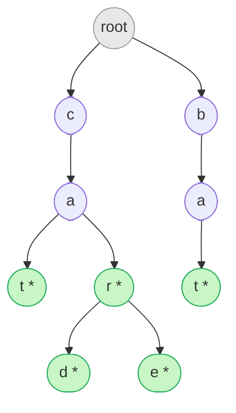
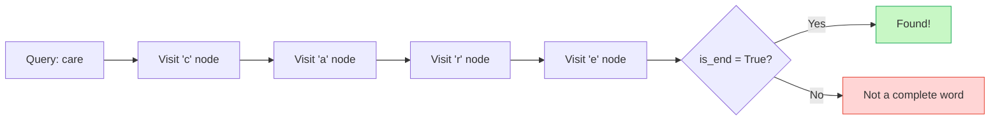

# Trie

Every time you type the first two letters of a search query and a dropdown of suggestions appears instantly — that is a Trie at work. Not a binary tree, not a hash map, but a structure purpose-built for strings: a tree where every path from root to a marked node spells out a complete word.

The name comes from the word "re**trie**val", though it is universally pronounced "try" to avoid confusion with "tree". By the end of this chapter you will have built one from scratch, complete with autocomplete.

---

## The Core Idea

A Trie stores strings character by character. Each node represents a single character, and each edge represents "this character follows that one". Words that share a prefix share nodes.



The `*` marks nodes where a complete word ends. Notice that "cat", "car", "card", and "care" all share the path `root → c → a`. This prefix sharing is what makes Tries efficient — inserting a thousand words that all start with "pre" costs nothing extra for those shared characters.

### Why Not Just Use a Hash Map?

A `dict` can tell you in O(1) whether a word exists, but it cannot:
- List all words with a given prefix efficiently
- Enumerate words in alphabetical order without sorting
- Count how many stored words share a prefix

Tries do all three naturally.

---

## Implementation

### The Node

Each node needs:
1. A map from character → child node
2. A boolean marking whether this node is the end of a word

```python,editable
class TrieNode:
    def __init__(self):
        self.children = {}   # char -> TrieNode
        self.is_end = False  # True if a word ends here

# Quick sanity check
node = TrieNode()
node.children['a'] = TrieNode()
node.children['a'].is_end = True
print("Node has child 'a':", 'a' in node.children)
print("'a' is end of word:", node.children['a'].is_end)
```

### Building the Full Trie

```python,editable
class TrieNode:
    def __init__(self):
        self.children = {}
        self.is_end = False

class Trie:
    def __init__(self):
        self.root = TrieNode()

    # ------------------------------------------------------------------ insert
    def insert(self, word: str) -> None:
        """Add a word to the Trie. O(m) where m = len(word)."""
        current = self.root
        for char in word:
            if char not in current.children:
                current.children[char] = TrieNode()
            current = current.children[char]
        current.is_end = True

    # ------------------------------------------------------------------ search
    def search(self, word: str) -> bool:
        """Return True if word is in the Trie (exact match). O(m)."""
        current = self.root
        for char in word:
            if char not in current.children:
                return False
            current = current.children[char]
        return current.is_end  # must be marked as a complete word

    # --------------------------------------------------------------- starts_with
    def starts_with(self, prefix: str) -> bool:
        """Return True if any word in the Trie starts with prefix. O(m)."""
        current = self.root
        for char in prefix:
            if char not in current.children:
                return False
            current = current.children[char]
        return True  # reached the end of prefix — at least one word continues here

    # ------------------------------------------------------------ autocomplete
    def autocomplete(self, prefix: str) -> list:
        """Return all words in the Trie that start with prefix. O(m + k)
        where k = total characters across all matching words."""
        # Step 1: walk to the end of the prefix
        current = self.root
        for char in prefix:
            if char not in current.children:
                return []  # prefix not found at all
            current = current.children[char]

        # Step 2: DFS from that node to collect all complete words
        results = []
        self._dfs(current, prefix, results)
        return sorted(results)

    def _dfs(self, node: TrieNode, current_word: str, results: list) -> None:
        if node.is_end:
            results.append(current_word)
        for char, child in node.children.items():
            self._dfs(child, current_word + char, results)


# ============================================================= demonstration
trie = Trie()
words = ["cat", "car", "card", "care", "bat", "ball", "band", "ban"]
for w in words:
    trie.insert(w)

print("=== Exact Search ===")
print(f"search('car')   : {trie.search('car')}")    # True
print(f"search('ca')    : {trie.search('ca')}")     # False (not a full word)
print(f"search('card')  : {trie.search('card')}")   # True
print(f"search('cart')  : {trie.search('cart')}")   # False

print()
print("=== Prefix Check ===")
print(f"starts_with('ca')  : {trie.starts_with('ca')}")   # True
print(f"starts_with('car') : {trie.starts_with('car')}")  # True
print(f"starts_with('xyz') : {trie.starts_with('xyz')}") # False

print()
print("=== Autocomplete ===")
print(f"autocomplete('ca')  : {trie.autocomplete('ca')}")   # car, card, care, cat
print(f"autocomplete('ba')  : {trie.autocomplete('ba')}")   # ball, ban, band, bat
print(f"autocomplete('car') : {trie.autocomplete('car')}")  # car, card, care
print(f"autocomplete('xyz') : {trie.autocomplete('xyz')}")  # []
```

---

## Why O(m) Search?

The key insight: **search time depends only on the length of the query, not the size of the dictionary**.

Searching for "care" in a Trie with 1,000,000 words takes exactly 4 steps — one per character. A hash map lookup is O(m) too (it must hash the string), but cannot do prefix queries. A sorted list can do prefix queries but needs O(log n) steps to binary search plus O(m) to compare.



| Operation | Trie | Hash Map | Sorted Array |
|---|---|---|---|
| Insert | O(m) | O(m) | O(n) |
| Search | O(m) | O(m) | O(m log n) |
| Prefix check | O(m) | O(n·m) | O(m log n) |
| Autocomplete | O(m + k) | O(n·m) | O(m log n + k) |

Where `m` = word length, `n` = dictionary size, `k` = total characters in results.

---

## Extended Example: Word Count in a Trie

Sometimes you want to count how many times each word was inserted — useful for building a word frequency map.

```python,editable
class TrieNode:
    def __init__(self):
        self.children = {}
        self.is_end = False
        self.count = 0  # how many times this word was inserted

class FrequencyTrie:
    def __init__(self):
        self.root = TrieNode()

    def insert(self, word: str) -> None:
        current = self.root
        for char in word:
            if char not in current.children:
                current.children[char] = TrieNode()
            current = current.children[char]
        current.is_end = True
        current.count += 1

    def frequency(self, word: str) -> int:
        current = self.root
        for char in word:
            if char not in current.children:
                return 0
            current = current.children[char]
        return current.count if current.is_end else 0

    def top_words_with_prefix(self, prefix: str, n: int) -> list:
        """Return the n most frequent words starting with prefix."""
        current = self.root
        for char in prefix:
            if char not in current.children:
                return []
            current = current.children[char]

        results = []
        self._collect(current, prefix, results)
        results.sort(key=lambda x: -x[1])
        return results[:n]

    def _collect(self, node, word, results):
        if node.is_end:
            results.append((word, node.count))
        for char, child in node.children.items():
            self._collect(child, word + char, results)


# Simulate a search log
search_log = [
    "python", "python", "python", "pytorch", "pytorch",
    "java", "javascript", "javascript", "javascript", "javascript",
    "java", "typescript"
]

trie = FrequencyTrie()
for term in search_log:
    trie.insert(term)

print("=== Search Frequencies ===")
for word in ["python", "pytorch", "java", "javascript", "typescript"]:
    print(f"  {word:12s}: {trie.frequency(word)} searches")

print()
print("=== Top 3 searches starting with 'java' ===")
for word, freq in trie.top_words_with_prefix("java", 3):
    print(f"  {word:15s}: {freq} searches")

print()
print("=== Top 2 searches starting with 'py' ===")
for word, freq in trie.top_words_with_prefix("py", 2):
    print(f"  {word:15s}: {freq} searches")
```

---

## Complexity Summary

| Operation | Time | Space |
|---|---|---|
| Insert word of length m | O(m) | O(m) worst case (all new nodes) |
| Search word of length m | O(m) | O(1) |
| Prefix check of length m | O(m) | O(1) |
| Autocomplete prefix m, k result chars | O(m + k) | O(k) for output |
| Total space for n words, avg length m | O(n · m) | — |

In practice, space is much better than O(n · m) because shared prefixes share nodes. A dictionary of 100,000 English words fits comfortably.

---

## Real-World Applications

- **Search autocomplete** — Google, DuckDuckGo, and every IDE (VS Code, IntelliJ) use Trie-like structures to surface completions as you type. The `autocomplete` function above is literally what they do.
- **Spell checkers** — walk the Trie; if you fall off at any character, the word is misspelled. Edit distance on Tries powers "Did you mean?" suggestions.
- **IP routing tables** — routers store IP prefixes in a Patricia Trie (compressed Trie) and do longest-prefix-match in O(32) steps for IPv4, regardless of routing table size.
- **Word games** — Boggle and Scrabble AI solvers use Tries to prune the search space: if no word starts with the current letter sequence, stop exploring that path immediately.
- **DNA sequence matching** — bioinformatics tools index genomic sequences in Tries (or suffix trees, a related structure) for pattern matching.
