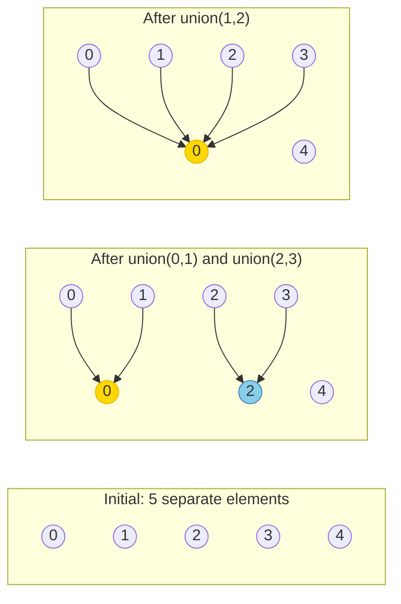
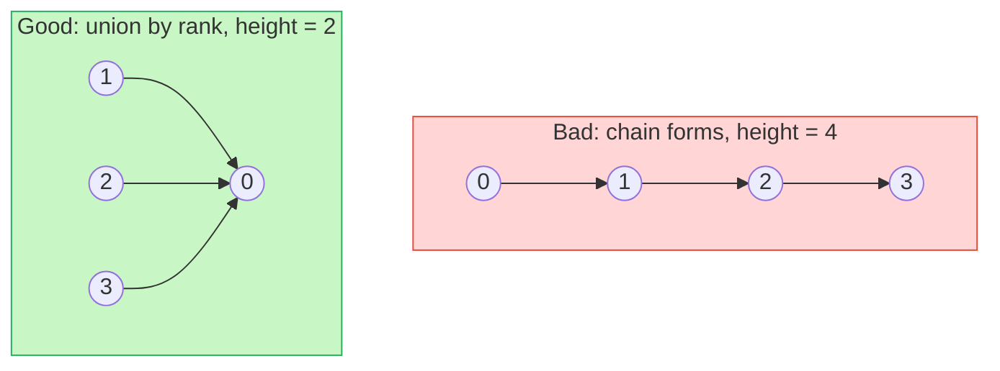
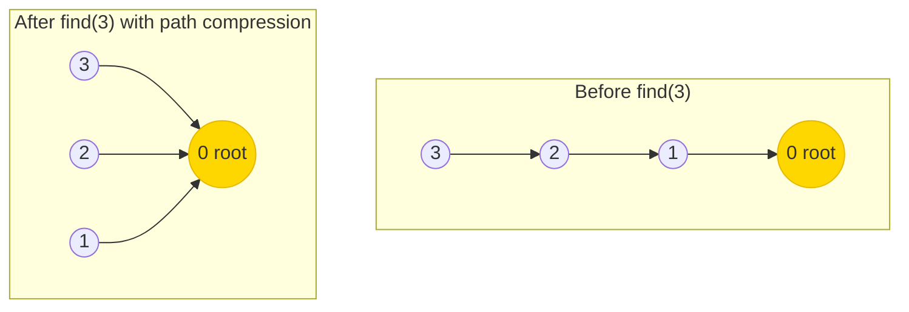

# Union-Find (Disjoint Set Union)

Are these two computers on the same network? Did this friendship connection just merge two separate social circles? Did adding this road create a cycle in the transport graph? These are all the same question in disguise: **do two elements belong to the same group?** Union-Find answers in near-O(1) time, no matter how many elements or operations you have.

Union-Find (also called Disjoint Set Union, or DSU) is one of those data structures that looks almost too simple — an array and two functions — yet it powers Kruskal's minimum spanning tree algorithm, social network analysis, image segmentation, and more.

---

## The Core Idea

Union-Find tracks a collection of elements partitioned into disjoint (non-overlapping) groups. Two operations:

- **`find(x)`** — which group does `x` belong to? Returns a "representative" (root) for the group.
- **`union(x, y)`** — merge the groups containing `x` and `y` into one.



Each group is represented as a tree. The root of the tree is the group's representative. `find(x)` walks up the tree to the root.

---

## Naive Implementation (to understand the problem)

The simplest version: each element's "parent" is stored in an array. Initially everyone is their own parent.

```python,editable
class UnionFindNaive:
    def __init__(self, n):
        # Each element starts as its own group (parent = itself)
        self.parent = list(range(n))

    def find(self, x):
        # Walk up to the root
        while self.parent[x] != x:
            x = self.parent[x]
        return x

    def union(self, x, y):
        root_x = self.find(x)
        root_y = self.find(y)
        if root_x != root_y:
            self.parent[root_x] = root_y  # attach x's tree under y's root

    def connected(self, x, y):
        return self.find(x) == self.find(y)


uf = UnionFindNaive(5)
print("Initial groups (each element is its own root):")
print([uf.find(i) for i in range(5)])   # [0, 1, 2, 3, 4]

uf.union(0, 1)
uf.union(2, 3)
print("\nAfter union(0,1) and union(2,3):")
print([uf.find(i) for i in range(5)])

print(f"\nconnected(0, 1): {uf.connected(0, 1)}")   # True
print(f"connected(0, 2): {uf.connected(0, 2)}")   # False

uf.union(1, 2)
print(f"\nAfter union(1,2): connected(0, 3): {uf.connected(0, 3)}")  # True
```

**The problem:** If we always attach the first tree under the second, we can create a long chain. In the worst case, `find` takes O(n) steps — walking up a linked-list-shaped tree.

---

## Optimisation 1: Union by Rank

Instead of blindly attaching one tree under another, attach the **smaller tree under the larger one**. This keeps trees shallow.

A tree's "rank" is an upper bound on its height. When two equal-rank trees merge, the new root gets rank + 1. Otherwise rank stays the same.



**Union by rank alone guarantees O(log n) per operation.** That is already a huge improvement over the naive O(n) worst case.

---

## Optimisation 2: Path Compression

Every time we call `find(x)`, we walk up a chain of parent pointers. After we find the root, we can flatten the entire chain by pointing every visited node directly to the root. Future `find` calls on the same elements become O(1).



---

## Full Implementation with Both Optimisations

```python,editable
class UnionFind:
    def __init__(self, n):
        self.parent = list(range(n))  # parent[i] = i means i is a root
        self.rank = [0] * n           # upper bound on tree height
        self.num_components = n       # track connected component count

    def find(self, x):
        # Path compression: make every node on the path point directly to root
        if self.parent[x] != x:
            self.parent[x] = self.find(self.parent[x])  # recursive compression
        return self.parent[x]

    def union(self, x, y):
        root_x = self.find(x)
        root_y = self.find(y)

        if root_x == root_y:
            return False  # already in the same component — no merge needed

        # Union by rank: attach smaller tree under larger
        if self.rank[root_x] < self.rank[root_y]:
            self.parent[root_x] = root_y
        elif self.rank[root_x] > self.rank[root_y]:
            self.parent[root_y] = root_x
        else:
            # Equal rank: pick one as root and increment its rank
            self.parent[root_y] = root_x
            self.rank[root_x] += 1

        self.num_components -= 1
        return True  # a merge happened

    def connected(self, x, y):
        return self.find(x) == self.find(y)

    def component_count(self):
        return self.num_components


# ============================================================= demo
uf = UnionFind(6)
print(f"Components: {uf.component_count()}")  # 6

uf.union(0, 1)
uf.union(2, 3)
uf.union(4, 5)
print(f"After 3 unions — Components: {uf.component_count()}")  # 3

print(f"connected(0,1): {uf.connected(0, 1)}")  # True
print(f"connected(0,2): {uf.connected(0, 2)}")  # False

uf.union(1, 3)
print(f"\nAfter union(1,3) — Components: {uf.component_count()}")  # 2
print(f"connected(0,2): {uf.connected(0, 2)}")  # True  (0-1-3-2 now same group)
print(f"connected(0,4): {uf.connected(0, 4)}")  # False

# Show path compression in action
print(f"\nParent array before any find: {uf.parent}")
_ = uf.find(0)  # trigger path compression
print(f"Parent array after find(0):   {uf.parent}")
```

---

## Application 1: Detecting Cycles in a Graph

Adding an edge between two nodes that are already connected (same component) creates a cycle. This is the foundation of Kruskal's Minimum Spanning Tree algorithm.

```python,editable
class UnionFind:
    def __init__(self, n):
        self.parent = list(range(n))
        self.rank = [0] * n

    def find(self, x):
        if self.parent[x] != x:
            self.parent[x] = self.find(self.parent[x])
        return self.parent[x]

    def union(self, x, y):
        rx, ry = self.find(x), self.find(y)
        if rx == ry:
            return False  # cycle detected
        if self.rank[rx] < self.rank[ry]:
            rx, ry = ry, rx
        self.parent[ry] = rx
        if self.rank[rx] == self.rank[ry]:
            self.rank[rx] += 1
        return True

def has_cycle(num_nodes, edges):
    uf = UnionFind(num_nodes)
    for u, v in edges:
        if not uf.union(u, v):
            return True, (u, v)  # this edge created the cycle
    return False, None


# Graph without a cycle: 0-1-2-3 (a path)
edges_no_cycle = [(0, 1), (1, 2), (2, 3)]
cycle, edge = has_cycle(4, edges_no_cycle)
print(f"Path 0-1-2-3 has cycle: {cycle}")   # False

# Graph with a cycle: triangle 0-1-2-0
edges_with_cycle = [(0, 1), (1, 2), (2, 0)]
cycle, edge = has_cycle(3, edges_with_cycle)
print(f"Triangle 0-1-2-0 has cycle: {cycle}, formed by edge {edge}")  # True, (2, 0)

# More complex: 5 nodes, edges including a back-edge
edges_complex = [(0,1), (0,2), (1,3), (2,4), (3,4)]
cycle, edge = has_cycle(5, edges_complex)
print(f"Complex graph has cycle: {cycle}, formed by edge {edge}")  # True
```

---

## Application 2: Number of Connected Components

```python,editable
class UnionFind:
    def __init__(self, n):
        self.parent = list(range(n))
        self.rank = [0] * n
        self.components = n

    def find(self, x):
        if self.parent[x] != x:
            self.parent[x] = self.find(self.parent[x])
        return self.parent[x]

    def union(self, x, y):
        rx, ry = self.find(x), self.find(y)
        if rx == ry:
            return
        if self.rank[rx] < self.rank[ry]:
            rx, ry = ry, rx
        self.parent[ry] = rx
        if self.rank[rx] == self.rank[ry]:
            self.rank[rx] += 1
        self.components -= 1

def count_components(n, edges):
    uf = UnionFind(n)
    for u, v in edges:
        uf.union(u, v)
    return uf.components


# 6 computers, some connected by network cables
n = 6
connections = [(0,1), (0,2), (3,4)]
# Results in 3 components: {0,1,2}, {3,4}, {5}
print(f"Connected components: {count_components(n, connections)}")  # 3

# Add a cable connecting the two clusters
connections.append((2, 3))
print(f"After adding (2,3): {count_components(n, connections)}")    # 2

# Connect the isolated node
connections.append((5, 0))
print(f"After adding (5,0): {count_components(n, connections)}")    # 1
```

---

## Application 3: Accounts Merge

A classic interview problem: given a list of accounts where each account is `[name, email1, email2, ...]`, merge accounts that share at least one email address (same person). Union-Find makes this elegant.

```python,editable
class UnionFind:
    def __init__(self, n):
        self.parent = list(range(n))
        self.rank = [0] * n

    def find(self, x):
        if self.parent[x] != x:
            self.parent[x] = self.find(self.parent[x])
        return self.parent[x]

    def union(self, x, y):
        rx, ry = self.find(x), self.find(y)
        if rx == ry:
            return
        if self.rank[rx] < self.rank[ry]:
            rx, ry = ry, rx
        self.parent[ry] = rx
        if self.rank[rx] == self.rank[ry]:
            self.rank[rx] += 1

def accounts_merge(accounts):
    uf = UnionFind(len(accounts))
    email_to_account = {}  # email -> first account index that owns it

    # Union accounts that share an email
    for i, account in enumerate(accounts):
        for email in account[1:]:           # skip the name at index 0
            if email in email_to_account:
                uf.union(i, email_to_account[email])
            else:
                email_to_account[email] = i

    # Group emails by root account
    from collections import defaultdict
    groups = defaultdict(set)
    for email, acc_idx in email_to_account.items():
        root = uf.find(acc_idx)
        groups[root].add(email)

    # Build result
    result = []
    for root, emails in groups.items():
        name = accounts[root][0]
        result.append([name] + sorted(emails))

    return sorted(result)


accounts = [
    ["Alice", "alice@work.com", "alice@home.com"],
    ["Bob",   "bob@work.com"],
    ["Alice", "alice@home.com", "alice@phone.com"],  # shares alice@home.com with account 0
    ["Bob",   "bob@work.com", "bob@personal.com"],   # shares bob@work.com with account 1
]

merged = accounts_merge(accounts)
print("Merged accounts:")
for account in merged:
    name = account[0]
    emails = account[1:]
    print(f"  {name}: {emails}")
```

---

## Complexity Analysis

With **both** union by rank and path compression, the amortised time per operation is O(α(n)) where α is the inverse Ackermann function. For any conceivable input size in the real world, α(n) ≤ 4. It is effectively constant.

| Implementation | find | union |
|---|---|---|
| Naive (no optimisation) | O(n) worst case | O(n) worst case |
| Union by rank only | O(log n) | O(log n) |
| Path compression only | O(log n) amortised | O(log n) |
| Both (full DSU) | O(α(n)) ≈ O(1) | O(α(n)) ≈ O(1) |

**Space:** O(n) for the parent and rank arrays.

---

## Real-World Applications

- **Network connectivity** — "Is server A reachable from server B?" in a dynamic network where links are added over time. Union-Find handles each new link in near-O(1).
- **Social network friend groups** — detecting communities: if Alice and Bob are friends, and Bob and Carol are friends, they are all in the same component. Adding new friendships is O(α(n)).
- **Kruskal's Minimum Spanning Tree** — sort edges by weight, add each edge if it connects two different components (checked with Union-Find). This builds the MST in O(E log E) time.
- **Image segmentation** — each pixel is a node; adjacent pixels with similar colour are unioned. Connected components become segments. Used in medical imaging and computer vision.
- **Percolation theory** — physics simulations of fluids through porous materials model each open site as a node; Union-Find determines if the top and bottom are connected (percolation occurs).
- **Duplicate detection** — grouping database records that refer to the same real-world entity (same person across multiple accounts, duplicate product listings, etc.).
