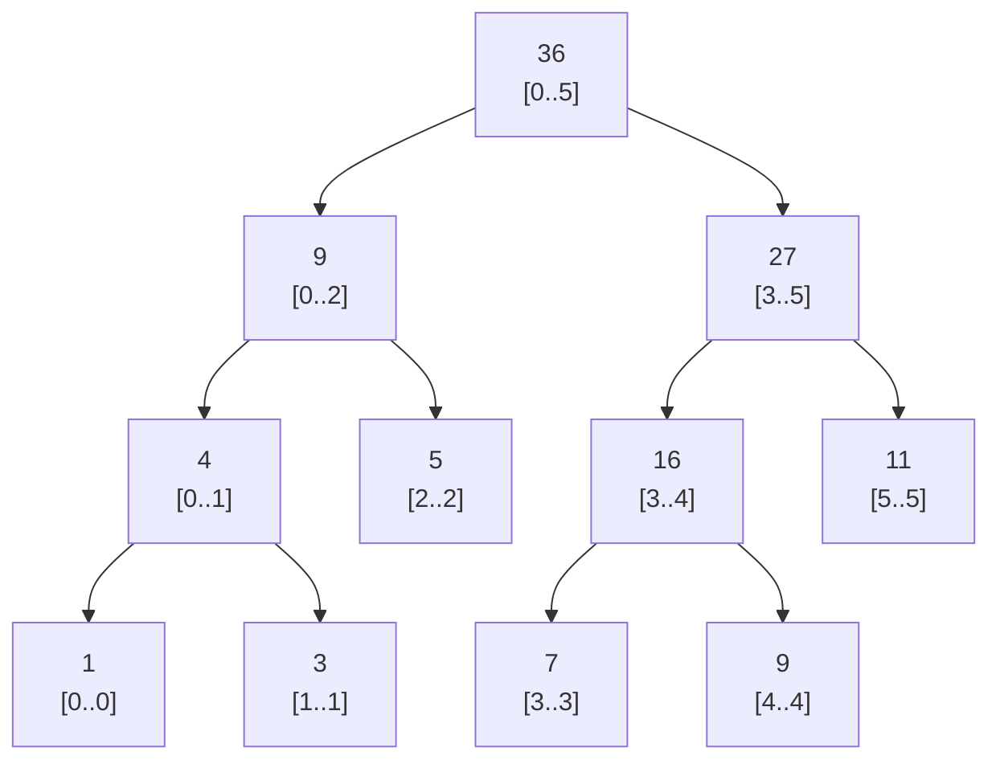
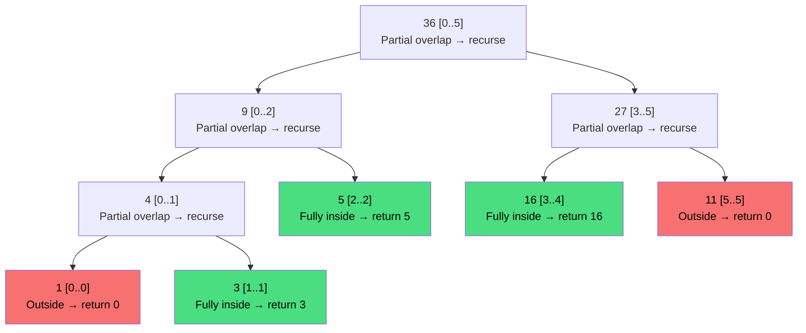

# Segment Tree

Your weather app shows the min/max temperature for any date range instantly. You tap "last 30 days" and the answer appears before the animation finishes. Behind that response is a data structure that answers range queries in O(log n) — the segment tree.

## The problem with the simple approaches

Suppose you have an array of daily temperatures for a year. Two common queries come up constantly: "what was the total/min/max between day L and day R?" and "update day I's reading to a new value."

Two naive approaches:

| Approach | Query time | Update time |
|---|---|---|
| Loop over the range | O(n) | O(1) |
| Prefix sum array | O(1) | O(n) |

Neither is great when both queries and updates are frequent. A segment tree gives you **O(log n) for both** — the sweet spot for dynamic range problems.

## How a segment tree works

A segment tree is a binary tree where:
- Each **leaf** stores one element of the original array.
- Each **internal node** stores the combined result (sum, min, max, etc.) of its children's ranges.
- The root holds the result for the entire array.

Here is the tree built from `[1, 3, 5, 7, 9, 11]` (storing range sums):



Every node answers the question "what is the sum of elements in my range?" instantly. To answer a query over any sub-range, you combine at most O(log n) nodes.

## Flat array storage

Just like a heap, a segment tree is stored in a flat array — no node objects, no pointers. The index arithmetic is slightly different because the tree is 1-indexed here (index 0 is unused, which simplifies the math):

| Relationship | Formula |
|---|---|
| Left child of node `i` | `2 * i` |
| Right child of node `i` | `2 * i + 1` |
| Parent of node `i` | `i // 2` |

For an array of length `n`, the flat tree array needs `4 * n` slots to be safe (the tree can have up to `4n` nodes including padding for non-powers of two).

```
Original array: [1, 3, 5, 7, 9, 11]

Flat tree (1-indexed, sum tree):
index:  1   2   3   4   5   6   7   8   9  10  11
value: [36,  9, 27,  4,  5, 16, 11,  1,  3,  7,  9]
                                                (11 is at index 13, sparse)
```

## Implementation

```python,editable
class SegmentTree:
    def __init__(self, arr):
        self.n = len(arr)
        self.tree = [0] * (4 * self.n)
        if self.n > 0:
            self._build(arr, 1, 0, self.n - 1)

    def _build(self, arr, node, start, end):
        """Recursively build the tree bottom-up."""
        if start == end:
            # Leaf node: store the element directly
            self.tree[node] = arr[start]
        else:
            mid = (start + end) // 2
            self._build(arr, 2 * node,     start, mid)
            self._build(arr, 2 * node + 1, mid + 1, end)
            # Internal node: store combined result of children
            self.tree[node] = self.tree[2 * node] + self.tree[2 * node + 1]

    def query(self, l, r):
        """Return the sum of arr[l..r] (inclusive)."""
        return self._query(1, 0, self.n - 1, l, r)

    def _query(self, node, start, end, l, r):
        if r < start or end < l:
            # Current segment is completely outside the query range
            return 0
        if l <= start and end <= r:
            # Current segment is completely inside the query range
            return self.tree[node]
        # Partial overlap: recurse into both children
        mid = (start + end) // 2
        left_sum  = self._query(2 * node,     start, mid,     l, r)
        right_sum = self._query(2 * node + 1, mid + 1, end,   l, r)
        return left_sum + right_sum

    def update(self, i, val):
        """Set arr[i] = val and update all affected nodes."""
        self._update(1, 0, self.n - 1, i, val)

    def _update(self, node, start, end, i, val):
        if start == end:
            # Leaf: apply the new value
            self.tree[node] = val
        else:
            mid = (start + end) // 2
            if i <= mid:
                self._update(2 * node,     start, mid,     i, val)
            else:
                self._update(2 * node + 1, mid + 1, end,   i, val)
            # Recalculate this node from updated children
            self.tree[node] = self.tree[2 * node] + self.tree[2 * node + 1]


arr = [1, 3, 5, 7, 9, 11]
st = SegmentTree(arr)

print("Array:", arr)
print()
print("sum(0..5) =", st.query(0, 5))   # 36 — full array
print("sum(1..3) =", st.query(1, 3))   # 15 — indices 1,2,3 → 3+5+7
print("sum(2..4) =", st.query(2, 4))   # 21 — indices 2,3,4 → 5+7+9
print()

# Update index 2 from 5 to 10
print("Updating index 2: 5 → 10")
st.update(2, 10)
print("sum(0..5) =", st.query(0, 5))   # 41 — was 36, now +5
print("sum(1..3) =", st.query(1, 3))   # 20 — was 15, now +5
```

## Walking through a query

Let's trace `query(1, 3)` on the original tree (sum of indices 1, 2, 3 = 3+5+7 = 15).



Only three nodes contribute to the answer (green). Two are skipped entirely (red). The final answer is 3 + 5 + 16 — wait, that is 24, not 15. The issue is the `[3..4]` node covers indices 3 and 4, but our query is only `[1..3]`. The recursion splits correctly: `[3..5]` is partially overlapping, so we recurse left to `[3..4]` which is fully inside `[1..3]`... Actually `[3..4]` covers indices 3 and 4, and our query ends at 3, so this is a partial overlap too. Let's re-trace in code:

```python,editable
class SegmentTree:
    def __init__(self, arr):
        self.n = len(arr)
        self.tree = [0] * (4 * self.n)
        self._build(arr, 1, 0, self.n - 1)

    def _build(self, arr, node, start, end):
        if start == end:
            self.tree[node] = arr[start]
        else:
            mid = (start + end) // 2
            self._build(arr, 2 * node,     start, mid)
            self._build(arr, 2 * node + 1, mid + 1, end)
            self.tree[node] = self.tree[2 * node] + self.tree[2 * node + 1]

    def query_verbose(self, l, r):
        return self._query(1, 0, self.n - 1, l, r)

    def _query(self, node, start, end, l, r):
        if r < start or end < l:
            print(f"  node {node} covers [{start}..{end}] — outside [{l}..{r}], return 0")
            return 0
        if l <= start and end <= r:
            print(f"  node {node} covers [{start}..{end}] — fully inside [{l}..{r}], return {self.tree[node]}")
            return self.tree[node]
        mid = (start + end) // 2
        print(f"  node {node} covers [{start}..{end}] — partial, splitting at mid={mid}")
        left  = self._query(2 * node,     start, mid,     l, r)
        right = self._query(2 * node + 1, mid + 1, end,   l, r)
        return left + right


st = SegmentTree([1, 3, 5, 7, 9, 11])
print("Tracing query(1, 3):")
result = st.query_verbose(1, 3)
print(f"Result: {result}")
```

## Complexity analysis

| Operation | Time | Space |
|---|---|---|
| Build | O(n) | O(n) |
| Range query | O(log n) | O(log n) stack |
| Point update | O(log n) | O(log n) stack |

The O(log n) query bound comes from the key observation: at any level of the tree, a query visits at most 4 nodes. With O(log n) levels, the total nodes visited is O(4 log n) = O(log n).

## Extending beyond sum

The same structure works for any operation that can be combined: min, max, GCD, product, bitwise OR/AND. The only change is the line that combines children:

```python,editable
# Min segment tree — only the combine line changes
class MinSegmentTree:
    def __init__(self, arr):
        self.n = len(arr)
        self.tree = [float('inf')] * (4 * self.n)
        self._build(arr, 1, 0, self.n - 1)

    def _build(self, arr, node, start, end):
        if start == end:
            self.tree[node] = arr[start]
        else:
            mid = (start + end) // 2
            self._build(arr, 2 * node,     start, mid)
            self._build(arr, 2 * node + 1, mid + 1, end)
            self.tree[node] = min(self.tree[2 * node], self.tree[2 * node + 1])  # changed

    def query(self, l, r):
        return self._query(1, 0, self.n - 1, l, r)

    def _query(self, node, start, end, l, r):
        if r < start or end < l:
            return float('inf')          # identity for min
        if l <= start and end <= r:
            return self.tree[node]
        mid = (start + end) // 2
        return min(
            self._query(2 * node,     start, mid,     l, r),
            self._query(2 * node + 1, mid + 1, end,   l, r)
        )

    def update(self, i, val):
        self._update(1, 0, self.n - 1, i, val)

    def _update(self, node, start, end, i, val):
        if start == end:
            self.tree[node] = val
        else:
            mid = (start + end) // 2
            if i <= mid:
                self._update(2 * node,     start, mid,     i, val)
            else:
                self._update(2 * node + 1, mid + 1, end,   i, val)
            self.tree[node] = min(self.tree[2 * node], self.tree[2 * node + 1])


# Daily temperatures (°C) for 6 days
temps = [22, 19, 25, 17, 30, 21]
mst = MinSegmentTree(temps)

print("Temperatures:", temps)
print("Min temp days 0–5:", mst.query(0, 5))   # 17
print("Min temp days 1–4:", mst.query(1, 4))   # 17
print("Min temp days 0–2:", mst.query(0, 2))   # 19

# Day 1 got a corrected reading
mst.update(1, 14)
print()
print("After correcting day 1 to 14°C:")
print("Min temp days 0–5:", mst.query(0, 5))   # 14
print("Min temp days 1–4:", mst.query(1, 4))   # 14
print("Min temp days 3–5:", mst.query(3, 5))   # 17 — unaffected
```

## Real-world uses

**Weather and sensor dashboards** — serve min/max/average for arbitrary date ranges while accepting live sensor updates without rebuilding any index.

**Database range queries** — database engines use segment-tree-like structures in their query planners to efficiently evaluate `WHERE date BETWEEN x AND y` on indexed columns with frequent writes.

**Stock price analytics** — trading platforms query the highest/lowest price over any rolling window while the price feed continuously pushes updates.

**Game leaderboards** — real-time leaderboards with range statistics ("rank 100–200 players by score") use segment trees to handle simultaneous score updates and ranking queries.

**Competitive programming** — segment trees are one of the most frequently tested data structures in algorithmic contests because they appear in a huge class of range-update, range-query problems.
