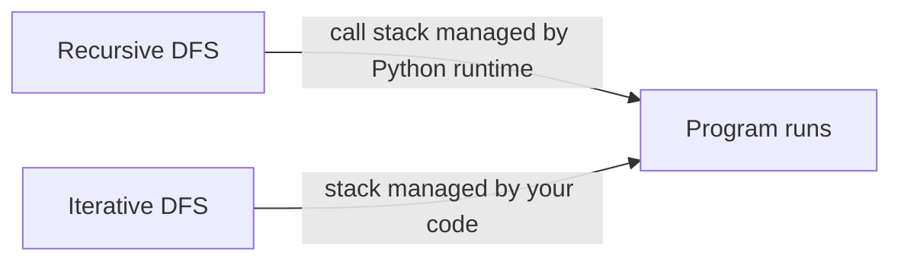
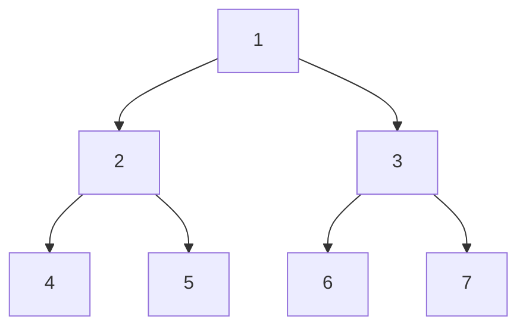

# Iterative DFS

Recursion is elegant but has a limit. Every recursive call consumes a frame on Python's call stack. A tree with 10,000 levels deep triggers `RecursionError: maximum recursion depth exceeded`. Iterative DFS gives you the same traversal with full control — and makes explicit something that recursion hides: the stack.

## The key insight

When you write a recursive DFS, Python is secretly managing a stack for you — it is called the call stack. Each function call pushes a frame; each return pops it. The frame holds the local variables and the "where to resume" information for that call.

Iterative DFS swaps Python's implicit call stack for an explicit one you manage yourself. The logic is identical; only the bookkeeping changes.



## The tree used in all examples



Expected traversal results (same as recursive DFS):
- Pre-order:  `[1, 2, 4, 5, 3, 6, 7]`
- In-order:   `[4, 2, 5, 1, 6, 3, 7]`
- Post-order: `[4, 5, 2, 6, 7, 3, 1]`

## Pre-order: the simplest case

Pre-order visits the node before its children (root → left → right). The stack mirrors this naturally: push root, then in the loop pop a node, record it, push its **right** child first, then **left**. Because a stack is LIFO, the left child will be processed before the right — exactly what we want.

```mermaid
flowchart LR
    S0["Stack: [1]"] --> |"pop 1, push 3 then 2"| S1["Stack: [3, 2]"]
    S1 --> |"pop 2, push 5 then 4"| S2["Stack: [3, 5, 4]"]
    S2 --> |"pop 4 (leaf)"| S3["Stack: [3, 5]"]
    S3 --> |"pop 5 (leaf)"| S4["Stack: [3]"]
    S4 --> |"pop 3, push 7 then 6"| S5["Stack: [7, 6]"]
    S5 --> |"pop 6 (leaf)"| S6["Stack: [7]"]
    S6 --> |"pop 7 (leaf)"| S7["Stack: []"]
```



Result collected in order: 1, 2, 4, 5, 3, 6, 7.

```python,editable
class TreeNode:
    def __init__(self, value, left=None, right=None):
        self.value = value
        self.left = left
        self.right = right


root = TreeNode(
    1,
    left=TreeNode(2, left=TreeNode(4), right=TreeNode(5)),
    right=TreeNode(3, left=TreeNode(6), right=TreeNode(7)),
)


def preorder_recursive(node):
    if node is None:
        return []
    return [node.value] + preorder_recursive(node.left) + preorder_recursive(node.right)


def preorder_iterative(root):
    if root is None:
        return []
    stack = [root]
    result = []
    while stack:
        node = stack.pop()
        result.append(node.value)
        # Push right first: left will be popped (and visited) first due to LIFO
        if node.right:
            stack.append(node.right)
        if node.left:
            stack.append(node.left)
    return result


print("Recursive pre-order: ", preorder_recursive(root))
print("Iterative pre-order: ", preorder_iterative(root))
```

## In-order: the tricky case

In-order is (left → node → right). The challenge is that you cannot record a node immediately when you first encounter it — you must descend all the way to the leftmost node first.

The pattern uses a `current` pointer alongside the stack. Drill left pushing onto the stack until you hit `None`, then pop, record, and switch to the right child.

```python,editable
class TreeNode:
    def __init__(self, value, left=None, right=None):
        self.value = value
        self.left = left
        self.right = right


root = TreeNode(
    1,
    left=TreeNode(2, left=TreeNode(4), right=TreeNode(5)),
    right=TreeNode(3, left=TreeNode(6), right=TreeNode(7)),
)


def inorder_recursive(node):
    if node is None:
        return []
    return inorder_recursive(node.left) + [node.value] + inorder_recursive(node.right)


def inorder_iterative(root):
    stack = []
    result = []
    current = root

    while current is not None or stack:
        # Phase 1: go as far left as possible, pushing each node
        while current is not None:
            stack.append(current)
            current = current.left

        # Phase 2: we have hit None — the top of the stack is the leftmost unvisited node
        current = stack.pop()
        result.append(current.value)

        # Phase 3: now explore the right subtree
        current = current.right

    return result


print("Recursive in-order: ", inorder_recursive(root))
print("Iterative in-order: ", inorder_iterative(root))
```

## Post-order: the reverse trick

Post-order (left → right → node) is the hardest to do iteratively because a node must be recorded only after both its children are fully processed.

The clever trick: notice that post-order is the reverse of a modified pre-order that goes (node → right → left). Run that modified traversal, collect results, then reverse at the end.

```python,editable
class TreeNode:
    def __init__(self, value, left=None, right=None):
        self.value = value
        self.left = left
        self.right = right


root = TreeNode(
    1,
    left=TreeNode(2, left=TreeNode(4), right=TreeNode(5)),
    right=TreeNode(3, left=TreeNode(6), right=TreeNode(7)),
)


def postorder_recursive(node):
    if node is None:
        return []
    return postorder_recursive(node.left) + postorder_recursive(node.right) + [node.value]


def postorder_iterative(root):
    if root is None:
        return []
    stack = [root]
    result = []
    while stack:
        node = stack.pop()
        result.append(node.value)
        # Push LEFT first (opposite of pre-order)
        # so right is processed before left when reversed
        if node.left:
            stack.append(node.left)
        if node.right:
            stack.append(node.right)
    # Reverse: node→right→left becomes left→right→node
    return result[::-1]


print("Recursive post-order: ", postorder_recursive(root))
print("Iterative post-order: ", postorder_iterative(root))
```

## Side-by-side comparison

```python,editable
class TreeNode:
    def __init__(self, value, left=None, right=None):
        self.value = value
        self.left = left
        self.right = right


root = TreeNode(
    1,
    left=TreeNode(2, left=TreeNode(4), right=TreeNode(5)),
    right=TreeNode(3, left=TreeNode(6), right=TreeNode(7)),
)

# ── Recursive ────────────────────────────────────────────────────────────────

def pre_r(node):
    if not node: return []
    return [node.value] + pre_r(node.left) + pre_r(node.right)

def in_r(node):
    if not node: return []
    return in_r(node.left) + [node.value] + in_r(node.right)

def post_r(node):
    if not node: return []
    return post_r(node.left) + post_r(node.right) + [node.value]

# ── Iterative ────────────────────────────────────────────────────────────────

def pre_i(root):
    if not root: return []
    stack, result = [root], []
    while stack:
        node = stack.pop()
        result.append(node.value)
        if node.right: stack.append(node.right)
        if node.left:  stack.append(node.left)
    return result

def in_i(root):
    stack, result, cur = [], [], root
    while cur or stack:
        while cur:
            stack.append(cur)
            cur = cur.left
        cur = stack.pop()
        result.append(cur.value)
        cur = cur.right
    return result

def post_i(root):
    if not root: return []
    stack, result = [root], []
    while stack:
        node = stack.pop()
        result.append(node.value)
        if node.left:  stack.append(node.left)
        if node.right: stack.append(node.right)
    return result[::-1]

# ── Results ───────────────────────────────────────────────────────────────────

print(f"{'Traversal':<12} {'Recursive':<30} {'Iterative':<30} {'Match?'}")
print("-" * 80)
for name, rf, itf in [("Pre-order", pre_r, pre_i), ("In-order", in_r, in_i), ("Post-order", post_r, post_i)]:
    r = rf(root)
    i = itf(root)
    print(f"{name:<12} {str(r):<30} {str(i):<30} {r == i}")
```

## Iterative DFS on a graph

Trees have no cycles, so no bookkeeping is needed. Graphs do have cycles, so you add a `visited` set. The stack-based pattern is identical.

```python,editable
def dfs_graph(graph, start):
    """
    Iterative DFS on an adjacency-list graph.
    Returns nodes in the order they are first visited.
    """
    visited = set()
    stack = [start]
    result = []

    while stack:
        node = stack.pop()
        if node in visited:
            continue
        visited.add(node)
        result.append(node)
        # Push neighbours (reverse to get left-to-right visit order)
        for neighbour in reversed(graph[node]):
            if neighbour not in visited:
                stack.append(neighbour)

    return result


# Graph as adjacency list
#
#   A --- B --- D
#   |     |
#   C --- E
#
graph = {
    'A': ['B', 'C'],
    'B': ['A', 'D', 'E'],
    'C': ['A', 'E'],
    'D': ['B'],
    'E': ['B', 'C'],
}

print("DFS from A:", dfs_graph(graph, 'A'))
print("DFS from D:", dfs_graph(graph, 'D'))
```

## Complexity

| | Recursive DFS | Iterative DFS |
|---|---|---|
| Time | O(n) | O(n) |
| Space (balanced tree) | O(log n) call stack | O(log n) explicit stack |
| Space (skewed tree) | O(n) — may crash | O(n) — safe |
| Max depth | ~1000 (Python default) | Unlimited |

The time complexity is the same. The space complexity is also the same in terms of Big-O — but the iterative version does not hit Python's recursion limit, which is 1000 frames by default.

## Real-world uses

**File system traversal** — `os.walk()` in Python's standard library is implemented iteratively. A directory with deeply nested folders would exhaust the call stack if implemented recursively.

**Web crawlers** — a crawler maintains an explicit queue/stack of URLs to visit and a visited set of already-seen URLs. The structure is exactly iterative DFS (or BFS depending on discovery order desired).

**Compilers and interpreters** — parsing deeply nested expressions like `f(g(h(i(j(...)))))` with a recursive descent parser can overflow the stack. Production compilers use iterative approaches or manually manage a parse stack.

**Graph algorithms in production** — Tarjan's strongly connected components algorithm and iterative deepening depth-first search (IDDFS) both rely on explicit stack management to handle large real-world graphs.
