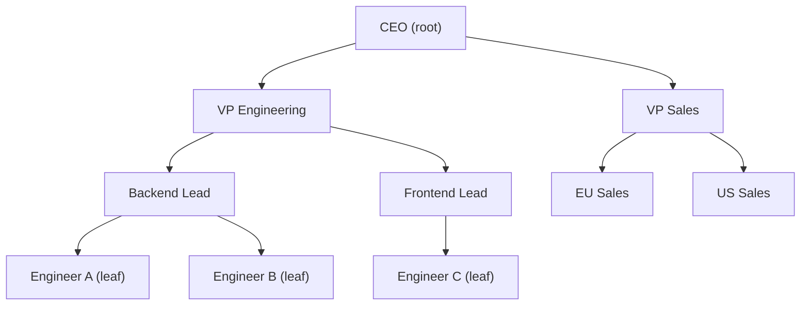

# Trees

Your file system, your company org chart, the HTML DOM of every webpage — all trees.

Open your terminal and run `ls /usr`. What you see is a tree: a root directory that branches into children, each of which can branch into more children. Zoom out and your entire hard drive is a single tree rooted at `/`. Zoom in on any webpage and the HTML is a tree where `<html>` is the root, `<body>` is a child, and every `
`, `
`, and `` hangs off it. The same shape appears in compilers, databases, AI decision-making, and network routing.

Trees are the most important non-linear data structure you will learn.

## What makes something a tree?

A tree is a collection of **nodes** connected by **edges**, where:

- There is exactly one **root** node at the top.
- Every other node has exactly one **parent**.
- A node with no children is called a **leaf**.
- Nodes can have zero or more **children**.

This is different from a linked list (purely linear) or a graph (edges can form cycles). A tree has no cycles — you can never follow edges and end up back where you started.

Every company org chart is a tree. The CEO is the root. VPs are internal nodes. Individual contributors with no direct reports are leaves.

## Key vocabulary

| Term | Meaning |
|---|---|
| **Root** | The single top-level node — has no parent |
| **Leaf** | A node with no children |
| **Height** | Number of edges on the longest path from root to a leaf |
| **Depth** | Number of edges from the root to a given node |
| **Subtree** | A node plus all of its descendants — itself a valid tree |
| **Level** | All nodes at the same depth form a level |

## What you will build toward

This section covers the most important tree variant — the **Binary Tree** — and the most important algorithm built on it — the **Binary Search Tree**. By the end you will know how to:

1. **Binary Tree** — understand the node/root/leaf vocabulary, build trees in code, and think about the three ways to walk one.
2. **Binary Search Tree** — exploit the left < node < right ordering rule to search in O(log n) time instead of O(n).
3. **BST Insert and Remove** — keep a BST sorted through insertions and the tricky three-case deletion.
4. **Depth-First Search** — dive deep before backtracking; produce sorted output, copy a tree, evaluate expressions.
5. **Breadth-First Search** — sweep level by level with a queue; find shortest paths and serialize trees.
6. **BST Sets and Maps** — use a BST as the engine behind an ordered set or ordered dictionary.

Each topic builds directly on the previous one. Start with Binary Trees and work through in order.
