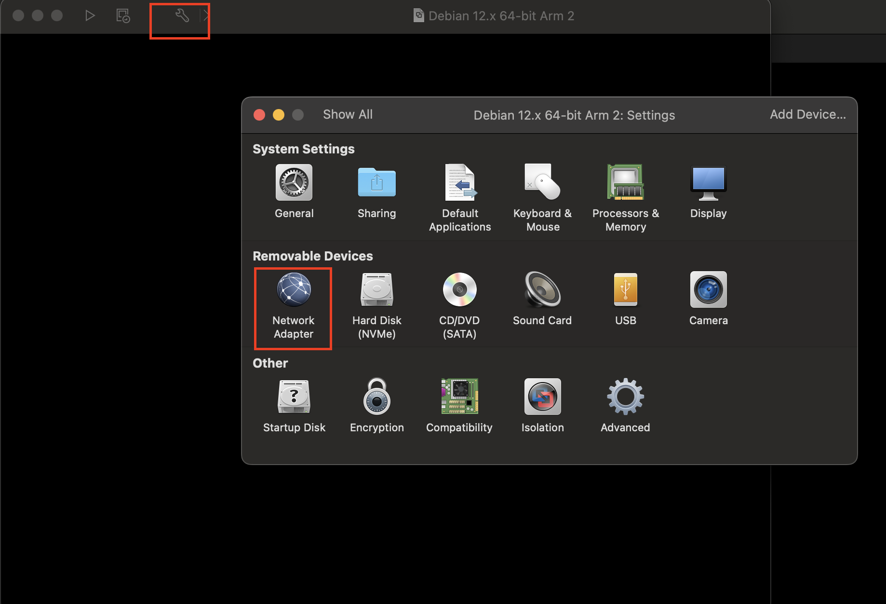
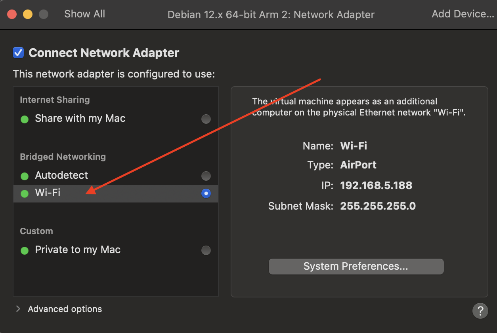

Download Debian distribution: https://www.debian.org/distrib/

Usually torrents are faster to download instead of HTTP.

Download it using torrents: https://www.debian.org/CD/torrent-cd/

For Macbook Pro M series (M1/M2... etc): Download torrent available in the category "DVD/USB" -> arm64.

Installation on VMWare Fusion:

Open VMWare Fusion App then, Click "File" -> "New" -> Double click "Install from disc or image" -> "Use another disc or disc image".

- File -> New: 

- Double click "Install from disc or image": 

- Use another disc or disc image:

- To make The virtual machine appears as an additional computer on the physical Ethernet network "Wi-Fi" you need to update "Network Adapter" settings.

- Hence Click on "Settings Icon", it looks something like this: 🔧. 

Network Adapter: 

Select Bridged network wifi:

After that start with Normal Installation process. Below screenshots are reference only. Select Configuration as per your need.

- Use Graphical Install

- 

