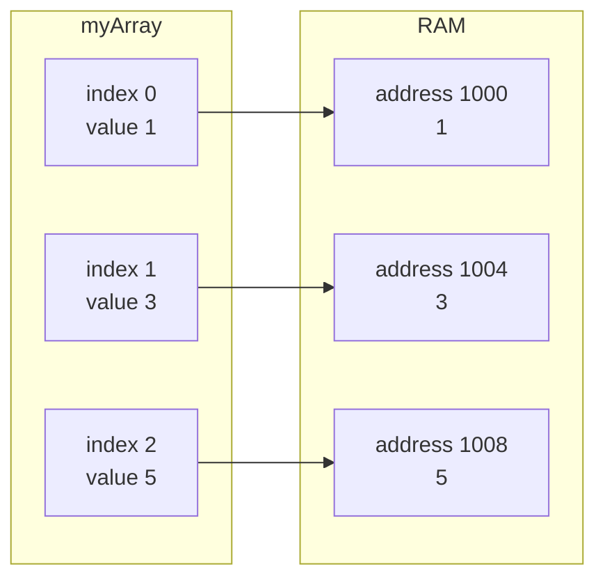

# RAM

Before arrays make sense, memory needs to make sense.

## Mental model

RAM can be imagined as a long strip of numbered slots. Each slot has an address, and a program stores values at those addresses.

When values are stored contiguously, the program can compute where `arr[i]` lives without scanning earlier elements.

## Why this matters

- Direct address calculation gives arrays `O(1)` index access.
- Contiguous layout makes caches happier.
- Inserting in the middle becomes expensive because later values must shift.

## Think in addresses

If a base address is `1000` and each integer uses `4` bytes, then:

- `arr[0]` lives at `1000`
- `arr[1]` lives at `1004`
- `arr[2]` lives at `1008`

That idea is the reason random access is so fast.
