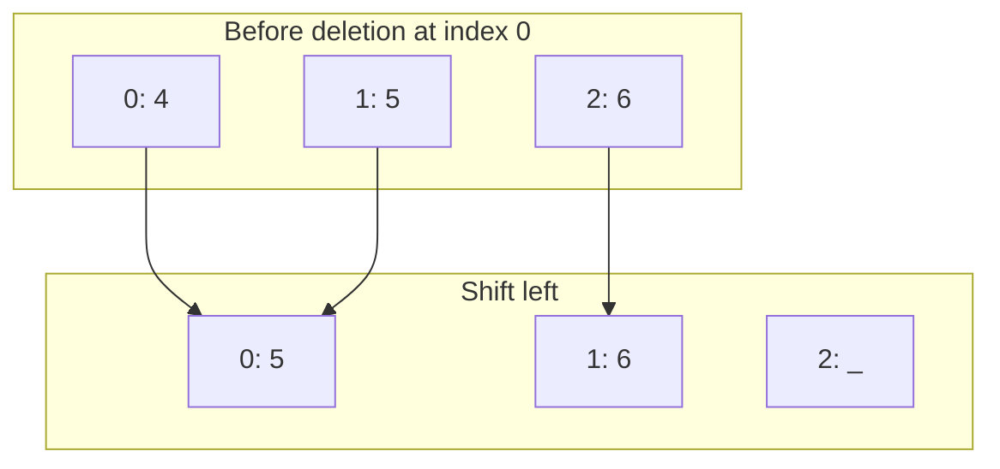
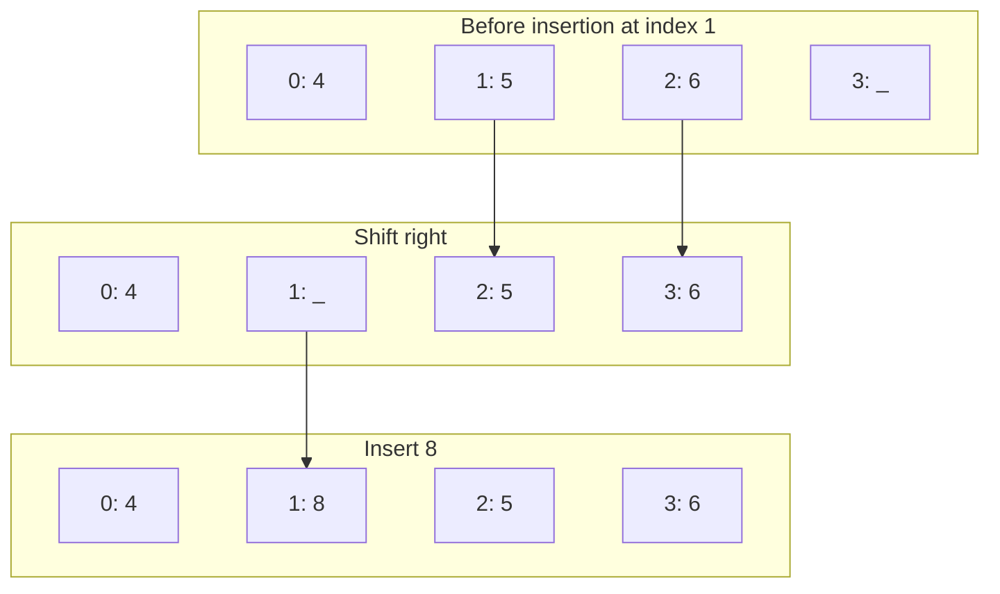

# Static Arrays

Static arrays have a fixed capacity. That makes them simple and predictable, but not flexible.

## Reading and traversal

```python,editable
arr = [1, 3, 5]

print(arr[1])

for i in range(len(arr)):
    print(i, arr[i])
```

- Read by index: `O(1)`
- Full traversal: `O(n)`

## Delete from the middle

To keep the array contiguous, values after the deleted position must shift left.



```python,editable
def remove_middle(arr, i, length):
    for index in range(i + 1, length):
        arr[index - 1] = arr[index]
    arr[length - 1] = 0
    return length - 1


arr = [4, 5, 6, 0]
length = 3
length = remove_middle(arr, 0, length)

print(arr)
print(arr[:length])
```

## Insert in the middle

To make room, values shift right first.



```python,editable
def insert_middle(arr, i, value, length, capacity):
    if length == capacity:
        raise ValueError("full array")

    for index in range(length - 1, i - 1, -1):
        arr[index + 1] = arr[index]

    arr[i] = value
    return length + 1


arr = [4, 5, 6, 0]
length = 3
length = insert_middle(arr, 1, 8, length, len(arr))

print(arr)
print(arr[:length])
```

## Takeaway

Static arrays are excellent when capacity is known and stable. They become awkward when the structure must grow.
