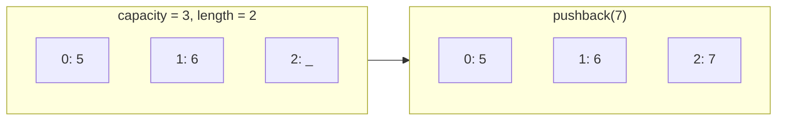
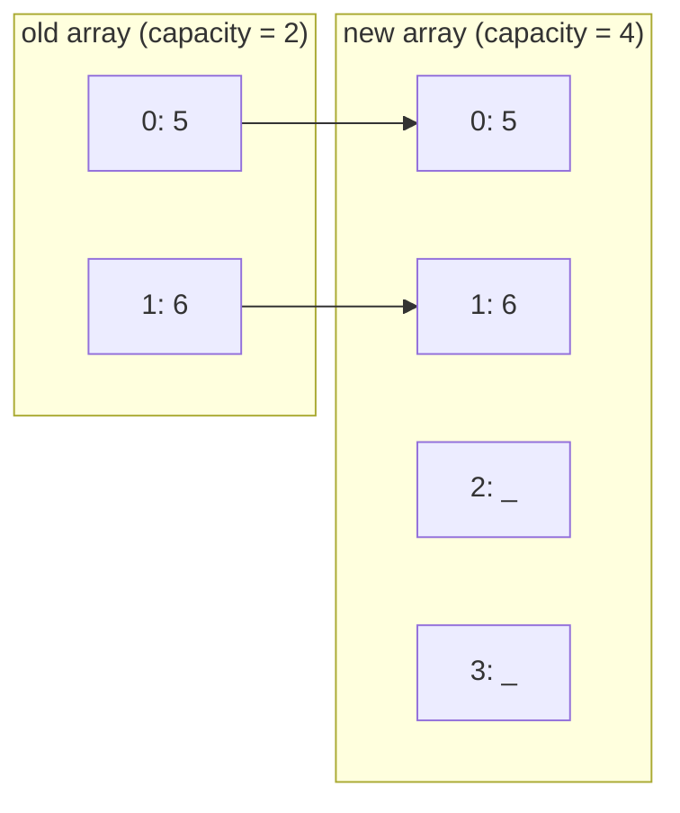
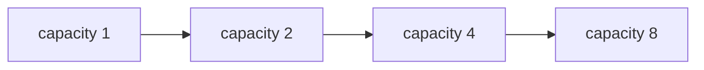

# Dynamic Arrays

Dynamic arrays keep the fast indexed access of arrays while adding the ability to grow.

Python `list` already behaves like a dynamic array, but the resizing idea is worth understanding.

## Push at the end

When free capacity exists, append is simple.



```python,editable
class DynamicArray:
    def __init__(self):
        self.capacity = 2
        self.length = 0
        self.arr = [0] * self.capacity

    def pushback(self, value):
        if self.length == self.capacity:
            self.resize()
        self.arr[self.length] = value
        self.length += 1

    def resize(self):
        self.capacity *= 2
        new_arr = [0] * self.capacity
        for i in range(self.length):
            new_arr[i] = self.arr[i]
        self.arr = new_arr

    def values(self):
        return self.arr[:self.length]
```

## Resize

When capacity fills up, allocate a bigger array and copy values over.





```python,editable
dyn = DynamicArray()

for value in [5, 6, 7, 8, 9]:
    dyn.pushback(value)
    print("values =", dyn.values(), "| length =", dyn.length, "| capacity =", dyn.capacity)
```

## Why append is amortized `O(1)`

- A resize costs `O(n)`.
- Resizes do not happen on every append.
- Doubling spreads expensive copies across many cheap appends.

That is why dynamic-array append is usually described as amortized `O(1)`.
