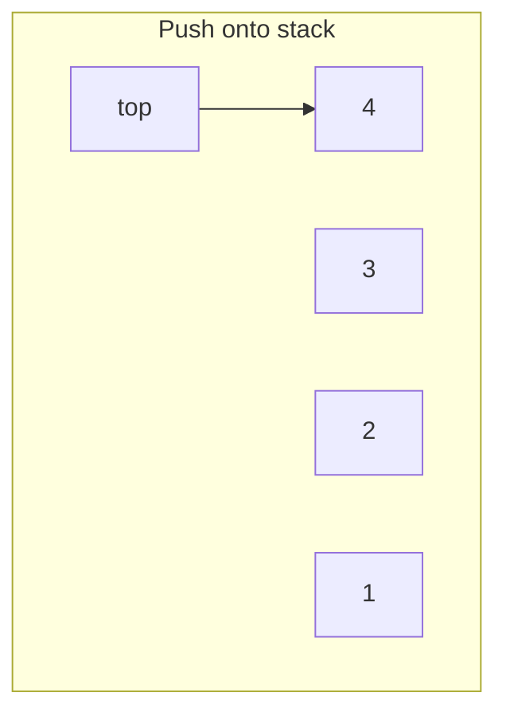
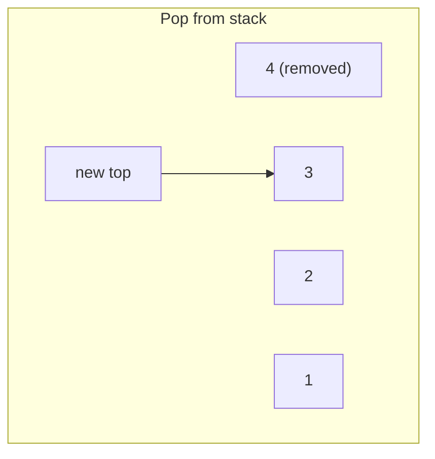

# Stacks

A stack is a linear structure that allows updates at one end only: the top.

## Rule

Last in, first out.

- `push`
- `pop`
- `peek`





```python,editable
class Stack:
    def __init__(self):
        self.data = []

    def push(self, value):
        self.data.append(value)

    def pop(self):
        if not self.data:
            raise IndexError("empty stack")
        return self.data.pop()

    def peek(self):
        if not self.data:
            raise IndexError("empty stack")
        return self.data[-1]


stack = Stack()
for value in [1, 2, 3, 4]:
    stack.push(value)

print(stack.peek())
print(stack.pop())
print(stack.data)
```

## Common uses

- expression evaluation
- undo behavior
- DFS
- recursion simulation

## Cost

- `push`: `O(1)` amortized
- `pop`: `O(1)`
- `peek`: `O(1)`
