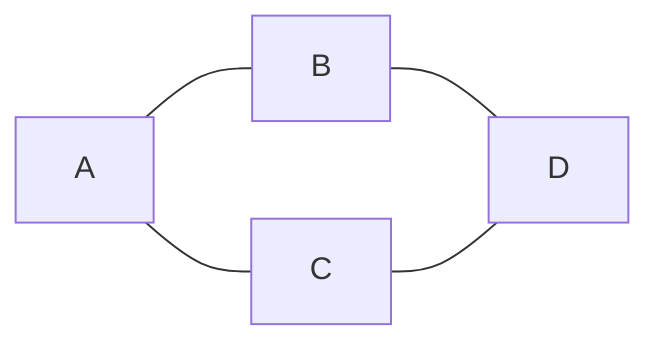

# Intro to Graphs

A graph has:

- vertices (nodes)
- edges (connections)

```mermaid
flowchart LR
    A["A"] --- B["B"]
    A --- C["C"]
    B --- D["D"]
    C --- D
```

Graphs can be:

- directed or undirected
- weighted or unweighted
- cyclic or acyclic
