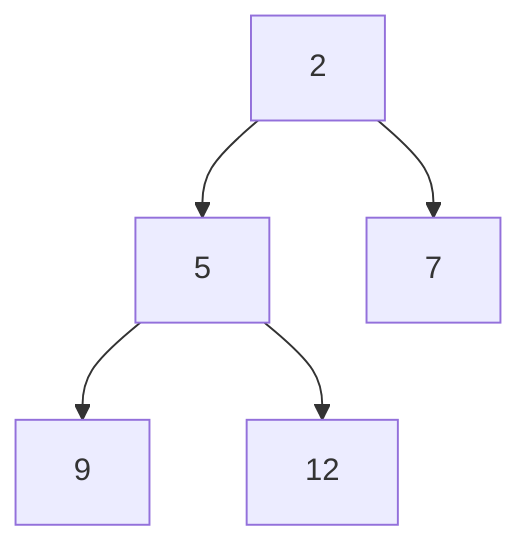

# Heap Properties

In a min-heap:

- every parent is less than or equal to its children
- the smallest value is at the root

When stored in an array:

- left child of `i` is `2*i + 1`
- right child of `i` is `2*i + 2`
- parent of `i` is `(i - 1) // 2`

This structure powers priority queues.
