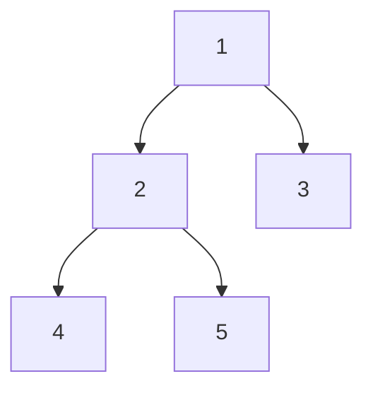

# Binary Tree

A binary tree node has up to two children: `left` and `right`.

```python,editable
class Node:
    def __init__(self, value, left=None, right=None):
        self.value = value
        self.left = left
        self.right = right


root = Node(
    1,
    left=Node(2, Node(4), Node(5)),
    right=Node(3),
)

print(root.value, root.left.value, root.right.value)
```


