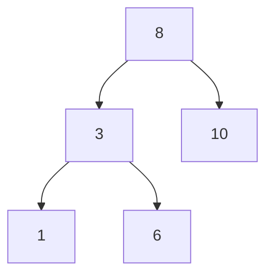

# Binary Search Tree

A BST keeps values ordered:

- all values in the left subtree are smaller
- all values in the right subtree are larger

```python,editable
class Node:
    def __init__(self, value):
        self.value = value
        self.left = None
        self.right = None


root = Node(8)
root.left = Node(3)
root.right = Node(10)
root.left.left = Node(1)
root.left.right = Node(6)

print(root.left.right.value)
```



BSTs make ordered search efficient on average, though an unbalanced tree can still degrade to `O(n)`.
